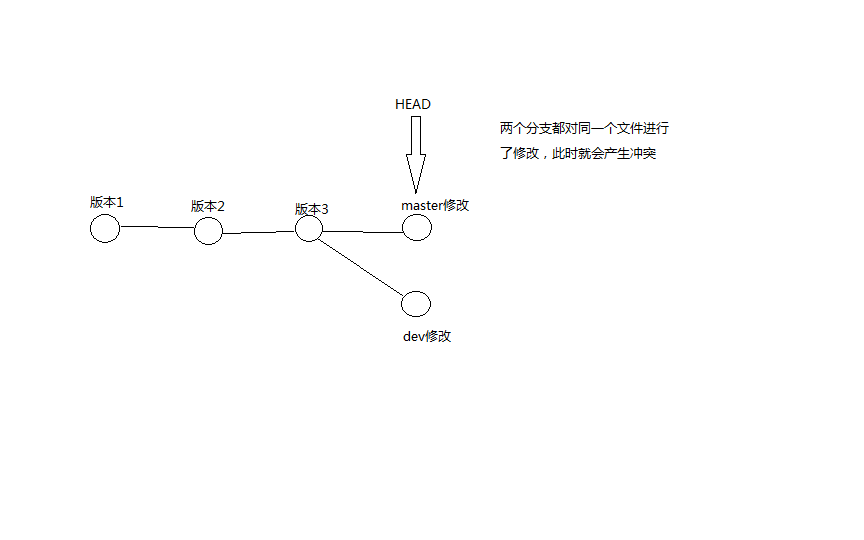

# 版本控制初步及GIT安装

**什么是版本控制？**  
我们写作文，要修改很多次，写代码也是一样的   
没有一次写完的代码，也没有一次写完就没有BUG的代码   
这中间要经历过很多次的修改，每次修改的记录，就是版本控制   
版本控制可以让我们知道相对于上一次，我们都修改了哪些地方   

原始的版本控制都是以文件的方式，就是一次修改存一个文件，会非常的凌乱  
这里用到的版本控制软件就是GIT，可以更加方便来管理版本  
使用了GIT之后，在本地电脑上，只会看到编写的文件本身，而针对它的修改是看不到的  
但是每次的修改都会被保存起来  

版本控制还有一些其他的实用功能：  
1. 多人协同开发：一个大的项目是无法一个人独立完成的，需要很多程序员共同来完成
2. 保留修改的历史记录，方便回退版本，尤其是当代码出现bug时

版本控制的种类：  
1. 分布式：每台本地电脑都保存有代码的全部备份  
   + 缺点：本地文件会过大 
2. 集中式：只有中央服务器保留有代码的全部备份
   + 缺点：一旦中央服务器故障，所有客户端无法获取代码

GIT是一种典型的分布式版本控制软件，并且完全开源免费，是目前使用最广泛的版本控制软件  

## GIT的安装

LINUX:Ubuntu为例   
`$ sudo apt-get install git`

Windows:直接官网下载并安装    
[下载地址](https://git-scm.com/)  
注：建议不要使用图形版，因为难以看懂       
更新方法：`git update-git-for-windows`       
注：在cmd或者powershell中均可输入该命令  
ps:不翻墙容易出错  
Git 的官网的 Documentation-->Book 是有中文版的，大家可以多看看  

## GIT的一些基本概念  

1. 工作区：写代码的文件夹，在该文件夹中新增、删除、修改其中文件均会被git追踪  
2. 版本库：  
   + 暂存区：暂时存放修改好的代码
   + 代码库：确定修改好之后的代码就可以提交到代码库
   + 远程仓库：把代码存放在云端
      - github(国外)[网址](www.github.com)
      - gitee(国内)[网址](www.gitee.com)

# 本地操作

用 Git 进行版本控制，本质上就是用 Git 来帮助管理文件夹  

基本流程:     
在文件夹创建仓库 --> 初始化这个文件夹 --> 在工作区编写文件，包括文件的增删改 --> 把修改提交到暂存区 --> 把暂存区的修改提交到代码库

## 创建仓库及查看文件夹状态

通过`git init`命令来让 Git 对该文件夹进行管理  
操作步骤：新建文件夹为例  
1. 新建文件夹 test
2. linux 输入 git init --> ls -l -->可以发现新创建了一个.git文件夹
3. windows 右键-->git bash here-->git init-->创建了一个.git文件夹(默认隐藏)

*注意：是在当前工作目录创建，可用pwd命令查看*

这个.git文件夹保存了git的相关配置信息和版本信息，有了它就可以进行版本的管理了   

通过`git status`命令来查看文件夹的状态  
在文件夹内的修改文件、新增文件、删除文件均会被记录  
1. 新建文件test.txt  
2. git bash here
3. git status  --> 可以发现红色的字，即为文件夹内的变化

文件夹的状态有三种：  
1. 红色 --> 有修改，未暂存
2. 绿色 --> 修改已被记录但未提交
3. 干净了 --> 所有修改被提交

文件夹状态涉及到的暂存，提交等概念下面会讲到  

## 配置Git

在使用之前，需要配置 Git，让 Git 知道是谁管理的这个文件夹  
项目的配置文件在 .git 文件夹中的config文件

1. 查看配置：`git config --list`
2. 设置用户名：`git config --global user.name 'xxx'`
3. 设置用户名邮箱：`git config --global user.email 'xxx@xx.com'`
4. 设置远程推送网址：`git remote add <url>`

以上的global均可以换成local，此时这些配置只对当前文件夹有效，global则表示对本台计算机用户都有效，如果是多人共用一台计算机，就要用到local了  

## 创建版本

通过`git add`命令将文件加入到暂存区，表示该修改已经被记录  
1. 新建一个文本文件test.txt --> 在已被追踪的文件夹中新增了一个文件
2. git status  --> 红色的字
3. git add test.txt  --> 把这个文件加入到暂存区
4. git commit -m 'version0.1'  --> 起一个有意义的内容，并用commit提交到代码库
5. git status  --> 干净了，即没有被修改的内容了
6. git log --> 查看版本记录 --> 可以发现commit后有版本信息
7. 修改test.txt内容    --> 这个文件被修改了，再次产生一个版本
8. git status  --> 再次变红 
8. git add test.txt   --> 提交到暂存区
9. git commit -m 'version0.2' --> 再次提交到代码库，此时这个文件夹有两个有两个不同的版本，一个是新增的操作，一个是修改文件的操作

git记录的是修改的内容，后面的版本依赖于前面的版本

如果文件夹内的文件特别多，一次编写了多个文件，用`git add`一个一个进行添加就太麻烦了，可以用`git add .`一次性暂存整个文件夹的改动  

## 查看版本

    git log
    git log --graph        # 图形化查看
    git log --graph --pretty=format:"%h %s"   # 指定格式查看
    git log --pretty=oneline --graph     # 指定格式查看，显示简易内容

`git log`是主命令，后面的--开头的称为选项，你可以定制用何种方式来查看版本  
使用较多的是`git log --pretty=oneline`

## 版本回退(版本之间的切换)

版本回退主要用到的命令是`git reset --hard`   
将已经提交到代码库的记录回退，即已经commit之后的代码  

**回滚之前的版本**  
方法一：HEAD法  
1. 创建好一个新的版本后，默认会有一个HEAD指向当前版本

2. HEAD之前版本的表示方法：
+ 第一种方法：HEAD^-->前一个版本；HEAD^^-->前两个版本
+ 第二种方法：HEAD~1-->前一个版本；HEAD~100-->前100个版本

3. git reset --hard HEAD^ --> 回到版本1，即指针指向了版本1
   
git log 查看版本信息，可以看到只有一个版本，但是版本2并没有删掉
  
这个过程很快，只是把HEAD移动到版本2处，可以简单地理解为把你需要的版本重新显示给你，本来所有的修改都并没有被删除。
  
方法二：版本号法  
1. 先使用`git log`命令查看记录
2. 每条记录都一个一行`commit xxxxxxxxxxxxx`(特别长的字符串)，这就是版本号
3. 使用命令`git reset --hard [版本号]`即可回滚到指定版本

**回滚到之后的版本**  
可以发现，`git log`只显示当前HEAD位置之前的版本号，那么*当HEAD在版本1时，如何查看之后版本的版本号?*  
`git reflog` --> 查看操作记录，最前面一栏即为版本号，查找到了版本号，就可以`git reset --hard [版本号]`了

## 工作区与暂存区回顾

文件所在的文件夹即为工作区，即git init的文件夹        
该文件夹中的.git目录为git的版本库，其中最重要的就是称为stage/index的暂存区           

**工作区与暂存区的关系如下图：**

add的作用就是把修改放入到暂存区中，commit的就是一次性把暂存区的所有修改记录放入版本库中         
*每次add操作都是把修改放入暂存区，可以多次add，然后一次性commit*          

查看工作区的状态`git status`  
如果对工作区的文件进行了修改，就可以知道哪些文件被修改，新增了哪些（显示未跟踪）     
注意：git add后可以加多个文件，也可以加目录，即可以把整个目录的修改都保存              
比较常用的有`git add .`即把当前目录的修改都放入暂存区            
一旦提交后，如果你又没有对工作区做任何修改，那么工作区就是“干净的(clean)”         

**注意：如果修改文件后，不用add将修改放入暂存区，commit的时候就不会记录该修改**            
也就是说，commit只记录暂存区的修改，任何没有加入到暂存区的修改都不会被记录            

## 丢弃改动

这里改动主要是指你正在写代码，发现不在状态，乱写一通，然后又删掉了修改的内容了，但是git又显示你修改了项目，想要丢弃掉这次改动，假装本次没有任何操作。  
这里所涉及的checkout主要是针对只add没有commit的操作。  

操作方法：  
1. 尚未add(放入暂存区)及commit(放入版本库)丢弃改动：`git checkout -- [文件名]`
2. 如果已经把改动后的加入到暂存区(已经add，尚未commit)，就需要以下命令来取消暂存`git reset HEAD [文件名]`
  
通过`git status`可以发现文件已经被取消暂存，可以用git checkout来放弃改动

## 对比文件

对比工作区和某个版本文件的不同   
`git diff HEAD -- [文件名(工作区中的文件)]`

1. 减号（－）对应着HEAD文件
2. 加号（＋）对应着工作区中的文件
3. 没有加号或减号的表示两个文件共有的

最下面的＋表示工作区中的文件比版本库中的文件多出的内容，如果是减号则相反         

**对比两个版本之间的不同**         
如对比HEAD与HEAD^的不同         
`git diff HEAD HEAD^ -- [文件名]`
注意：总是要加上两个“--”

## 删除文件

在工作的增、删、改都属于改动范畴      
在工作区中删除某个文件后，可以使用git checkout来丢弃修改          

如果确实删除文件，先删除文件，然后使用如下命令         
`git rm [文件名]`  
把删除修改添加到暂存区       
`git commit -m '说明'`        

## 分支

在开发过程中，通常是一边运营一边修改，在项目上线之后，主分支(master/main)运行的是稳定版本，不会轻易地去修改。    
这时要新增或删除功能怎么办？  
这个时候就需要分支功能，在主分支之外新建一个分支来继续开发，待测试稳定再合并入主分支  

GIT的默认的分支为master分支，但是在git2.23版本以后默认分支改为main分支，现在已经有很多在github上的开源项目已经把master修改成了main，为顺应发展的趋势，我们也应当多用用main这个命名                 

1. 查看分支：`git branch`
2. 创建并切换分支：`git checkout -b dev`，再次查看分支(git branch)可以看到有两个分支              

之前，我们知道了checkout是丢弃修改功能，在这里，又变成了切换分支的功能。  

本质上，分支是创建了一个新的指针，不影响原指针的位置         
把HEAD指针指向新创建的分支上         
此后，所有的修改操作均在新分支上进行，不会对原纪录产生任何影响
查看：git log --pretty=oneline

**切换分支**   
`git checkout master`   
直接让HEAD重新指向master

在git的2.23版本以后，切换分支可以使用switch   
`git switch <分支名> # 切换分支 `   
`git switch -c <分支名> # 创建并切换分支`  
可以把-c理解为create  

建议：多使用switch，因为它更加地清晰明确，不会操作失误。  
PS:理论上讲，分支的数量是不限的，但是也不要太多  

**合并操作**   
`git merge dev`   
记住：在合并之前把当前分支切换到主分支上，然后把dev分支上的内容合并到master分支上 
合并之后master(main)分支的内容就包括了dev分支开发的内容  
快速合并(fast-forward)，在没有冲突的情况下，把master指针连同HEAD指向dev的位置   
可以使用快速合并时默认使用快速合并

合并之后可以删除dev分支        
`git branch -d dev`   
即直接删除dev的指针  

当然了，因为dev分支始终是用于开发，应当保持dev分支的代码是最新的，所以在开发之前，需要把 master 分支的内容合并到 dev 分支上，即`git merge master`  

### 冲突

冲突的产生：两个分支都对**同一个文件**进行了修改并提交就会出现冲突   
如果对不同的文件进行修改不会产生冲突   
  
如果执行git merge dev就会报错，并指出哪个文件发生了冲突   
git status也会指出冲突发生的位置   

**解决方法**
打开产生冲突的文件，可以看到冲突的内容   
然后对其进行修改并提交，产生一个新的版本即可解决冲突   
   

查看分支图`git log --graph --pretty=oneline`

### 分支管理策略

快速合并时，直接移动指针          
有时，快速合并不能成功，但是又没有冲突，这时合并会做一次新的提交       
但是这种模式下删除分支后会丢掉分支的信息          

例：
1. 创建并切换分支dev
2. 在dev上创建新的文件并提交
3. 切换master分支并修改文件，然后提交
4. 此时git merge dev无法实现快速合并
5. 出现弹窗后提示输出信息
6. 这个界面表示git做了一次新的提交，而不是快速合并

有时需要禁用fast-forward来保存dev分支的记录！   
`git merge --no-ff -m '说明信息' dev`  
对比一下默认的快速合并模式   
`git merge dev`

### bug分支

遇到BUG时，新建一个bug临时分支，修复之后合并到master分支，然后删除bug分支         

场景：
1. 当前正在dev分支上进行开发，但是软件运行过程中发现bug需要立即修复
2. 因当前dev分支上的开发工作尚未完成无法提交

`git stash  --> 保存当前工作区`   
`git status  --> 发现工作区干净了`

操作流程：

    回到master分支并创建一个临时bug分支
    git checkout master
    git checkout -b bug-001
    修复bug之后
    git add [文件名]
    git commit -m '修复bug001'
 
    回到master分支并合并，需要禁用ff
    git checkout master
    git merge --no-ff -m '修复bug001' bug-001  --> 删除bug-001后不会丢 信息

    回到dev
    git checkout dev
    git status  --> 发现是干净的
    git stash list --> 列出保存的工作区
    如何回复工作现场
    git stash pop

注意：`git stash pop`也会产生冲突，如果有冲突，重新编辑解决可   
与stash相关的一些命令：    
1. git stash  --> 将当前工作区所有修改过的内容存储到“某个地方”，将工作区还原到当前版本未修改过的状态
2. git stash  --> 查看“某个地方”存储的记录
3. git stash clear --> 清空“某个地方”
4. git stash pop  --> 将第一个记录从“某个地方”重新拿到工作区(可能有冲突)
5. git stash apply  --> 编号，将指定编号记录从“某个地方”重新拿到工作区(可能有冲突)
6. git stash drop  --> 编号，删除指定编号的记录

## rebase 变基

rebase 的功能是使得 git 的提交记录变得简洁  

场景一：  
某功能开发周期长，产生了很多次提交，导致`git log`冗长  
但是对于看代码的人来讲，只有第一次初始代码和最后一次合并完成的代码才有意义  
此时，rebase 可以将多个记录整合成一个记录  

把某些记录整合成一条
`git rebase -i <版本号x> --> 即把当前的记录到版本号x之间进行合并`
`git rebase -i <HEAD~X> --> 如果x=3，即把当前记录到最近2条记录进行合并`

注意：合并记录时，不要合并已经push到远程仓库的记录

# 远程操作 

在开始远程操作之前，我们的操作都是在本地电脑上完成，如果更换了工作场地，更换了办公电脑等等，就没有办法继续工作了，虽然可以用U盘拷出来，但是不专业。 这里就用到了远程操作，可以把我们的代码统统拉取到新电脑上继续工作。  
远程操作还可以分享代码，把项目开源，让更多人参与到你的项目中来。    
这里的远程操作主要用到 GitHub 这个世界上最大的开源代码存储网站  
当然了，也是最大的同性交友社区...

总结一下远程操作作用：备份，共享

还有一款名为 Gitlab 的开源软件，可以帮助我们自己搭建一个代码托管平台，因为毕竟在 github 上私有仓库是收费的  

## 关于 Github

[github的网址](https://github.com/github)  
*Github基本概念：*
1. repository:仓库
2. star:收藏
3. fork:复制克隆项目-->将别人的仓库完整复制到自己的仓库中，标记为forked from xx/x仓库
+ fork的仓库独立存在，在自己的仓库做任何修改不影响被fork的仓库
+ 可以通过自己的仓库向原仓库发起*pull request*，如果原仓库作者同意，可以合并到原仓库
4. watch:关注 --> 项目有更新会提示，类似朋友圈
5. issue:问题 --> 发现代码BUG，但没有成型代码，需要讨论

sign in:登陆  
sign up:注册

*开源项目贡献流程*

1. 新建Issue
2. 发起pull request

`gitignore:在github中，选择某一语言，会自动创建需要忽略跟踪的文件`

## 将本地代码推送至 Github

1. 在本地新建代码库(init -> add -> commit)
2. 连接远程仓库：`git remote add origin https://github.com/<用户名>/<仓库名>`
3. 推送本地代码至远程仓库：`git push origin <分支名称>`  
    + 例：git push origin dev  
    + *origin代表的是远程分支*  
    + 如果远程没有dev分支，则新建一个   
4. 如果本地已经存在代码库，直接使用`git remote add origin <url>`+`git push origin <分支名>`
5. 有几个分支，就需要推送几次

*将本地分支跟踪远程分支*  
跟踪之后，本地提交与远程的不一样会有提示  
`git branch --set-upstream-to=origin/dev dev`  
这里的最后一个dev与前面的origin/dev分别代表本地分支和远程分支  
`git status`  

*跟踪之后，使用git push后面不用加远程分支名*        

如果push报错：修改.git/config文件           
将

    [remote "origin"]
    url = "https://github.com/用户名/仓库名.git

修改为

    [remote "origin"]
    url = "https://用户名:密码@github.com/用户名/仓库名.git

## 远程拉取代码

**首次拉取代码**  
在一台新电脑上，可以通过 Git 来拉取远程仓库的代码  
`git clone [ssh方式/HTTPS方式]`   
该命令会在当前目录下新建一个目录，把内容全部放在新目录中  
如果使用`git branch`命令发现少了分支，只是没有显示出来，使用切换分支命令依然可以正常切换到其他分支  
注意：`git clone`之后默认加上了命令`git remote add origin`，所以该仓库默认就已经连接了远程端  

如果出错执行下面的命令(linux)  
`eval "$(ssh-agent -s)"`   
`ssh-add`   

**合并远程仓库的代码**  
这里指的是在 A 地点写好代码后并上传，在 B 地点合并远程的代码  
当然了，在 B 地点早就`git clone`过了，此时就可以用以下命令  
`git pull origin dev  --> 从dev分支拉取代码，并合并到本地所在分支`  

### 

## 个人主页

访问地址：
https://用户名.github.io

搭建步骤：
1. 创建个人站点 --> 新建仓库（注：仓库名必须是【用户名.github.io】）
2. 在仓库下新建index.html的文件即可 --> 主页

注意：github个人主页仅支持静态网页

## 项目主页

访问地址：
https://用户名.github.io/仓库名

搭建步骤：
1. 进入项目主页，点击settings，点击[Launch automatic page generator]

gitlab在国内访问比较快，可以通过gitlab来下载github的项目

## ssh模式 --> 可选

把本机ssh公钥保存至github账户中      

如何生成ssh公钥？       
linux中：
1. 进入用户家目录编辑.gitconfig，即git的配置文件，里面保存了github账户名和邮箱地址
2. 执行命令ssh-keygen -t rsa -C '邮箱地址'
该命令生成一个文件夹.ssh，其中有三个文件：id_rsa、id_rsa.pub、known_hosts        
其中id_rsa是私钥自己保留，id_rsa.pub是公钥          
把公钥内容复制到github中              

# 总结

1. 进入文件夹
2. git init --> 初始化文件夹，生成 .git 文件夹，开始管理该文件夹，即工作区
3. 配置：
   + 用户名：git config --global user.name 'xxx'
   + 邮箱：git config --global user.email 'xx@xxx'
   + 也可以使用--local参数，来表示该配置只适用于当前文件夹
4. git status --> 检测整个目录下文件的状态，即工作区的状态
    + 两种颜色:
        - 红色-->未被管理的文件或修改了以后的文件，即没有被暂存(add)
        - 绿色-->已经管理了，但是没有生成版本，即没有被提交到版本库(commit)
5. git checkout <文件名/目录名> --> 放弃修改
6. git add <文件名/目录名> --> 加入到暂存区，git add .管理整个目录
7. git commit -m '自定义版本信息' --> 提交版本到版本库
8. git log --> 查看当前版本记录
9. git reflog --> 查看全部版本记录 
10. git reset <版本号>或者<HEAD> --> 回滚操作，从暂存区挪到工作区
11. git reset --hard <版本号>或者<HEAD> --> 回滚操作，从版本库挪到工作区未修改状态
12. git reset --soft <版本号>或者<HEAD> --> 回滚操作，从版本库挪到暂存区
13. git reset --mix <版本号>或者<HEAD> --> 回滚操作，从版本库挪到工作区已修改状态
14. git checkout -- <文件名> --> 放弃修改
15. git branch --> 查看分支
16. git branch <分支名> --> 创建分支，可以创建多个分支，不仅仅是两个
17. git checkout <分支名> --> 切换分支
18. git merge <分支名>  --> 合并分支，回到master分支进行操作
19. git branch -d <分支名> --> 删除分支
20. git remote --> 查看远程库信息
21. git remote -v  --> 查看远程库的详细信息
22. git remote add origin [链接]  --> 链接至远程仓库，此处origin是别名
23. git push -u origin master  --> 推送至远程仓库（主分支）
24. git push -u origin <分支名> --> 推送其他分支，-u可省略
25. git clone <url>  --> 复制代码，包含分支，不一定显示分支，可直接切换
26. git pull origin <分支名> --> 更新代码，clone之后用pull来更新代码
+ git pull =  git fetch + git merge
+ git fetch origin --> 将远程代码拉取到本地的版本库
+ git merge origin/<分支名> --> 合并代码，因为是远程拉取的，所有有前缀origin/
25. git branch --set-upstream-to=origin/dev dev --> 将本地分支跟踪远程分支，最后两个dev表示本地与远程的对应

