# 编辑器及解释器

工欲善其事必先利其器  
本节主要介绍anaconda的基本使用及编辑器vscode的基本使用

## ANACONDA

什么是anaconda?          
它是一款开源的python发行版本，包含python的解释器和环境管理及一些包，   
可以用它来管理python包，创建虚拟环境等等。   
----每个虚拟环境独立解释器和库    
[下载地址](https://www.anaconda.com/)

**为何要有虚拟环境**   
每一台计算机都可以安装多个版本的python解释器，但是python是会更新升级的，升级偶尔会导致一些你已经写好的代码不适用新版本，包括你已经下载好的包可能没有支持到新的版本，你依然需要用旧版本来运行程序。  
同时，与时俱进是一个好习惯，你应当学习新版python所支持的一些新特性，所以，你的电脑里会有不同的python版本。  
但是你的电脑里有一些已经安装好的包，你需要能够支持它的解释器去调用。例如，某个包你在python3.5版本下安装了，在python3.7版本也安装了，这就非常容易导致混乱，这时候你就需要虚拟环境来将每个解释器和包“包装”起来，防止放乱了。

**虚拟环境**  
虚拟环境简单的说就是独立的python解释器+包的组合，你可以安装python3.5和它可以使用的包，并把它作为一个虚拟环境。   
然后再安装一个python3.9和它可以使用的包，并把它作为另外一个虚拟环境。  
虚拟环境之间互不干扰，也不会乱。  
当然了，也会稍微占点硬盘空间，毕竟每个解释器下面的包是重新下载完整版。  
         
**什么是环境变量？**   
简单的说，就是在命令行工具中优先查找的命令，  
系统会优先从环境变量中查找你所输入的命令。   

**关于conda的环境变量**          
windows下要把anaconda文件夹下的scripts文件夹加入到系统的环境变量中，  
然后可以通过cmd的conda --version命令来查看是否添加成功    
         
如果不添加至系统的环境变量，可以通过anaconda自带的prompt(conda的命令行工具)来使用   

### 一、开始使用conda：

以下以windows操作系统为例  
如果你安装时把conda加入到了环境变量中，请打开cmd或powershell，你可以在开始菜单中找到；如果没有加入环境变量，可以打开conda自带的Anaconda PowerShell Prompt，效果是一样的，你都会看到一个黑色的对话框  
  
1. 更新所有的工具包：  
`conda upgrade --all`或者`conda update --all`        
更新指定包：`conda update/upgrade <package_name1 package_name2>`     
以空格隔开多个包的名称      
2. 更新conda：   
`conda update -n base -c defaults conda`或者：`conda update conda`      
3. 创建虚拟环境:         
`conda create -n learnpy python=3.7` (自动查找3.7版本中的最新小版本)     
`conda create -name execrise_python python=3.8`(自动查找3.8版本中的最新小版本)    
   + -n或者--name后面跟的是虚拟环境的名称        
   + 注意：创建虚拟环境需要联网以查找需要的python版本        
   + 可以在指定版本之后加上包的名称，可以在创建虚拟环境的时候一起把包也下载了    
4. 查看虚拟环境:  
`conda env list`   
显示结果前面的*号表示当前激活的虚拟环境  
5. 启用已经设定好的虚拟环境：   
`conda activate learnpy`         
如果只输入`conda activate`，则启动conda自带的base环境     
   + **在linux环境中，使用source activate [环境名称：如learnpy]**      
   + **此时，linux系统会用learnpy的解释替换掉系统环境变量的解释器**      
6. 取消已激活的虚拟环境：   
`conda deactivate`          
**在linux环境中，使用source deactivate [环境名称：如learnpy]**
7. 卸载环境：    
`conda remove --name test --all`   
同时卸载环境的所有包   

### 二、在虚拟环境中安装包

*在某个虚拟环境中安装的包只有该虚拟环境能使用*
1. 刚才新建的learnpy与execrise_python中是比较干净的环境，没有包
2. `conda activate learnpy--->python--->import requests`   
找不到这个包，退出解释器exit()
3. 安装requests包：  
`conda install requests`或者：`pip install requests`   
安装好之后就可以在解释器中导入了
4. 卸载包：  
`conda remove requests`或者：`pip uninstall requests`
卸载指定环境的包：   
`conda remove --name <env_name> <package_name>`
5. 查看当前环境的所有已安装包：   
`conda list`
6. 给指定的环境安装包(即不给当前环境安装，给其他环境安装)：   
`conda install -- name <env_name> <package_name>`
7. 包的查找：  
+ 精确查找：`conda search --full-name <package_full_name>`
+ 模糊查找：`conda search <text>`  
以上列出每个包可以安装的版本   
***注意：在conda无法进行包的安装时，必须使用pip来安装***  
***注意：pip无法指定环境安装，必须切换到具体的环境中***

### 三、导入导出环境信息

1. 导出当前环境的包信息：   
`conda env export > environment.yaml`   
将包信息存入yaml文件中
2. 导入虚拟环境信息（即创建一个相同的虚拟环境）：   
`conda env create -f environment.yaml`
3. 复制环境：   
`conda create --name <new_env_name> --clone <copied_env_name>`   
复制后的环境除了名称不一样其他都一样

**anaconda的几个重要目录**  
1. 查看anaconda的主目录，可以发现它就是base环境
2. 进入env文件夹，即可看到你所创建的所有虚拟环境
3. 本质上讲，每个虚拟环境其实都是一个真实的环境，不过可以通过activate来切换 

### anaconda源问题

anaconda安装完成后，国内的网络连接Anaconda的官方源，速度基本为0，大部分时间是连接不上的。国内清华大学有对应的镜像源，可以更改为对应的源，可以通过更换原解决

1. 在终端(Terminal)运行下面的命令生成anaconda的`.condarc`配置文件：   
`conda config`  
2. 使用下面命令查看 .condarc 中的源  
`conda config --show channels`

**windows下添加清华源**  
打开anaconda prompt，在命令行中直接使用以下命令：
```
conda config --add channels https://mirrors.tuna.tsinghua.edu.cn/anaconda/pkgs/free/
conda config --add channels https://mirrors.tuna.tsinghua.edu.cn/anaconda/cloud/conda-forge
conda config --add channels https://mirrors.tuna.tsinghua.edu.cn/anaconda/cloud/msys2/
```
    
设置搜索时显示通道地址  
`conda config --set show_channel_urls yes`  

**Linux下**  
将以上配置文件写在`~/.condarc`中
```
vim ~/.condarc
channels:
    - https://mirrors.ustc.edu.cn/anaconda/pkgs/main/
    - https://mirrors.ustc.edu.cn/anaconda/cloud/conda-forge/
    - https://mirrors.tuna.tsinghua.edu.cn/anaconda/pkgs/free/
    - defaults
show_channel_urls: true
```

也可以把anaconda仓(https://repo.continuum.io/)的添加进去：
这是在anaconda安装tensorflow1.4.1的时候遇到的问题，把这个anaconda仓添加进去问题就解决了
```
channels:
    - https://mirrors.ustc.edu.cn/anaconda/pkgs/main/
    - https://mirrors.ustc.edu.cn/anaconda/cloud/conda-forge/
    - https://mirrors.tuna.tsinghua.edu.cn/anaconda/pkgs/free/
    - https://repo.continuum.io/pkgs/main
    - defaults
show_channel_urls: true
```

若源不生效，试着把.condarc文件中的`- defaults`那行去掉，就不会出现这个问题了  

## 编辑器Vscode

为啥要用vscode？  
全球2400万开发者，有1400万在用vscode。  
跟风不是一个好习惯，但是vscode确实有其独到之处。  
它与IDE不一样，首次使用时并不是开箱即用，而是需要根据自己的一些要求来进行配置。  
而且vscode体积小，运行快，对电脑的配置也没多少需求。   
  
[Vscode下载地址](https://code.visualstudio.com/)   
注意：请下载管理员版本

**基本概念**   
窗口(window)：每打开一个软件，整个软件界面就是一个窗口  
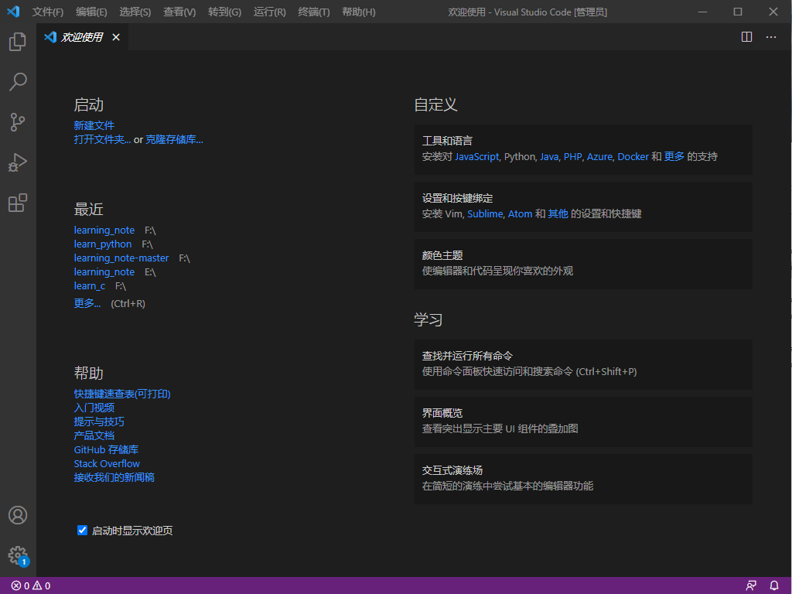
工作区(workbench)：一个工作区是一个独立的小窗口，是窗口下面的一个“小窗口”  
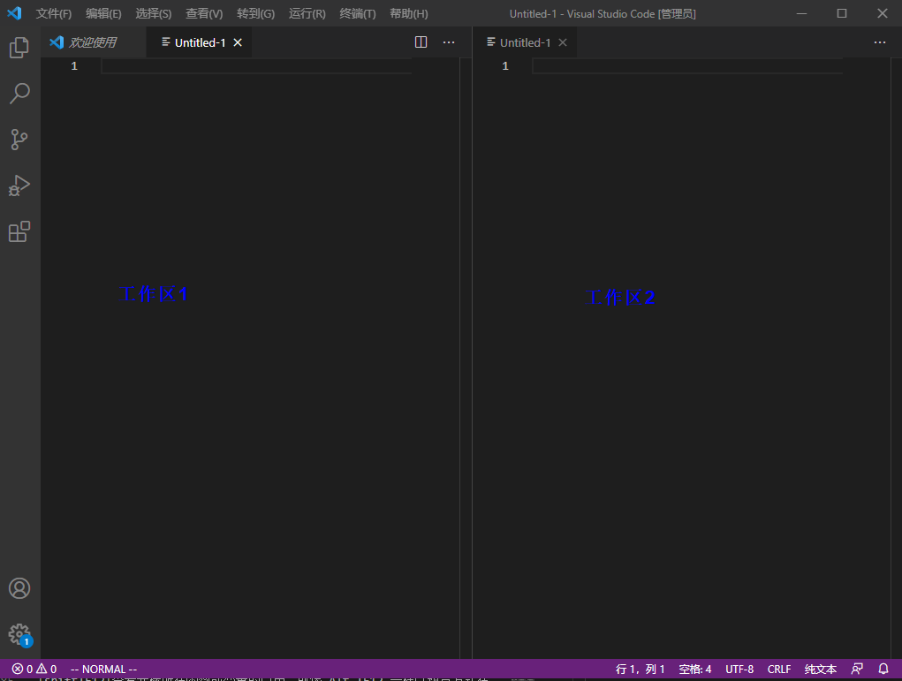
缓冲区(buffer)：一个工作区可以有很多个小缓冲区，类似于vim中的标签(tag)  
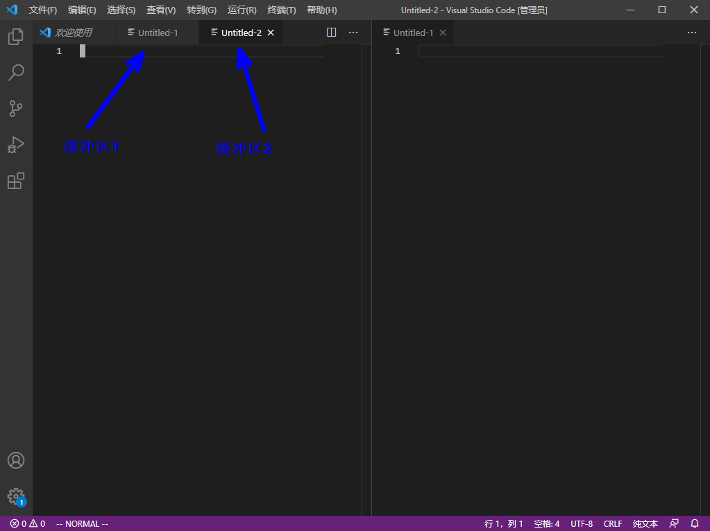
控制台(console)：显示调试软件时的输出  
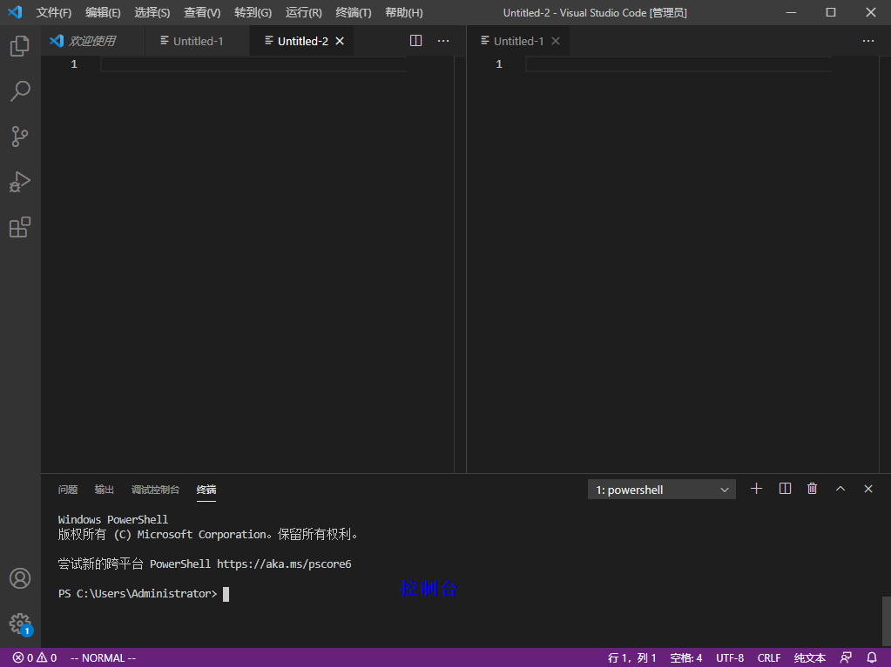

### 常用快捷键  

**工作区：**  
|快捷键|作用|备注|
|--|--|--|
|ctrl+shift+p|打开VsCode命令窗口。在这个窗口下输入插件名称就能知道这个插件支持哪些特性了，顺带还会说明特性快捷键。|vscode的控制中心|
|ctrl+\ |新建一个工作区(在当前窗口的右侧)|抄代码利器  |
|ctrl+b |显示/隐藏侧边栏|  |
|ctrl+1、2... |切换工作区|  |
|ctrl+j |显示/隐藏控制台|  |
|ctrl+shift+n |重新打开一个软件的窗口|类似于游戏多开  |
|ctrl+shift+w |关闭软件的当前窗口||
|ctrl+n |新建文件||
|ctrl+w |关闭当前文件||
|alt+F12|以预览方式在当前页面显示定义，都是查看定义，相对F12的优点是不会跳出当前文件到定义文件，而是在当前文件打开一个小窗口预览|  |
|shift+F12|查看光标所在函数或变量的引用，就像 Alt +F12 一样以预览方式在当前文件打开引用的文件列表。|  |
|ctrl+shift+o|查看当前文件的符号，可以用关键字过滤符号，当然你也可以在左侧的大纲视图中查找符号，不过大纲视图不能查找匹配符号，所以我更习惯用快捷键方式查找符号。|  |

**跳转操作：**  
|快捷键|作用|备注|
|--|--|--|
|ctrl+tab|在一个工作的不同缓冲区之间跳转|  |
|ctrl+pagedown/pageup|在一个工作的不同缓冲区之间跳转|  |
|ctrl+shift+o|在当前文件的不同**方法**之间进行跳转|  |
|ctrl+g|跳转到指定行|  |
|ctrl+shift+\ |跳转到指定的括号|超级方便，可以从左括号直接跳转到右括号  |
|F12|跳转到定义，跳转到函数或符号的定义。|  |

**移动光标：**  
|快捷键|作用|备注|
|--|--|--|
|ctrl+ 左右方向键|在单词之间移动|类似vim的w\e\b  |
|fn+←或→|整行之间移动|  |
|fn+←(或win+←)|将光标定位到当前行的最左侧|  |
|fn+→(或win+→)|将光标定位到当前行的最右侧|  |
|ctrl+home|将光标定位到当前文件的第一行|  |
|ctrl+end|将光标定位到当前行的最后一行|  |
|alt+左/右箭头|前进或者后退到光标所在源码的上一个位置。|  |

**编辑操作：**  
|快捷键|作用|备注|
|--|--|--|
|ctrl+enter|在当前行的下方新增一行，然后跳至该行|即使光标不在行尾，也可以快速向下插入新行  |
|ctrl+shift+enter|在当前行的上方新增(插入)一行||
|alt+↑/↓|将光标所在行向上/下移动||
|alt+shift+↑/↓|将光标所在行向上/下复制||
|ctrl+F2|多光标编辑，选中光标所在位置的单词，然后编辑|常用于大规模修改变量名等  |
|alt+鼠标左键点击任意位置|在任意位置设置多光标编辑点|  |
|ctrl+alt+上下键|在连续的多列上同时出现光标|  |
|ctrl+[|移动代码块(向左移动)|在python中非常常用 |
|ctrl+]|移动代码块(向右移动)| |

**删除操作：**   
|快捷键|作用|备注|
|--|--|--|
|ctrl+shift+k|删除整行| |
|ctrl+backspce|删除光标之前的一个单词| |
|ctrl+delete|删除光标之后的一个单词| |

**编程相关：**  
|快捷键|作用|备注|
|--|--|--|
|ctrl+/|添加单行注释| |
|alt+shift+f|代码格式化| |
|F2|以重构的方式进行重命名| |
|ctrl+u|将光标的移动回退到上一个位置| |

**搜索相关：**  
|快捷键|作用|备注|
|--|--|--|
|ctrl+shift+f|全局搜索代码| |
|ctrl+f|在当前文件中搜索代码，光标在搜索框中| |
|F3|在当前文件中搜索代码，光标仍停留在编辑区| |
|ctrl+p|文件查找，快速打开文件列表，输入关键字匹配文件，优先显示最新打开过的文件，方便的在指定文件之间跳转。 |  |

**自定义快捷键**  
方法一：(推荐)
1. ctrl+shift+p打开命令面板
2. 输入`键盘快捷方式`
3. 选择`首选项：打开键盘快捷方式`
方法二：
1. 点击左下角齿轮图标
2. 点击`键盘快捷方式`按钮

附：[快捷键官方速查表](https://code.visualstudio.com/shortcuts/keyboard-shortcuts-windows.pdf)

### 常用设置

设置使用命令面板功能更加高效，即ctrl+shift+p  
设置方法：  
1. 打开功能面板：ctrl+shift+P   
2. 输入：settings
   + 首选项：打开设置(ui)  --> 通过图形界面来设置
   + 首选项：打开设置(json) --> 通过json文件来设置
3. 搜索框内输入需要的搜索的内容
4. 可以选择在json中打开，自行手动输入设置
   
常用设置：
1. 显示相对行号：`linenumbers:relative`
vim插件中根据相对行号跳转  
`:.+n` # +号表示向下跳转n行   
`:.-n` # -号表示向下跳转n行  
2. 设置git路径
3. 设置python相关的一些路径
4. 大小写转换：选中需要转换的文本，打开命令面板，输入transform 

### VSCODE远程开发//TODO

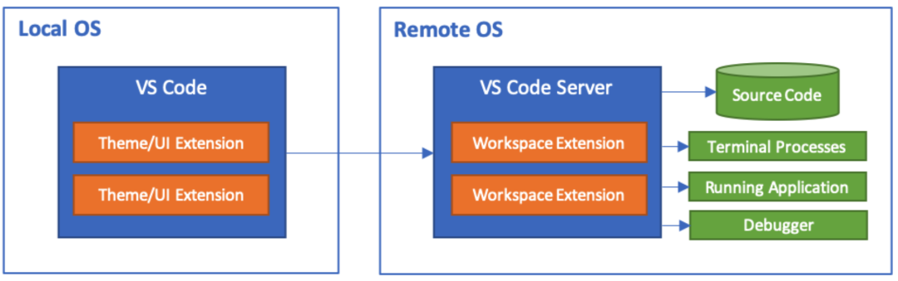

Local OS是 Win10 ,  Remote OS 是 Linux云主机。
远程开发本地 VS Code 用 SSH 协议与远程服务端通信，所以要先配置SSH环境变量，
由于Git自带SSH客户端程序

    [SSH程序](image/ssh程序.png)

配置GIT的环境变量，即将git的的bin目录添加到系统的环境变量中

    [环境变量](image/环境变量.png)

安装远程开发插件：
    vscode有一个远程开发插件包，包括了：

    Remote - SSH - 通过使用 SSH 链接虚拟或者实体Linux主机。
    Remote - Containers – 连接 Docker 开发容器。
    Remote - WSL - 连接 Windows Subsystem for Linux （Linux子系统）。

    打开软件的扩展界面，搜索 Remote 开头的插件，也能看到这三个的不同远程开发插件，
    我们这里连接的是云主机，选择安装 Remote - SSH 插件安装即可。


### 插件推荐  

vscode受欢迎的一个重要因素就是其强大的可扩展性和插件市场，你可以自己定制自己的插件，也可以在插件市场中找到其他人写好的插件，一键安装，即装即用。  

#### 插件推荐-源码阅读插件

**插件名称：Todo Tree**  
使用方法：这个插件的使用场景是，你看完代码加了下面这个注释 ：
// TODO 
以后会扩展这部分功能当然，不知道这个「以后」是什么时候，一不小心以后变成遥遥无期，
一部分原因是不想改，另一部分原因是写下这段注释的人时间久了就忘记了，这时候你需要
「 TODO Tree 插件」，我们可以更方便的管理代码中的此类注释。
这个插件能帮你组织和管理TODO注释，你在代码中注释的带 TODO 的标签会统一在侧边栏显示出来，
当然不限于 TODO 注释，可以自定义管理标签比如 FIXME 等，可以基于标签过滤和筛选。

**插件名称：Bookmarks**  
使用方法：「书签」这个插件的功能就和它名字一样直接，没错它就是一个你的源码书签，
当我们看大工程源码的时候，往往需要在成千上万个源文件之间跳转，此外， Bookmarks 
能帮你方便的创建和管理书签，看到哪个位置想加个书签就按
快捷键 Ctrl + Alt + K ，多按一次就是删除，
不仅如此他还提供了在书签之前跳跃和查看管理的功能，更多功能可以自己体验，反正我看
大工程源码用这个很爽。

#### GIT相关

*插件名称：Git Graph*
使用方法：提交记录变成一条条时间线，分支也能清晰的用不同颜色时间线区分出来，并且点开
提交线上的提交点可以查看当时的提交动作，可以在提交动作上查看做了哪些改动，也可以方便
的跳转到改动文件，更多功能自行体验。

*插件名称：GitLens*
使用方法：它可以在文件中改动的位置后面直接显示出本次改动的提交信息，然后你可以直接通过
显示的提交信息跳转到提交文件对比，其实还有其他丰富的功能。

#### 其他

*插件名称：BracketPairColorizer*
使用方法：这个插件让每一个括号都能找到他自己的颜色，成双成对，点一下其中一半括号自动
匹配另一半，拯救了广大程序员的近视眼睛度数。

*插件名称：koroFileHeader*
使用方法：用于自动的插入头文件开头的说明和函数的说明。安装插件之后你只需要简单配置想要的格式，
然后按下
快捷键Ctrl + Alt +i
即可自动即可自动生成这样一个模板。
类似的对函数的说明注释模板，只需按下
快捷键Ctrl + Alt +t
即可完成，非常的方便。

*插件名称：shellman*
使用方法：在 Linux 下工作难免随手写一个脚本，这个插件能提供了便捷的shell script 自动补全
和联想等功能，提高你的脚本编写速度和准确性。
   
#### 插件推荐-python相关

1. 右键-提取方法自动生成函数 
2. 安装yapf:代码重构 
pip install yapf
3. 安装好之后可以使用,在图形化配置中启用yapf
快捷键:alt+shift+f 

插件
4. autoDocstring:快速生成结构化的文档注释
5. 快捷键：ctrl+shift+2 

#### 插件推荐-C/C++

*插件名称：Switcher*
使用方法：我们经常需要通过头文件跳到对应的源文件，或者从源文件跳转到对应的头文件，
当然可以在侧边栏的文件管理器中选择打开，但是多了一个步骤有点繁琐，所以我找了这个插件，
其实按插件的说明文档，它是能在不同的文件类型之间跳转，不仅仅局限于头文件和源文件，
懒人福音，你值得拥有。

# 计算机基础

1. 计算机三大核心硬件：CPU 内存 硬盘 
2. 应用程序与操作系统
+ 应用程序实现功能
+ 操作系统控制硬件

应用程序通过调用操作系统的功能来控制硬件

所有软件都是运行在硬件之上的，重点三大硬件：CPU--内存--硬盘
1. 软件运行之前都是存放在硬盘内，以二进制形式存放
2. 任何软件的启动都是将数据从硬盘中读入内存，然后CPU从内存中取出指令并执行
3. 软件运行过程中产生的数据都是存放于内存中，若想永久保存软件产生的数据，则需将数据由内存存入硬盘

# Python的解释器及注释

Python是一门解释性语言，它的运行要靠解释器来完成。  
什么是解释器？  
简单的讲，解释器就是把代码解释给cpu，告诉cpu这个代码该如何运行。   
任何一台计算机要想运行Python代码，就必须先安装解释器。如果你的代码中使用了第三方的库，你还需要在计算机中安装这个第三方库  

[解释器下载地址](https://www.python.org/)
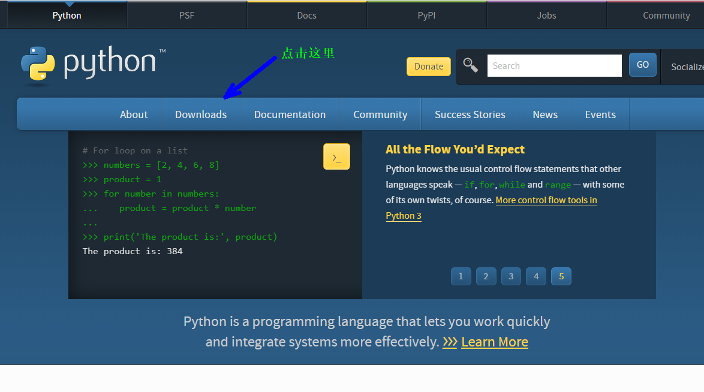
具体安装步骤：略

什么是注释？  
注释就是用来解释代码的，但是在实际运行过程中，解释器会忽略掉注释内容不执行  

添加注释的方法：  
1. 单行注释“#”，多用于解释单行代码，或者注释掉某行代码来测试代码
```
print('这是一句话') # 用print()函数来打印
# print('这是里另一句话')  此行代码不执行
```
2. 多行注释(双引号)："""注释内容"""
3. 多行注释(单引号)：'''注释内容'''

多行注释通常用于解释一个函数、一个对象的具体功能，也用于整个代码文件的开头来简要介绍这个文件   

以下是注释在编辑器中的样子，编辑器或者IDE都会给注释加上不同的颜色    
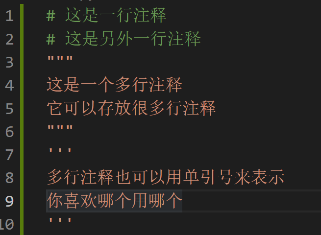

## 如何运行Python代码？  

运行一个python程序通常有两种方法：  
1. 交互式解释器
2. 在编辑器中写好代码，以.py后缀名来命名文件，然后调用python命令来执行

**我们先来看看第一点，在交互式解释器中运行代码：**  
首先按下win键+r键，打开`运行`对话框，输入cmd或者powershell都可以   

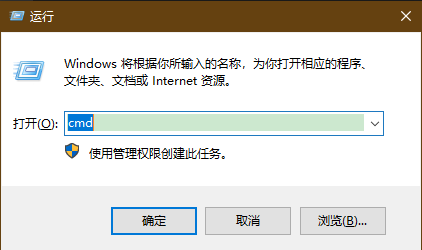

然后就有以下对话框：   
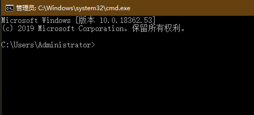   
输入`python`后，按下回车键即可：   
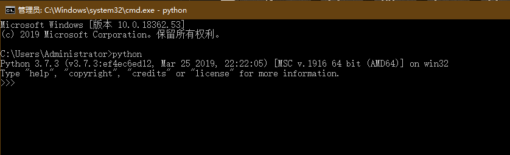
以上还标注了python的版本，可以看到，我的python版本是Python 3.7.3  
最新已经到3.9啦，加入了很多新特性，但是基本的方法是不会变的  
  
这里顺便提以下，Python3是一个大的版本，在这之前还有Python2和Python1.0，大的版本之间语法是不兼容的   
也就是说，你用Python2的解释器是无法运行python3的代码的，它们之间的语法也是有差异的   
python2已经面临淘汰，所以，我们都应当下载python3的解释器来使用，并且学习python3的语法    

在>>>后面输入以下内容`3 ** 2`，然后按下回车  
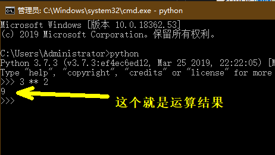    
再来一个复杂一点的，按照以下内容输入   
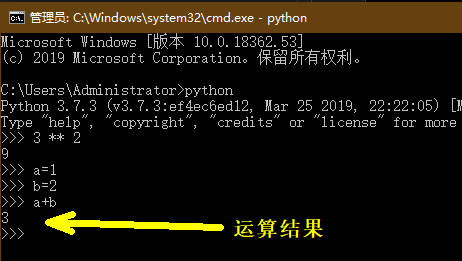

这里的a和b就称为变量，关于变量我们下面会详细讲解   
好了，输入`exit()`即可退出python解释器，不要忘记最后的括号      
这种在命令行中使用的解释器又叫做交互式解释器，可以快速查看一些简单功能的运行结果  

**下面在编辑器中编写并运行代码：**   
首先要新建一个.py的文件   
输入图中的代码，然后按F5键运行，在下面的终端查看运行的结果  
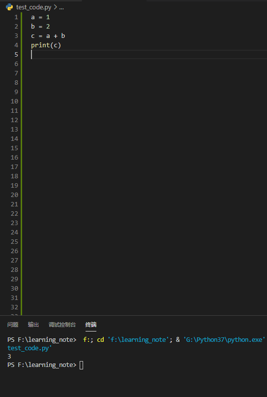  

在这里，你就必须用print()函数把变量c打印出来，如果不用print()函数你是看不到结果的  
这里，我们接触到了第一个函数，就是print()函数，它的功能就是把括号内的内容输出到终端上   

什么是函数呢？  
函数的英文是function，我们可以用词典查一下，这个单词还有一个意思，就是功能   
所以，函数就是功能，就是完成某一个具体任务的功能  
print()的功能就是输出到终端     
至于为什么总是要带着括号，我们在函数一节详细讲解   

# 变量

变量就是可以变化的量，量指的是事物的状态，比如人的年龄、性别，游戏角色的等级、金钱等等   
更抽象一点：变量是一个容器，专门用于盛放数据。  
一个经典的形容：变量是一个小火车，每一节车厢都放着数据。  
变量有类型之分，不同的火车厢放不同的货物，有的可以放集装箱，有的放煤，有的则是载客   
**Python是一种弱类型的语言，在使用变量的时候不需要先规定好变量的种类。**  
          
变量的使用原则：先定义，后使用
```
name = 'xxx' # 定义变量，这个变量的名字是name
print(name)  # 取，使用这个变量
print(id(name)) # 函数id()获取变量的内存地址
l = ['a', name]
print(id(name))
print(id(l[1]))
```
           
定义变量的时候python解释器会向系统申请内存空间用于存放变量值

**变量有三大组成部分**         
1. 变量名：是指向等号右侧值的内存地址的，用来访问等号右侧的值
2. 赋值符号(=)：将变量值的内存地址绑定给变量名 
3. 变量值：代表记录的事物的状态

## 变量的命名规则  

1. 可以由数字、字母和下划线(_)组成，不可含有其他符号
2. 字母区分大小写，也就是变量a与变量A不同
3. 开始不可是数字，可以是下划线(_)和字母
4. 不可与内置关键字重复
   + 关键字：python解释器已经使用了，你不可以起重名的，如while, class, def

变量命名举例：
```
a = 1   # 合规
1a = 1  # 不合规
a1 = 1  # 合规
a_1 = 1 # 合规
_a1 = 1 # 合规
a!? = 1 # 不合规
while = 1 # 不合规，while是python的关键字
```

### **推荐的变量命名形式**  
pep8推荐的命名规范(Naming Conventions)  

python中使用的不同命名风格主要包含以下几种：
1. 驼峰式命名法(CamelCase)
2. 混合式命名法(mixedCase)
3. 大写(UPPERCASE) 或大写加下划线(UPPER_CASE_WITH_UNDERSCORES)
4. 前缀(_leading)和后缀(trailing _)下划线，有时是双下划线(__doubled)

变量名尽量小写, 如有多个单词，用下划线隔开

Names to Avoid 应避免的名字
永远不要使用字母‘l’（小写的L），‘O’（大写的O），或者‘I’（大写的I）作为单字符变量名。
在有些字体里，这些字符无法和数字0和1区分，如果想用‘l’，用‘L’代替。

以下作为了解，以后会用到，这里看一下知道即可   

**Package and Module Names 包名和模块名**  
模块应该用简短全小写的名字，如果为了提升可读性，下划线也是可以用的。Python包名也应该使用简短全小写的名字，但不建议用下划线。
当使用C或者C++编写了一个依赖于提供高级（更面向对象）接口的Python模块的扩展模块，这个C/C++模块需要一个下划线前缀（例如：_socket）

**Class Names 类名**
类名一般使用首字母大写的约定。
在接口被文档化并且主要被用于调用的情况下，可以使用函数的命名风格代替。
注意，对于内置的变量命名有一个单独的约定：大部分内置变量是单个单词（或者两个单词连接在一起），首字母大写的命名法只用于异常名或者内部的常量。

**Exception Names 异常名**  
因为异常一般都是类，所有类的命名方法在这里也适用。然而，你需要在异常名后面加上“Error”后缀（如果异常确实是一个错误）。

**Global Variable Names 全局变量名**  
（我们希望这一类变量只在模块内部使用。）约定和函数命名规则一样。
通过 from M import * 导入的模块应该使用all机制去防止内部的接口对外暴露，或者使用在全局变量前加下划线的方式（表明这些全局变量是模块内非公有）。

**Function Names 函数名**  
函数名应该小写，如果想提高可读性可以用下划线分隔。
大小写混合仅在为了兼容原来主要以大小写混合风格的情况下使用（比如 threading.py），保持向后兼容性。

**Function and method arguments 函数和方法参数**  
始终要将 self 作为实例方法的的第一个参数。
始终要将 cls 作为类静态方法的第一个参数。
如果函数的参数名和已有的关键词冲突，在最后加单一下划线比缩写或随意拼写更好。因此 class_ 比 clss 更好。（也许最好用同义词来避免这种冲突）

**Method Names and Instance Variables 方法名和实例变量**  
遵循这样的函数命名规则：使用下划线分隔小写单词以提高可读性。
在非共有方法和实例变量前使用单下划线。
通过双下划线前缀触发Python的命名转换规则来避免和子类的命名冲突。
Python通过类名对这些命名进行转换：如果类 Foo 有一个叫 __a 的成员变量， 它无法通过 Foo.__a 访问。（执着的用户可以通过 Foo._Foo__a 访问。）一般来说，前缀双下划线用来避免类中的属性命名与子类冲突的情况。
注意：关于__names的用法存在争论（见下文）。

**Constants 常量**   
常量通常定义在模块级，通过下划线分隔的全大写字母命名。例如：MAX_OVERFLOW和TOTAL。 

**关于PEP**   
python是一种格式严格，语法自由的语言，但是为了保证大家写的代码具有一定的可读性，统一规定了pep规范来告诉大家应该怎么写代码，用什么格式写代码，但是如果你完全不遵守它，也不会影响代码的运行，只是会影响你的代码的可读性。   
Guido(python之父，俗称龟叔)的一条重要的见解是代码阅读比写更加频繁。这里提供的指导原则主要用于提升代码的可读性，使得在大量的Python代码中保持一致。就像PEP 20提到的，“Readability counts”。   
这是一份关于一致性的风格指南。这份风格指南的风格一致性是非常重要的。更重要的是项目的风格一致性。在一个模块或函数的风格一致性是最重要的。   
然而，应该知道什么时候应该不一致，有时候编码规范的建议并不适用。当存在模棱两可的情况时，使用自己的判断。看看其他的示例再决定哪一种是最好的，不要羞于发问。   
特别是不要为了遵守PEP约定而破坏兼容性！   

几个很好的理由去忽略特定的规则：
+ 当遵循这份指南之后代码的可读性变差，甚至是遵循PEP规范的人也觉得可读性差。
+ 与周围的代码保持一致（也可能出于历史原因），尽管这也是清理他人混乱（真正的Xtreme Programming风格）的一个机会。
+ 有问题的代码出现在发现编码规范之前，而且也没有充足的理由去修改他们。
+ 当代码需要兼容不支持编码规范建议的老版本Python。
          
## 变量的基本类型

在Python中，有如下8种基本变量：  
1. int型：整数类型，如1、2、3、4等等      
   + 形式：`a = 1`
2. float型：浮点数，如1.0、2.2、3.3等等，小数点后边的位数称为精度，位数越多精度越高
   + 形式：`a = 1.0`
3. str型：字符串型，如"abc"、"123"等等，字符串类型都需要单/双引号括起来，即使是数字在引号内也是字符串型
   + 形式：`a = 'abc'`
4. 列表(list)：一串数据的合集，有序，计数从0开始而不是1；可列表嵌套使用
   + 形式：`a = ['abc', 2, "cde"]`
5. 字典(dict)：key值位置，且key值必须为不可变类型，即不可使用容器类型
   + 形式：`a = {a:1, b:2, c:"abc"}`
6. 元组(tuple)：不可变的列表
   + 形式：`a = (1, 2, 3, 4)`
7. 集合(set)：无序，元素不重复的列表
   + 形式：`a = {1, 2, 3, 4}`
8. 布尔值(bool)：只有两个值，True和Falsfe，主要用于条件判断
   + 形式：`a = True`
可以用函数type()来查看一个变量的类型  
```
a = 1
print(type(a))
===> <class 'int'>
```
注：在本文代码中，用`===> `表示输出结果，下同   
如果直接`type(a)`是看不到结果了，需要用print函数来把type函数的返回值打印到终端   
这里返回值的概念会在函数一节详细描述，这里先记住，要想在控制台看到输出结果，就要用到print()函数     

**可变类型与不可变类型**  

列表与字典：本身并不存放值，存放的是索引与内容的对应关系，每个索引对应一个内存地址。   
或者说，列表存放的是值的地址。
```
name = 'xxx'
l = ['a', name]
name = 'yyy'
print(l[1])
==> xxx
```
可以看到l[1]的值是'xxx'，因为值'xxx'在内存中的地址没有变，给name重新赋值，只是改变了name这个变量与'xxx'的绑定关系  
l[1]依然指向值'xxx'的内存地址，与变量名无关        
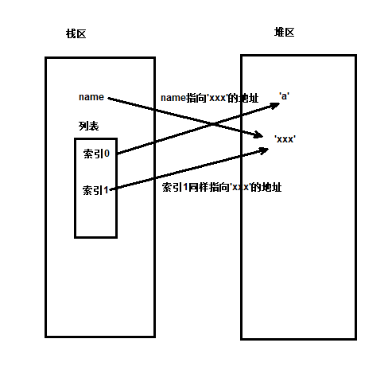  
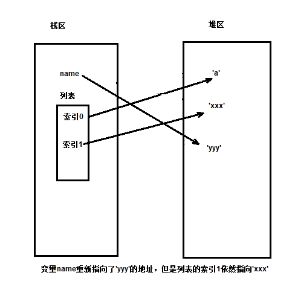  
字典：key对应内存地址

可变类型：值改变，id不变，证明改的是原值，证明原值是可以被改变的      
小结：list、dict是可变类型      

不可变类型：值改变，id也变了，证明是产生新的值，压根没有改变原值，证明原值是不可以被修改的  
小结：bool、int、float、str都被设计成了不可分割的整体，不能够被改变

## 基本类型的内置方法

什么是方法(method)？  
方法本质上是函数，代表一种功能  
方法一词来源于面向对象，在python中基本类型也是一种对象  
函数在对象中，就称为方法，这一点在面向对象一章中会详解，这里了解即可  

内置方法就是python帮你写好的方法，可以直接使用而不需要再去单独写这项功能  
基本类型的方法：python针对基本类型，内置的一些功能，可以更方便的达到一些操作数据的目的     

### 数字类型

1. 类型转换：       
纯数字类型的字符串(str型)可以转换成int类型  
`res = int('100000')`  
2. 进制转换(进制问题请参看note_of_computer)：       
十进制--> 二进制：11 -> 1011     
二进制 --> 十进制：1011 -> 8 + 2 + 1 = 11      
`print(bin(11))`     
十进制--》八进制     
`print(oct(11))`      
十进制--》十六进制      
`print(hex(11))`      
二进制->10进制      
`print(int('0b1011',2)) # 11 二进制前缀0b`      
二进制->8进制     
`print(int('0o13',8)) # 11 八进制前缀0o`      
二进制->16进制       
`print(int('0xb',16)) # 11 十六进制前缀0x`       
float类型转换成十进制会被截断，只保留整数部分，不是四舍五入       

### 字符串类型

str()函数可以把任意其他类型都转成字符串  
字符串类型类似于列表，可以按索引取值       
`msg='hello world'`      
正向取      
`print(msg[0])`   
`print(msg[5])`  
反向取    
`print(msg[-1])`     

**只能取，不能改**      
`msg[0]='H'`     
报错：TypeError      
*所以，字符串类型只是类似于列表，但不是列表，该类型是不可变类型*        
 
**切片：取出长字符串的一部分**    
`msg = 'hello world`    
`res = msg[0:5]   # 顾头不顾尾`    
`res = msg[0:5:2] # 步长：间隔数`      
`res = msg[5:0:-1] # 反向步长`       
`res = msg[:] # res = msg[0:11]`      
`res = msg[::-1] # 把字符串倒过来`     
      
**求长度：len()函数**     
`msg = 'hello world`  
`print(len(msg))`   

**成员运算**      
判断一个子字符串是否存在于一个大字符串中

    print("alex" in "alex is sb")       
    print("alex" not in "alex is sb")
    print(not "alex" in "alex is sb") # 不推荐使用

**去除-->strip方法**      
默认去掉的是空白字符 --> 空白字符包括\n, \t, 空格等        

    msg='      egon      '
    res=msg.strip()
    print(msg) # 不会改变原值
    print(res) # 是产生了新值

也可以指定去除的字符，将字符串中所有的符合要求的字符去除

    msg = 'abcdefga'
    print(msg.strip('a'))  # 所有的a将被去掉
    ==> bcdefg

了解：strip只去两边，不去中间

    msg = 'abcaaaadefga'
    print(msg.strip('a'))

*lstrip/rstrip指定去除左边/右边*

**分割：split()方法** 

分割字符串，分割后的结果为列表，*默认分隔符是空格*     

    info='lilei 18 male'
    res=info.split()
    print(res) 

指定分隔符

    info='egon:18:male'
    res=info.split(':')
    print(res) 

指定分隔次数(了解)

    info='egon:18:male'
    res=info.split(':',1)
    print(res)

**循环：取出每一个字符**  

    info='egon:18:male'
    for x in info:
        print(x)

**字符串拼接**    
方法一：加法  

    a = 'lilei'
    b = 'hanmeimei
    print(a + b)

方法二：join方法   
把列表拼接成字符串，或在字符串中添加字符     
该方法的参数为字符串或列表    
在*每个字符*后添加一个字符    

    str1 = 'abc'
    res = '+'.join(str1)
    print(res)

用join方法要求列表内的元素必须全为字符串类型，否则报类型错误。     
字符串中间添加字符  

    l = ['a', 'b', 'c']
    l1 = ":".join(l)
    l2 = "".join(l)
    print(l1)
    print(l2)

简单地讲，join方法就是把.join()点号前面的内容加入到括号内的内容。   

**字符串其他常用方法**  
乘法：多次打印

    msg = "hello World"
    print(msg * 3)

upper/lower方法：改变大小写

    print(msg.upper())
    print(msg.lower())

capitalize方法：首字母大写

    print(msg.capitalize())

startswith,endswith方法：判断首尾是否存在某字符串

    print("lilei is a student".startswith("lilei"))
    print("lilei is student".endswith('student'))

replace方法：后面的参数替换前面的参数  

    msg="you can you up no can no bb"
    print(msg.replace("you","YOU",))   # 前一个参数是原字符串内容，后一个参数是替换内容
    print(msg.replace("you","YOU",1))  # 指定替换次数

isdigit:判断字符串是否由纯数字组成

    print('123'.isdigit())
    print('12.3'.isdigit())

find,rfind,index,rindex方法

    msg='hello lilei hello hanmeimei'
    # 找到返回起始索引
    print(msg.find('i')) # 返回要查找的字符串在大字符串中的起始索引
    print(msg.find('lilei'))
    print(msg.index('i'))
    print(msg.index('lilei'))

    # 找不到
    print(msg.find('xxx')) # 返回-1，代表找不到，常用
    print(msg.index('xxx')) # 抛出异常

count方法:统计

    msg='hello lilei hello hanmeimei, lilei'
    print(msg.count('lilei'))

center,ljust,rjust,zfill方法，zfill中的z代表zero：这些方法是调整输出格式的方法   
两个参数：第一个是宽度，第二个是填充的字符，即原字符不够宽度，剩下的用什么来补上  

    print('lilei'.center(50,'*')) # 指定宽度为50，居中，并用*填充
    print('lilei'.ljust(50,'*'))  # 指定宽度为50，左对齐，并用*填充
    print('lilei'.rjust(50,'*'))  # 指定宽度为50，右对齐，并用*填充
    print('lilei'.zfill(10))      # 指定宽度为10，右对齐，默认用0填充

expandtabs方法:指定\t的空格数

    msg='hello\tworld'
    print(msg.expandtabs(2)) # 设置制表符代表的空格数为2

swapcase,title方法

    print("Hello Ada Lovelace".swapcase()) # 大小写反转
    print("hello ada lovelace".title())  # 按照标题样式，首字母大写，以空格作为单词的分割

is数字系列：主要用于判断

    print('abc'.islower())
    print('ABC'.isupper())
    print('Hello World'.istitle())
    print('123123aadsf'.isalnum()) # 字符串由字母或数字组成结果为True
    print('ad'.isalpha()) # 字符串由由字母组成结果为True
    print('     '.isspace()) # 字符串由空格组成结果为True
    print('print'.isidentifier())
    print('age_of_egon'.isidentifier())
    print('1age_of_egon'.isidentifier())

isdigit只能识别：num1、num2

    num1=b'4' #bytes
    num2=u'4' #unicode,python3中无需加u就是unicode
    num3='四' #中文数字
    num4='Ⅳ' #罗马数字
    print(num1.isdigit()) # True
    print(num2.isdigit()) # True
    print(num3.isdigit()) # False
    print(num4.isdigit()) # False

isnumberic可以识别：num2、num3、num4

    print(num2.isnumeric()) # True
    print(num3.isnumeric()) # True
    print(num4.isnumeric()) # True

isdecimal只能识别：num2

    print(num2.isdecimal()) # True
    print(num3.isdecimal()) # False
    print(num4.isdecimal()) # False

### 列表类型

取索引、切片、求长度、成员运算in和not in   

类型转换：但凡能够被for循环遍历的类型都可以当做参数传给list()转成列表   
`res = list('hello')`    
`print(res) # 一个由字符组成的列表`      
        
`res = list({'k1':111, 'k2':333, 'k3':333})`     
`print(res) # 取出key并组成列表`       

**取元素**  
基本形式：变量名[下标]  
下标从0开始，即下标是1就是取列表中的第二个元素  
如果下标不存在，则报错  
另外，下标必须是整数，输入小数也报错     
```
res = list(range(10)) # [0, 1, 2, 3, 4, 5, 6, 7, 8, 9]
print(res[1])
===> 1
print(res[10])
===> IndexError:报错
print(res[1.5])
===> IndexError
```

**增加元素**      
1. append方法：在列表最后添加，需要一个参数     
```
l = [111, 222, 333]
l.append('aaa')
```

2. insert方法：需要两个参数，第一个表示插入的位置，第二个是插入的内容
```
l = [111, 222, 333]
l.insert(0, 'aaa')
```

3. extend方法：可以把一个列表中的所有元素添加到另一个列表中，在目标列表的后面
append和insert方法不可以合并两个列表，只会把一个列表当做一个元素添加进另一个列表中  
```
l1 = [111, 222, 333]
l2 = ['aaa', 'bbb']
# l1.append(l2)
# print(l1)
# l1.insert(0, l2)
# print(l1)
l1.extend(l2)
print(l1)
```

**删除元素**
1. del方法:通用删除方法，无返回值
```
l = ['111', 222, 'aaa']
del l[1]
```

2. pop方法:依据索引删除，默认最后一个元素，返回值为被删除的元素
```
l = ['111', 222, 'aaa']
a = l.pop()
l.pop(0)
```

3. remove方法:依据元素删除，返回none
```
l = ['111', 222, 'aaa']
l.remove('111')
```

**切片：取出列表中的部分元素**   
切片就是只需要列表中的一部分元素，而不是所有的元素   
```
mls = list(range(10))  # mls = [0, 1, 2, 3, 4, 5, 6, 7, 8, 9]
print(mls[1:4])        # [1:4]就是指定下标的范围，结果===> [1, 2, 3]
print(mls[1:4:2])      # 指定了步长，就是隔1个数取一个，结果===> [1, 3]
print(mls[-5:-1])      # 负数表示反向取，就是倒数第五个取到倒数第一个，结果===> [5, 6, 7, 8]
print(mls[-1:-5:-1])   # 反向取，这里的步长是-1，则表示倒序，结果===> [9, 8, 7, 6]
# 切片是左开右闭区间，即取到左索引，右索引取不到

pirnt(mls[:2])      #[0, 1]，起始下标缺省，默认为0，等价于mls[0:2]
pirnt(mls[2:])      #[2, 3, 4, 5, 6, 7, 8, 9]，终止下标缺省，默认为n=len(mls)，等价于mls[2:n]
pirnt(mls[:])       #[0, 1, 2, 3, 4, 5, 6, 7, 8, 9]，起始和终止下标均缺省，等价于mls[0:n]
pirnt(mls[:2:-1])   #[9, 8, 7, 6, 5, 4, 3]，步长为负数时，起始下标缺省，默认为-1，等价于mls[-1:2:-1]
pirnt(mls[2::-1])   #[2, 1, 0]，步长为负数时，终止下标缺省，默认为-n-1，等价于mls[2:-n-1:-1]
pirnt(mls[::-1])    #[9, 8, 7, 6, 5, 4, 3, 2, 1, 0]，步长为负数，起始和终止下标均缺省，默认为mls[-1:-n-1:-1]
```
总结来说，就是步长为正数时，首末缺省下标分别是0和n；步长为负时，首末缺省下标分别是-1和-n-1。    
特别地，当步长为-1、首末下标均缺省时，效果等价于lyst.reverse()或者reversed(mls)，但具体功能有区别：   
```
mls = list(range(10))
print(mls[::-1])   # 输出[9, 8, 7, 6, 5, 4, 3, 2, 1, 0]，只是输出逆序结果，mls本身不变
mls.reverse()      # 对列表的inplace操作，无返回值，但执行后mls变为[9, 8, 7, 6, 5, 4, 3, 2, 1, 0]
print(mls)         # 列表被改变
reversed(mls)      # mls列表不变，返回逆序结果，但返回的是一个迭代器对象
```
注意：步长索引不能为0，且也必须是整数  
在切片过程中的索引超过范围，不会报错，返回空列表  
`print(mls[10:])`  

对于单索引的赋值，要求索引必须在合格范围之内，否则报错   
但对于切片的赋值则"无需"考虑索引是否合法，甚至无需考虑赋值长度是否匹配   
```
a = [1,2,3,4,5]
b = [5,6]
a[8] = 8       # IndexError: list assignment index out of range
a[-8] = 8      # IndexError: list assignment index out of range
a[8:] = b      # 执行后，a为[1, 2, 3, 4, 5, 5, 6]
a[-8:-6] = b   # 执行后，a为[5, 6, 1, 2, 3, 4, 5]，注意这里限定了赋值区间首末
a[-8:-10] = b  # 执行后，a也是[5, 6, 1, 2, 3, 4, 5]，即便限定的区间实际上为空
a[-8:] = b     # 执行后，a为[5, 6]，因为a的赋值区间未限定长度，而赋值起始索引在a起始之前，所以整体都给覆盖了
```
由于对超出列表长度的索引位置进行切片赋值会直接拼接，所以这个操作相当于列表的extend()方法

**其他常用操作**    
1. find/index/count用法同str类型，注意find不报错，index报错即可
2. clear方法：清空列表
3. reverse方法：倒序排列列表，原列表被改变  
4. sort方法：排序，要求列表内的元素必须相同，原列表不会被该表
默认升序，可以传入参数（reverse=True）--> 降序

### 元组类型

同列表一样是有序的，但是只能读取不能改       
元组中也存放的是内存地址    

如果元组中只有一个元素，必须加逗号     
`t=(10,)     `

**类型转换**
```
print(tuple('hello'))  # 变成一个由单个字符组成的元组
print(tuple([1,2,3]))
print(tuple({'a1':111,'a2':333}))  # 只取键组成元组
```

取索引、切片、求长度（len）、循环等操作同列表   

### 字典类型

{}内用逗号分隔开多个key：value，其中value可以使任意类型，但是key必须是不可变类型,且不能重复    
本质上，字典的key是value地址的别名，字典也是存放地址的容器。    

定义字典：   
方法一：直接定义
```
d={'k1':111,(1,2,3):222} # d=dict(...)
print(d['k1'])   # 字典的取值依据键，不同于列表、字符串的索引
print(d[(1,2,3)])
print(type(d))

d={} # 默认定义出来的是空字典
print(d,type(d))
```

方法二：dict函数
```
d=dict(x=1,y=2,z=3)
print(d,type(d))
```

方法三：类型转换
```
l1 = [
    ['aaa', 'bbb'],
    ('ccc', 'ddd'),
    ['eee', 'fff']
]
# 如果以上列表不是成对出现就会报错，ValueError
d1 = dict(l1)
print(d1) 
```

方法四：字典的fromkeys方法
```
l1 = ['aaa', 'bbb', 'ccc']
d1 = {}.fromkeys(l1, None)  # None是设定的默认值，可以换成其他的
print(d1)
>> {'aaa': None, 'bbb': None, 'ccc': None}
# 第一个参数l1是字典的key，第二个参数是value
# 本质上讲，fromkeys方法就是列表转换成字典的方法
# 它从列表中取出成对元素并转换成字典的键值对
```

**取、改、增**
```
dic1 = {
    'a':1111,
    'b':2222,
    'c':3333
}
print(dic1['a']) # 取，不存在报错
print(dic1.get('a')) # 取，不存在返回none，不报错，所以取值常用get方法
dic1['a'] = 4444 # 改
dic1['d'] = 5555 # 增，改一个不存在的key即增加
```

**删**   
1. 通用删del
2. pop方法：传入key作为参数，返回被删除key的value值
3. popitem方法：随机删除，返回元组

**循环取值的结果：**
```
d={'k1':111,'k2':2222}
# 取key方法一：
for k in d.keys():
    print(k)
# 取key方法二：
for k in d:
    print(k)
# 取value
for v in d.values():
    print(v)
# 取key和value
for k,v in d.items():
    print(k,v)

print(list(d.keys()))
print(list(d.values()))
print(list(d.items()))   # key-value组成的元组
```

**字典的其他常用方法**
1. clear:清空字典
2. update:更新字典-->如果key存在，则更改值，如果不存在则新增值
3. setdefault:如果key有则不添加,返回字典中key对应的值;如果key没有则添加，返回字典中key对应的值
4. 求长度len():结果为字典中key的数量
5. 成员运算in和not in：依据key是否存在,值存在没有用
  
### 集合类型

定义: 在{}内用逗号分隔开多个元素，多个元素满足以下三个条件:
1. 集合内元素必须为不可变类型
2. 集合内元素无序-->把一个set转换成list，无法保证顺序
3. 集合内元素没有重复

定义空集合：

    s = set()  # 这个是空集合
    s = {}     # 这个是空字典

求长度、成员运算、循环同其他可变类型

类型转换
```
set({1,2,3})
res=set('hellolllll')
print(res)

print(set([1,1,1,1,1,1]))
print(set([1,1,1,1,1,1,[11,222]]) # 报错，内有可变类型

print(set({'k1':1,'k2':2}))  # 取出key，组成集合
```

**内置方法**    
`animals = {"dog", "cat", "chicken", "duck"}`    
`animalss = {"fish", "cow", "chicken", "duck"}`   

1. 取交集：     
`res = animals & animalss`    
`print(res)`    
`print(animals.intersection(animalss))`

2. 取并集：   
`print(animals | animalss)`    
`print(animals.union(animalss))`    

3. 取差集：animals独有的元素    
`print(animals - animalss)`    
`print(animals.difference(animalss))`     

4. 取对称差集：求两个集合独有的（即交集的补集）  
`print(animals ^ animalss)`   
`print(animals.symmetric_difference(animalss))`   

5. 判断是否父子集：即是否包含   
`print(animals > animalss) # 不存在包含关系，结果false`   
`print(animals < animalss) # 不存在包含关系，结果false`   
`print(animals.issuperset(animalss)) `   
`print(animalss.issuperset(animals)) `   

6. 判断是否有交集：   
`res = animals.isdisjoint(animalss) # 完全无相同元素则返回True`

7. 删除元素
```
s = {1, 2, 3, 4}
s.discard(5) # 删除元素，不存在则什么也不做
s.remove(5)  # 删除元素，不存在则报错
a = s.pop()  # 删除元素，并返回被删除元素
```

7. 更新集合update   
`s.update({2, 4, 6}) `

8. 增加元素add    
`s.add(4)`

## 可变类型的深浅copy

首先，请运行下面的示例
```
list1 = ['aaa', 'bbb', [1, 2]]
list2 = list1
print(list2)
list1[0] = 'ccc'
print(list2)
```
可以看到修改了list1,list2的内容跟着被修改，此时并不是真正意义上的复制。  

简单的把一个列表赋值给另外一个列表，python也只是简单地在栈区新建一个变量名指向原列表  
浅copy:是把原列表第一层的内存地址不加区分完全copy一份给新列表  

需求：       
1. 拷贝一下原列表产生一个新的列表        
2. 想让两个列表完全独立开，并且针对的是改操作的独立而不是读操作     

要想copy得到的新列表与原列表的改操作完全独立开，必须有一种可以区分开可变类型与不可变类型的copy机制
解决方法一：切片，list()函数
```
a = [1, 2, 3, 4, 5, 6]
b = a[:]
b = list(a)   # 效果同上
a[0] = 100
print(b[0])
```

解决方法二：copy库
要使用深copy就需要导入python的一个内置模块，即copy模块  
关于模块，以后章节会详解，这里先记住简单的格式`import [模块名]`
正因为python中拷贝的特殊性，所以有个专门的库叫copy，里面有2个重要的方法分别是copy.copy()和copy.deepcopy()    
顾名思义，后者叫做深拷贝，前者自然就叫做浅拷贝。   

深copy的使用方法

    import copy
    list1 = ['aaa', 'bbb', [1, 2]]
    list3 = copy.deepcopy(list1)  # 此时，修改list1不会导致list3的更改

## 内存管理与垃圾回收(GC)

内存管理是指在程序的运行过程中，分配内容和回收内存的过程。如果只分配，不回收，电脑上那点内存很快就被用光。     
好的程序能够高效的使用内存，不好的程序会造成过多的内存消耗，内存泄露，栈溢出，程序崩溃。       
       
举个例子：生成包含1亿个随机字符串的序列，小白可能用list，而有点经验的会用generator(生成器)，内存的使用效率可能差了一亿倍。      
generator出现的一个重要原因就是省内存。     
       
**变量存储机制**

定义一个变量：  
```
name = "张三"
print(id(name))

name = "李四"
print(id(name))
```
复习一下：一个变量在内存中有两个部分    
+ 一个是name这个变量名 --> 栈区
+ 一个是真正存储变量值  --> 堆区
        
上述代码在内存中的变化过程如下：    

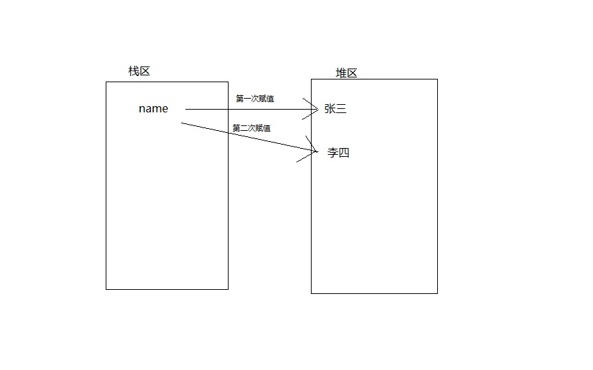
        
此时，"张三"这个值依然存在内存中，但是不在有变量使用，可能会被垃圾回收器销毁

容器类型变量：     

    list1 = [1, 'aaa', '222']
    print(id(list1))
    list1[2] = 'bbb'
    print(id(list1))
   
这个存储的原理如下：   
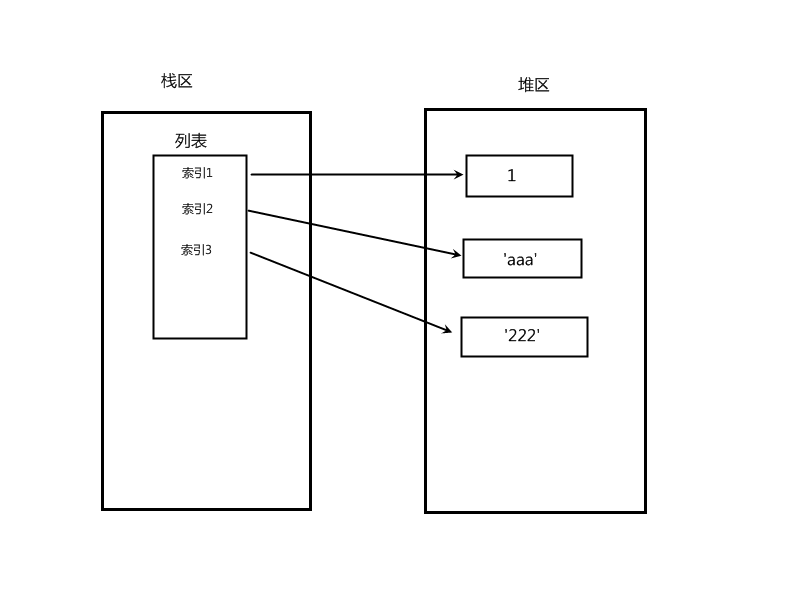
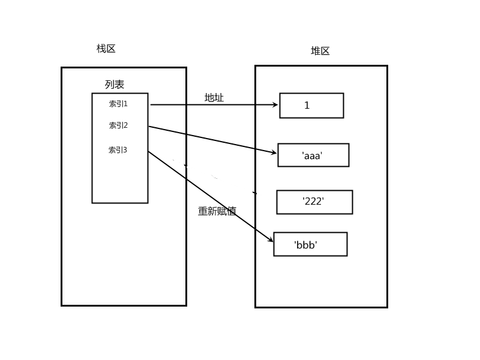

如上：改变一个列表内的值不会影响列表的地址，列表存放的只是值的地址，与变量名无关      
也就是说：列表被加载到内存之后，内部全部被转换成了地址，*不再依赖变量名去读取值*     
      
**参数传递和返回值**     
         
1. 对于不可变的参数类型，例如字符串、整数这样的类型，函数通过拷贝进行传递，因为函数内外的string变量的id是不一样的。      
2. 而对于像是列表，字典这样的可变对象，函数是通过引用进行传递。表现在函数内外，列表的id是一样的。       
         
结论：函数参数的传递和返回值的传递都是传递的变量所指向的内存地址！     

**垃圾回收机制**
       
垃圾：一个变量被绑定的变量名个数为0，此时该变量的值无法再被访问到，这个值就称之为垃圾；      
执行垃圾回收的是叫垃圾回收器(Garbage Collecor)的后台线程    
            
垃圾回收机制有三种：
1. 引用计数
2. 标记清除
3. 分代回收

引用分为直接引用和间接引用
```
x = 10 # 直接引用
l = ['a', x]  # 间接应用，列表中为变量的内存地址
```
间接引用只出现在容器类型

一个值的引用计数增加
```
x = 10 # 10的引用计数为1
y = x  # 10的引用计数为2
z = x  # 10的引用计数为3
```
有三个变量指向10的地址

一个值的引用计数减少
```
del x # 解除变量名x与10的绑定关系，计数为2
del y # 10的计数为1
z = 12345 # 10的引用计数为0，此时被回收
```
引用计数为0，gc机制就将值回收

查看对象的引用次数：       
`import sys`       
`name = '张三'`        
`print(sys.getrecount(name))`     
这其中的4次引用：
1. name变量
2. getrefcount：当name被传递给getrefcount函数的时候，函数的参数也指向了它。
3. Python解释器：为了执行这个脚本，Python解释器也保留了一个引用，直到脚本结束。只针对脚本全局变量。
4. 编译优化器：当执行脚本的时候，优化器会尝试优化字节码，所以也产生了一次引用。这个引用是临时的，很快就会消失。
   
总结：导致引用次数增加的原因
1. 创建对象
2. 被其他变量引用
3. 被当作函数参数使用
4. 被当作一个元素放入容器类型变量中 
  
如果不在脚本中运行，直接在交互式Python下运行，refcount是2        

容器之间容易出现循环引用问题           
循环引用导致计数不为0，但是又无法取到          
此时无法通过引用计数回收           
---> 内存泄漏，该内存无法被清空
            
标记清除：不是时时刻刻都在运行，当内存不够用时，python解释器会停止解释程序，开始扫描栈区            
如果堆区的值在栈区中没有变量*直接引用*，就清除堆区            
这项功能主要用于清除循环引用问题  

分代：优化扫描垃圾的频率，以空间换时间的方式提高垃圾回收效率          
在历经多次扫描的情况下，都没有被回收的变量，gc机制就认为该变量是常用变量，gc会对其扫描的频率降低    
即根据变量的存活时间划分不同的等级（不同的代），以代为依据进行扫描       
         

手动回收：
导入gc模块并调用gc.collect()函数来立即执行垃圾回收       
```
import sys
import gc

class MyObject():
    def __init__(self):
        self.y = [i for i in range(1000000)]
        self.x = 1

while True:
    a = MyObject()               # 创建一个对象
    b = MyObject()
    print("MyObject 引用次数a：", sys.getrefcount(a))    # 查看引用次数
    print("MyObject 引用次数b：", sys.getrefcount(b))    # 查看引用次数
    a.x = b     # a的x属性赋值b
    b.x = a     # b的x属性赋值a
    # 销毁对象a和b
    del a
    del b
    gc.collect()
```

# 输入与格式化输出

与计算机互动才是一个程序的终极目标   
即计算机根据你输入的内容，得到相应的结果   

## 输入  

在Python中，最常用的输入方法莫过于input()函数   
需要注意的是：input得到的值均为**字符串类型**   
如果你需要输入数字，则需要进行类型转换   
```
a = input("请输入一个数字，你将得到它的10倍：")
b = int(a)
c = b * 10
print(f'{a}的10倍是', c)

# 以上代码可以简写
a = int(input("请输入一个数字，你将得到它的10倍："))
print(f'{a}的10倍是', a*10)
```
input()函数内的参数是一个字符串，它会被打印出来   
通常，这个字符串写一些提示信息，告诉用户要输入什么内容   
同时，还需要一个变量来接收input()函数的返回值，它的返回值就是用户输入的内容   
不论你输入什么，input()都会将它转换成字符串类型   
如果要把输入的内容作为一个int型或float型进行数学计算，就需要进行相应的类型转换  

## 输出

现阶段，我们用到的主要输出方法均为print()函数，这里主要讲解print()函数要用到的输出方法

### 1. %占位符----->效率低，不推荐

值按照位置与%s一一对应，少一个不行，多一个也不行   

    res = "my name is %s my age is %s" % ('LiLei',"18")
    res = "my name is %s my age is %s" % ("18",'Hanmeimei')
    res = "my name is %s" % "LiLei"
    print(res)

以字典的形式传值，打破位置的限制

    res = "我的名字是 %(name)s 我的年龄是 %(age)s" % {"age":"18","name":'LiLei'}
    print(res)

%s可以接收任意类型

    print('my age is %s' %18)
    print('my age is %s' %[1,23])
    print('my age is %s' %{'a.txt':333})
    print('my age is %d' %18) # %d只能接收int
    print('my age is %d' %"18")

### 2. str.format:兼容性好

按照位置传值

    res='我的名字是 {} 我的年龄是 {}'.format('Lilei',18)
    print(res)

    res='我的名字是 {0}{0}{0} 我的年龄是 {1}{1}'.format('Lilei',18)
    print(res)

打破位置的限制，按照key=value传值

    res="我的名字是 {name} 我的年龄是 {age}".format(age=18,name='lilei')
    print(res)

### 3. f:python3.5以后才推出，效率高，推荐

    x = input('your name: ')
    y = input('your age: ')
    res = f'我的名字是{x} 我的年龄是{y}'
    print(res)

### 位置与填充//TODO

先取到值,然后在冒号后设定填充格式：`[填充字符][对齐方式][宽度]`

    *<10：左对齐，总共10个字符，不够的用\*号填充
    print('{0:*<10}'.format('开始执行')) # 开始执行******

    *>10：右对齐，总共10个字符，不够的用*号填充
    print('{0:*>10}'.format('开始执行')) # ******开始执行

    *^10：居中显示，总共10个字符，不够的用*号填充
    print('{0:*^10}'.format('开始执行')) # ***开始执行***

重点看{}中的`*<10`，*表示填充的字符，<表示左对齐，10表示宽度，即总长度为10，不够的用规定的字符填充

### 精度与进制

    print('{salary:.3f}'.format(salary=1232132.12351))  #精确到小数点后3位，四舍五入，结果为：1232132.124
    print('{0:b}'.format(123))  # 转成二进制，结果为：1111011
    print('{0:o}'.format(9))  # 转成八进制，结果为：11
    print('{0:x}'.format(15))  # 转成十六进制，结果为：f
    print('{0:,}'.format(99812939393931))  # 千分位格式化，结果为：99,812,939,393,931

# 运算符

计算是计算机的基本功能，这里的运算不仅仅是简单的加减乘除  
各种各样的数学运算和逻辑运算计算机都可以帮你   
概括一下，Python中的运算符包括算数运算符、比较运算符、赋值运算符  

## 算数运算符

1. 加减乘除
2. ** 表示乘方
3. // 除法，结果只保留整数部分，也叫地板除
4. %  除法，结果只保留余数，即取余

## 比较运算符

主要用于逻辑判断，也可以称为逻辑运算符  
大于，大于等于，小于，小于等于，等于（判断），不等于       

    >、>=、<、<=、==、!=、is
    结果为布尔值

注意区分!=和is，!=比较的是两个变量的值，而is比较的是变量的id地址   
根据之前深浅copy我们知道，同一个值的变量不一定是同一个变量   
同一个id的变量值一定是相同的  

## 赋值运算符

= 变量的赋值

**链式赋值**

    x=10
    y=x
    z=y
    z = y = x = 10 # 链式赋值
    print(x, y, z)
    print(id(x), id(y), id(z))

    id相同，直接引用

**交叉赋值**

    m=10
    n=20
    m,n=n,m # 交叉赋值
    print(m,n)

**解压赋值**

```
salaries=[111,222,333,444,555]
# 把五个月的工资取出来分别赋值给不同的变量名
mon0=salaries[0]
mon1=salaries[1]
mon2=salaries[2]
mon3=salaries[3]
mon4=salaries[4]

解压赋值
mon0,mon1,mon2,mon3,mon4=salaries
print(mon0)
print(mon1)
print(mon2)
print(mon3)
print(mon4)

mon0,mon1,mon2,mon3=salaries # 对应的变量名少一个不行
mon0,mon1,mon2,mon3,mon4,mon5=salaries # 对应的变量名多一个也不行
```

**引入\*，可以帮助我们取两头的值，无法取中间的值**
```
取前三个值
x,y,z,*_=salaries=[111,222,333,444,555] # *会将没有对应关系的值存成列表然后赋值给紧跟其后的那个变量名，此处为_
print(x,y,z)
print(_)

取后三个值
*_,x,y,z=salaries=[111,222,333,444,555]
print(x,y,z)

x,*_,y,z=salaries=[111,222,333,444,555]
print(x,y,z)

salaries=[111,222,333,444,555]
_,*middle,_=salaries
print(middle)

解压字典默认解压出来的是字典的key
x,y,z=dic={'a.txt':1,'b':2,'c':3}
print(x,y,z)
```
        
# 流程控制

什么是流程？  
流程就是做一件事的先后顺序    
流程控制包括了if分支控制和循环控制   
流程控制就像是一个工厂的生产线，首先要判断是否有原料  
有原料的话就进入下一步开始生产，生产的过程就是在不停的循环   
一个工厂不可能只生产一件产品

流程控制的主要依据就是逻辑判断    
判断条件的真与假，以此为依据执行或者跳过

## 条件及判断

条件：是否往下执行的前提，真就执行，或者说，非空执行语句块内容
1. 显式布尔值
   + 比较运算符
   + 布尔值True,False
2. 隐式布尔值:0，none，空（空字符串，空列表，空字典）--》布尔值为false，其余为真 

逻辑运算符：not/and/or       
优先级：not > and > or

成员运算符:in和not in

    print("lilei" in "hello lilei") # 判断一个字符串是否存在于一个大字符串中
    print("e" in "hello lilei") # 判断一个字符串是否存在于一个大字符串中

    print(111 in [111,222,33]) # 判断元素是否存在于列表

判断key是否存在于字典

    print(111 in {"k1":111,'k2':222})
    print("k1" in {"k1":111,'k2':222})

not in

    print("lilei" not in "hello lilei") # 推荐使用
    print(not "lilei" in "hello lilei") # 逻辑同上，但语义不明确，不推荐

身份运算符       
is # 判断的是id是否相等

*注意身份运算符与==运算符的不同，==比较的是两个变量的值，而is是比较两个变量的ID*

针对一连串的判断有短路运算      
短路运算:偷懒原则，偷懒到哪个位置，就把当前位置的值返回

    1 > 3 and (1 > 2 or 3 > 1)

以上表达式在实际运算过程中只会算到第一个`1 > 3`，很显然是假的，后面()内的已经不需要再算了  
这就是短路运算  

## if分支判断

if在英语中的意思是如果，在逻辑学中，如果开头的就是代表假言判断   
如果+条件，条件成立，就执行if语句块中的语句，不成立则跳过   
这里提到了语句块，那么这么多的代码Python是如何区分哪些是if的语句块呢？  
这里就用到了Python的语法规范问题。在Python中，把向内缩进的语句视为上面没有缩进语句的子语句  
```
语句1：      # 顶格写，就是靠最左边，视为顶级语句
    语句2
    语句3    # 语句2和3,均缩进了，就视为语句1的子语句
        语句4  # 语句4也缩进了，所以语句4就是语句3的子语句
```
通过上面的例子，我们知道了子语句的概念，那么应该缩进多少呢？   
理论上讲，可以随意缩进，只要有缩进，就可以当作子语句   
但是在PEP的规范中，建议的缩进是4个空格，这样的代码更加容易阅读   
要注意了，本质上键盘上的tab键在系统中是`\t`，而不是4个空格   
我们需要在编辑器中设置一下tab键，把它变成4个空格   
如果你用的vscode就不需要了，自动帮你设置   
如果你用的vim，就需要在配置文件中显式的告诉编辑器，我要tab键是4个空格，而不是`\t`

下面是if的基本语法，尤其要注意，判断条件后面要加上冒号`:`，这个表示条件判断的结束  
忘了就会报语法错误    
语法1：独立if

    if 条件：
        代码1
        代码2
*满足条件，执行代码1和2，不满足就跳过*

语法2：if与else配合

    if 条件：
        代码1
    else：
        代码2
*满足条件，执行代码1，不满足执行代码2*

语法3：

    if 条件1：
        代码1
    if 条件2：
        代码2
*每一个条件都要判断，都满足都执行，满足一个执行一个，都满足就都执行，都不满足就跳过*

语法4：

    if 条件1：
        代码1
    elif 条件2:
        代码2
    elif 条件3：
        代码3
    else：
        代码4
*从上到下依次判断，满足哪一个执行哪一个代码，然后跳过其他的条件判断*
*也就是说：if与elif等只会执行一个代码块*

下面我们来举几个例子来具体看一看如何用   
语法一示例：
```
your_age = 20
if your_age > 18:
    print("可以进入网吧")
    print("请保管好贵重物品")
print("看一看这句是否运行")
```
我们可以把`your_age`这个变量改成10，看一下效果    
可以看到if的子语句没有运行，直接跳到了第五行的语句   

语法二示例：
```
your_score = input("请输入你的考试分数：")
your_score = int(your_score)
if your_score > 60:
    print("奖励手机一部")
else:
    print("不及格还想要手机？回去学习！")
```

语法三示例：
```
your_score = input("请输入你的考试分数：")  # 请尝试输入不同的数字
your_score = int(your_score)
if your_score > 60:
    print("奖励手机一部")
if your_score > 80:
    print("奖励自行车一辆")
print("这是if以外的代码")
```

语法四示例：
```
your_score = input("请输入你的考试分数：")
your_score = int(your_score)

# 这回奖励要缩水了，只有一个奖励，但是价值越来越高^_^
if your_score > 90:
    print("优秀！奖励手机一部")
elif your_score > 80:
    print("还行吧，奖励手环一个")
elif your_score > 60:
    print("刚及格，奖励鲜花一朵")
else:
    print("不及格还想要奖励？回去学习！")
```
根据语法四的例子可以看到，输入的分数它会依次进行判断   
比如输入99，满足了第一个大于90的条件，执行子语句，下面的所有elif和else均被跳过   
如果输入81，不满足第一个if，跳过，满足第二个elif，执行子语句，跳过下面的elif和else   

## 循环--while和for

循环，顾名思义，就是重复做一件事，这可是计算机非常擅长的    
解放了大量的人力   

**while循环**   
下面是while的基本语法格式，同样的，它也带有缩进的子语句  
```
while 条件：
    代码1
    代码2
满足条件即可运行块内代码
```
循环是如何工作的？   
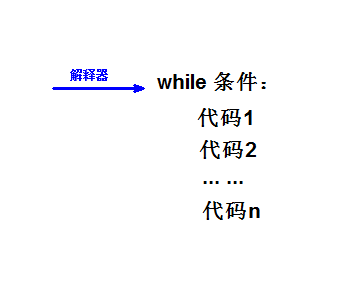   
解释器首先读取while所在行，并进行条件判断，如果条件为真，则依次运行子代码  
一直将子代码全部运行完毕，然后解释器会回到while关键字所在行，再次进行条件判断   
如此一直循环往复，直到条件为假，则跳过while及其子代码，继续往下运行  

如果条件一直为真，那么，这个就是个死循环，解释器只会运行子代码，找不到出口   

来写一个简单的循环   
```
while True:
    print("正在运行")
```
这个代码在不停的运行，因为`True`是它的判断条件，一直都是真，所以，停不下来啊  
请按快捷键`ctrl+c`(windows系统)或者`ctrl+z`(Linux系统)，这个是系统自带的强制关闭程序运行的，根据系统不同会有差别   

结论：无出口会导致死循环，即条件始终为真。  
我们要避免出现死循环的情况，它会导致系统崩溃  
所以，写循环之前最好想好如何结束它  

退出循环的两种方法：        
方式一:将条件改为false，等到下次循环判断时才会生效
```
# 一个简单的登陆认证，例如登陆游戏之类的
tag=True
while tag:
    inp_name=input('请输入您的账号：')
    inp_pwd=input('请输入您的密码：')

    if inp_name  == username and inp_pwd == password:
        print('登录成功')
        tag = False # 之后的代码还会运行，下次循环判断条件时才生效
    else:
        print('账号名或密码错误')

    # print('====end====')
```

方式二：break,只要运行到break就会立刻终止本层循环
```
while True:
    inp_name=input('请输入您的账号：')
    inp_pwd=input('请输入您的密码：')

    if inp_name  == username and inp_pwd == password:
        print('登录成功')
        break # 立刻终止本层循环
    else:
        print('账号名或密码错误')

print('====end====')
```
break会结束离它最近的while   

while+continue：结束本次循环，直接进入下一次        
强调：在continue之后添加同级代码毫无意义，因为永远无法运行       
```
while 条件：
    代码1
    代码2
    ...
    continue
    代码n
```
解释器遇到continue，直接回到了while那一行，代码n是不会被运行的  
        
while+else:当while循环正常执行完的情况下，执行else输出；   
如果当while循环中执行了跳出循环的语句，比如 break，将不执行else代码块的内容    
```
while 条件1：
    代码1
    代码2
    if 条件2：
        代码3
        break
else:
    代码4
```
ps：break只会结束循环，不会结束if判断  
条件2为真，执行代码3和break，while被结束了  
else的子代码`代码4`就不会被运行   
暂时没想到好例子...
当条件2位假，if被跳过，while循环正常结束之后  
就会运行代码4

**for循环**   
理论上for循环能做的事情，while循环都可以做   
之所以要有for循环，是因为for循环在循环取值（遍历取值）比while循环更简洁   
语法：
```
for 变量名 in 可迭代对象(iterable):
    代码1
    代码2
    代码3
    ...
```
ps:可迭代对象可以是：列表、字典、字符串、元组、集合      
(学过面向对象编程之后，可以知道可迭代对象都含有__iter__方法)
```
lst = [1, 2, 'aaa', 'bbb']
for i in lst:
    print(i)
```
上面例子中的变量i是在for循环中定义的临时变量，用于接收列表中取出的单个值   
列表中有4个元素，所以for会自动运行4次而不需要自定义次数    
第一次循环，i = 1   
第二次循环，i = 2  
第三次循环，i = 'aaa'   
第四次循环，i = 'bbb'   
列表没有值了，结束循环  
         
比较常用的for循环控制循环次数：range()      
```
for i in range(10):
    print("正在运行第%s次" % i)
```
ps:可以看到，range(10)是从0开始取到9，没有取到10，注意这个小细节   

for也可以与continue和else联用     
补充：终止for循环只有break一种方案，没有while那种标记tag的方式      

while循环称之为"条件循环"，循环次数取决于条件何时变为假        
for循环称之为"取值循环"，循环次数取决in后包含的值的个数

# 字符编码

一篇比较详细讲解字符编码的文章  
[字符编码](https://www.cnblogs.com/leesf456/p/5317574.html)

应用：字符串类型、文本文件    
什么是编码：在计算机内部，一切都是0和1，编码就是建立字符与数字的对应关系     

众所周知，计算机只认识0和1，但是我们却能看到计算机在屏幕上输出不同的字符，如字母，汉字等等   
这就是靠字符编码，建立起各种不同字符与0/1组合对应关系  
   
**文本编辑器的启动流程**    
阶段1、启动一个文件编辑器（文本编辑器如nodepad++，pycharm，word）  
   
阶段2、文件编辑器会将文件内容从硬盘读入内存    
   
阶段3、文本编辑器会将刚刚读入内存中的内容显示到屏幕上   
-->注意：显示到屏幕上的内容在内存中，点保存才会写入硬盘   
    
**python解释器执行文件的流程**    
阶段1、启动python解释器，此时就相当于启动了一个文本编辑器   
   
阶段2、python解释器相当于文本编辑器，从硬盘上将xx.py的内容读入到内存中  
   
阶段3、python解释器解释执行刚刚读入的内存的内容，开始识别python语法  

## 字符编码种类和编码的基本过程

存：编码(encode)   
字符---->编码表--->内存   
  
取：解码(decode)   
内存---->编码表--->字符   
   
编码表由操作系统提供，启动后加载到内存   
所以同一个文件在不同系统会出问题，除非用统一的编码表    
  
在unicode中，地球上所有的字符都能找到对应的编码    
    
windows系统cmd中文表示用的是gbk表示   
大多数编程语言用到的是utf-8编码    
所以，你用windows自带的cmd来调试程序时会出现乱码的原因  
   
ASCII表：   
1. 只支持英文字符串
2. 采用8位二进制数对应一个英文字符串-->2**8=256  


GBK表：
1. 支持英文字符、中文字符
2. 采用8位（8bit=1Bytes）二进制数对应一个英文字符串，同ASCII    
采用16位（16bit=2Bytes）二进制数对应一个中文字符串-->2**16=65536

unicode（内存中统一使用unicode）：   
1. 兼容万国字符，与万国字符都有对应关系
2. 采用16位（16bit=2Bytes）二进制数对应一个中文字符串，个别生僻会采用4Bytes、8Bytes

unicode在内存中的转换：

                        内存
    人类的字符---------unicode格式的数字----------
                            |                     |
                            |                     |
                            |
                          硬盘                    |
                            |
                            |                     |
                            |                     |
                    GBK格式的二进制       Shift-JIS格式的二进制

老的字符编码都可以转换成unicode，但是不能通过unicode互转     
理论上是可以将内存中unicode格式的二进制直接存放于硬盘中的，但由于unicode固定使用两个字节来存储一个字符，  
如果多国字符中包含大量的英文字符时，使用unicode格式存放会额外占用一倍空间（英文字符其实只需要用一个字节存放即可）       
然而空间占用并不是最致命的问题，最致命地是当我们由内存写入硬盘时会额外耗费一倍的时间    

utf-8：       
将内存中的unicode二进制写入硬盘或者基于网络传输时必须将其转换成一种精简的格式，   
这种格式即utf-8（全称Unicode Transformation Format，即unicode的转换格式）  
+ 英文->1Bytes(8bit)
+ 汉字->3Bytes(24bit)

结论：
1. 内存固定使用unicode，我们可以改变的是存入硬盘采用格式，unicode更像是一种过渡版本，用来兼容其他诸如gbk,shift-jis等
+ 英文+汉字->unicode->gbk
+ 英文+日文->unicode->shift-jis
+ 万国字符>-unicode->utf-8
  + gbk\shift-jis\utf-8是平级的

2. 文本文件存取乱码问题  
+ 存乱了：解决方法是，编码格式应该设置成支持文件内字符串的格式
+ 取乱了：解决方法是，文件是以什么编码格式存如硬盘的，就应该以什么编码格式读入内存
     
## python中字符编码的方法

**在文本编辑器中更改的字符编码改的是存入硬盘的编码格式**  

1. python解释器默认读文件的编码
+ python3默认：utf-8
+ python2默认：ASCII

2. 保证运行python程序前两个阶段不乱码的核心法则：指定文件头，修改解释器的编码格式
ps：控制的是读文件的编码，即程序运行的前两个阶段   
`# coding:文件当初存入硬盘时所采用的编码格式`    

例如：
**字符串的编码与解码**
```
# coding:utf-8

x='上'
res=x.encode('gbk') # unicode--->gbk
# print(res,type(res))
print(res.decode('gbk'))
```
解释器用自己默认的字符编码读取文件的首行

写文件由编辑器控制

3. python3的str类型默认直接存成unicode格式，无论如何都不会乱码
保证python2的str类型不乱码

    x=u'上'

4. 了解:python2解释器有两种字符串类型：str、unicode   

```
    #str类型
    x='上' # 字符串值会按照文件头指定的编码格式存入变量值的内存空间
    #unicode类型
    x=u'上' # 强制存成unicode
```
     
# 文件操作

文件是存储数据的虚拟概念/接口     
用户/应用程序直接操作的是文件，对文件进行的所有的操作，都是在向操作系统发送系统调用，    
然后再由操作将其转换成具体的硬盘操作      
     
注意：vscode中打开文件始终从.vscode所在目录开始进行查找，而不是从执行文件所在文件夹查找。      

## python操作文件的基本方法和流程

在Python中，对文件的操作主要有三种：r模式(读)，w模式(写)，a模式(追加)   
简单地分析一下这三种模式：  
1. r模式：从文件中读出数据，只是读，不做任何其他操作
2. w模式：将某些内容写入文件，只是写，不会读，也不关心文件里面是否有内容
3. a模式：将某些内容写入文件的后面，如果原文件有内容，就在原内容的后面写，也不会读

针对不同文件读写的额外模式：t模式和b模式      
**强调：t和b不能单独使用，必须跟r/w/a连用**    
基本形式就是：`mode=rt`，`mode=wb`，`mode=at`等等   
可以任意组合，不局限于上面的三个例子   

t模式：文本模式（默认的模式），例如`mode=r`，r后面就会有个省略的t      
1. 读写都以str（unicode）为单位的
2. 文本文件
3. 必须指定encoding='utf-8'

b模式：二进制/bytes模式，除文本文件外的其他文件，如图片，视频等等       
1. 直接读取文件的原始二进制格式，不加任何转换

基本流程：     
一、打开文件open    
`open('文件路径', mode=r, encoding='utf-8')`    
例如：  
```
f = open('a.txt', encoding='utf-8')  
res = f.read()
print(res)
```
这里使用了文件的.read()方法来读出其中的内容，并存放在变量res中  
然后就可以打印出来知道其中的内容了   
上面的例子把文件`a.txt`放在了执行文件的根目录下，所以可以省略掉前面的路径  
如果我想打开计算机中其他位置的文件应该怎么办？  
所以，我们要引入文件路径的概念  

**文件路径**
文件路径就是文件存放的“地址”，跟我们网购时要写清楚收货地址是一样的   
快递员通过地址找到我们的家，把包裹给我们   
我们通过文件的路径找到具体文件，然后操作文件    

路径有两种，根据具体情况来选择使用：
1. 绝对路径：以/（根目录）开头(linux、mac系统)，或以盘符开头(windows系统)的路径    
   + linux：/home/Desktop/aaa/a.txt
   + windows：d:\learn\test\a.txt
2. 相对路径：以执行文件所在文件夹作为起始，向上或向下查找     
   + 相对路径主要用到点"."和点点".."，.表示当前文件所在目录，..表示当前文件所在目录的上一级
   + 举例：一个文件的绝对路径是/home/Desktop/aaa/a.txt，那么.a.txt表示文件夹aaa，..a.txt表示文件夹Desktop

windows路径分隔符问题   
`open('C:\a.txt\nb\c\d.txt')`    
解决方案一：字符串前加上'r'，表示原始字符串，不含任何转义，推荐   
`open(r'C:\a.txt\nb\c\d.txt')`   
解决方案二：open这个功能自动识别    
`open('C:/a.txt/nb/c/d.txt')`    

解决跨平台路径问题，推荐使用os模块    
该模块下的path函数用于读取文件/文件夹名称(str类型)     
配合该函数的join方法拼接出完整路径     
这种方法要求要知道所有的文件夹名称  
```
import os
BASE_PATH = os.path.join("User",
                        "adminstrator",
                        "aaa.txt")
```

下面继续讲解打开文件   
open()函数会返回一个叫文件对象（file object）的对象，也称为文件句柄    
这个文件对象是一种变量，归属于这个程序，同样存在于内存空间     
并且同时映射到硬盘内的具体文件    
操作文件：读/写文件，应用程序对文件的读写请求都是在向操作系统发送    
系统调用，然后由操作系统控制硬盘把输入读入内存、或者写入硬盘     

默认参数：   
`f = open('aaa.txt')`    
`print(f)`    
`<_io.TextIOWrapper name='aaa.txt' mode='r' encoding='cp936'>`    
指定参数：    
`f = open('aaa.txt', mode='rt', encoding='utf-8')`    

文件对象和其他类型一样，有内置的方法：    
读：f.read() ---> 这个方法有返回值，需要有变量接收    
写：f.write()  

   

关闭文件：回收操作系统资源--->操作系统打开文件数是一定的   
`f.close()`      
但是这个f的变量还是存在的，只是不可以读取      
因为操作系统打开文件有上限，如果忘了close文件，可能下面的文件就打不开了  
所以，为了防止这样的情况，Python引入了with关键字来根据上下文打开\关闭文件   

**with:上下文管理，跳出代码块后即关闭文件**
```
with open('a.txt',mode='rt') as f1,\       # 注意这里的格式，一个反斜杠\表示换行，继续输入，用在较长的语句中
        open('b.txt',mode='rt') as f2:
    res1=f1.read()  # t模式会将f.read()读出的结果解码成unicode
    res2=f2.read()
    print(res1)
    print(res2)
print("以上两个文件已经自动关闭")
```

为什么用t模式需要指定编码表？没有指定encoding参数操作系统会使用自己默认的编码     
linux系统默认utf-8      
windows系统默认gbk       
尤其是在windows系统下编写代码，养成加上encoding的好习惯

## 文件操作模式详解

**r模式**       
默认模式，当访问的文件不存在时报错，打开文件后*文件指针*跳到开头   
这里提到文件指针的概念，先不管，下面章节会详细讲解，这里需要记住    
```
with open('c.txt',mode='rt',encoding='utf-8') as f:
    print('第一次读'.center(50,'*'))
    res=f.read() # 把所有内容从硬盘读入内存
    print(res)
```
read方法在读取大文件时容易填满内存    
在调用read方法后，*文件指针*移动，并读出文件内容直到文件结尾     
此后，在调用read方法将无法读出文件内容     
```

===============案例：输入验证==================
# 新建一个用于存放用户名和密码的文件user.txt

inp_username=input('your name>>: ').strip()
inp_password=input('your password>>: ').strip()

# 验证
with open('user.txt',mode='rt',encoding='utf-8') as f:
    for line in f:
        # print(line,end='') # egon:123\n
        # strip()去除空白字符，包括\n\t等等
        username,password=line.strip().split(':')
        if inp_username == username and inp_password == password:
            print('login successfull')
            break
    else: # 注意，for循环遍历完列表并且没有被break打断，执行代码
        print('账号或密码错误')
```

**w模式**          
只写模式，当文件不存在时会创建空文件，当文件存在会*清空*文件，指针位于开始位置，此时文件不可读，即不可使用read方法，用了就报错      

在以w模式打开文件没有关闭的情况下，连续写入，新的内容总是跟在旧的之后
```
with open('d.txt',mode='wt',encoding='utf-8') as f:
    f.write('这是一句话\n')
    f.write('这是另一句话\n')
    f.write('这还是一句话\n')
```

如果重新以w模式打开文件，则会清空文件内容
```
with open('d.txt',mode='wt',encoding='utf-8') as f:
    f.write('这是一句话\n')
with open('d.txt',mode='wt',encoding='utf-8') as f:
    f.write('这是另一句话\n')
with open('d.txt',mode='wt',encoding='utf-8') as f:
    f.write('这还是一句话\n')
```

案例：文件复制程序：
```
src_file=input('源文件路径>>: ').strip()
dst_file=input('源文件路径>>: ').strip()
with open(r'{}'.format(src_file),mode='rt',encoding='utf-8') as f1,\
    open(r'{}'.format(dst_file),mode='wt',encoding='utf-8') as f2:
    res=f1.read()
    f2.write(res)
```

**a模式**        
只追加写，在文件不存在时会创建空文档，在文件存在时文件指针会直接跳到末尾，不会清空文件，此时文件不可读，即不可使用read方法，用了就报错

强调w模式与a模式的异同：
1. 相同点：在打开的文件不关闭的情况下，连续的写入，新写的内容总会跟在前写的内容之后
2. 不同点：以a模式重新打开文件，不会清空原文件内容，会将文件指针直接移动到文件末尾，新写的内容永远写在最后

```
案例：a模式用来在原有的文件内存的基础之上写入新的内容，比如记录日志、注册
注册功能
name=input('your name>>: ')
pwd=input('your name>>: ')
with open('db.txt',mode='at',encoding='utf-8') as f:
    f.write('{}:{}\n'.format(name,pwd))
```

**+模式**       
了解即可，使用场景少，一般都用纯净的模式     
    
+不能单独使用，必须配合r、w、a  
特性取决与r\w\a     
1. r+，如果文件不存在则报错，并且是覆盖写入
2. w+，如果文件不存在则创建，如果文件存在则清空
3. a+，打开文件后指针跳到最后

**x模式**        
了解即可，使用场景少，一般都用纯净的模式     

x，只写模式【不可读；不存在则创建，存在则报错】        
防止清空文件时可用       

**b模式**      
1. 读写都是以bytes为单位
2. 可以针对所有文件-->图片，视频等等
3. 一定不能指定字符编码，即一定不能指定encoding参数

与t模式对比：      
1. 在操作纯文本文件方面t模式帮我们省去了编码与解码的环节，b模式则需要手动编码与解码，所以此时t模式更为方便
2. 针对非文本文件（如图片、视频、音频等，文本也行）只能使用b模式


错误演示：t模式只能读文本文件
```
with open(r'xxx.mp4',mode='rt') as f:
    f.read() # 硬盘的二进制读入内存-》t模式会将读入内存的内容进行decode解码操作
```

```
with open(r'test.jpg',mode='rb',encoding='utf-8') as f:
    res=f.read() # 硬盘的二进制读入内存—>b模式下，不做任何转换，直接读入内存
    print(res) # bytes类型—》当成二进制
    print(type(res))
```

b模式更加通用，t模式帮我们做了编码的操作，省了一步
```
案例：文件拷贝工具
src_file=input('源文件路径>>: ').strip()
dst_file=input('源文件路径>>: ').strip()
with open(r'{}'.format(src_file),mode='rb') as f1,\
    open(r'{}'.format(dst_file),mode='wb') as f2:
    # res=f1.read() # 内存占用过大
    # f2.write(res)

    for line in f1:
        f2.write(line)


循环读取文件   
方式一：自己控制每次读取的数据的数据量
with open(r'test.jpg',mode='rb') as f:
    while True:
        res=f.read(1024) # 1024字节
        if len(res) == 0:
            break
        print(len(res))
b模式下的read方法接受一个参数，即字节大小


方式二：以行为单位读，当一行内容过长时会导致一次性读入内容的数据量过大
with open(r'g.txt',mode='rt',encoding='utf-8') as f:
    for line in f:
        print(len(line),line)

with open(r'g.txt',mode='rb') as f:
    for line in f:
        print(line)

with open(r'test.jpg',mode='rb') as f:
    for line in f:
        print(line)

# 无论是图片还是视频，都是以某种方式来换行，for循环都可以遍历
```

如果某个文件的一行太大，用while循环按照字节来读取不会对内存造成太大压力。

**bytes类型转换**

bytes类型是Python3.x新增的类型，在Python2.x中是不存在的。

字节串（bytes）和字符串（string）的对比：
+ 字符串由若干个字符组成，以字符为单位进行操作；字节串由若干个字节组成，以字节为单位进行操作。
+ 字节串和字符串除了操作的数据单元不同之外，它们支持的所有方法都基本相同。
字节串和字符串都是不可变序列，不能随意增加和删除数据。

bytes只负责以字节序列的形式（二进制形式）来存储数据，至于这些数据到底表示什么内容（字符串、数字、图片、音频等），完全由程序的解析方式决定。如果采用合适的字符编码方式（字符集），字节串可以恢复成字符串；反之亦然，字符串也可以转换成字节串。

说白了，bytes只是简单地记录内存中的原始数据，至于如何使用这些数据，bytes并不在意，你想怎么使用就怎么使用，bytes并不约束你的行为。

bytes类型的数据非常适合在互联网上传输，可以用于网络通信编程；bytes也可以用来存储图片、音频、视频等二进制格式的文件。

通过字符串得到bytes类型的三种方法：     
1:如果是纯英文字符(即ASCII码)，可以直接加前缀b得到bytes类型，所有编码表均兼容英文字符

    l = [
        b'1111aaa1\n',
        b'222bb2',
        b'33eee33'
    ]

2:字符串本身有一个encode()方法，该方法专门用来将字符串按照指定的字符集转换成对应的字节串；如果不指定字符集，那么默认采用 UTF-8。    
    l = [
        bytes('上',encoding='utf-8'),
        '上'.encode('utf-8')
    ]
    print(l)

3:bytes 是一个类，调用它的构造方法，也就是 bytes()，可以将字符串按照指定的字符集转换成 bytes；如果不指定字符集，那么默认采用 UTF-8。

    b1 = bytes() # 创建一个空bytes类型
    b2 = b''     # 通过字符串创建一个空bytes类型
    b3 = bytes('来来来', encoding='utf-8')


flush方法：flush刷新          
因为操作系统不是每次写入操作都会立刻执行，而是在某些条件下才会触发       
f.flush()会让操作系统立刻写入        
尽量少用，因为操作系统的延迟写入本身也是一种优化机制

**重点：只有在调用read方法时才会把内容放入内存**         
**open函数只是产生了一个文件对象，不会读取内容**  

总结：主模式--> r, w, a用于控制打开文件的方式，读，写，追加    
辅模式--> t, b用于控制打开文件的编码方式，文本模式和bytes(字节)模式

## read方法与write方法

readline:一次读一行

readlines:生成一个列表，把每行内容放入这个大列表中

f.read()与f.readlines()都是将内容一次性读入内存，如果内容过大会导致内存溢出，若还想将内容全读入内存，用循环的方式

f.write():把()中的参数写入文件，传入多少写入多少     
f.writelines():把一个列表中的元素，以for循环的方式写入文件，不用手写for循环
```
with open('h.txt',mode='wt',encoding='utf-8') as f:
    l=['11111\n','2222','3333']
    # l=['11111\n','2222','3333',4444]  --> 报错
    # for line in l:
    #     f.write(line)
    f.writelines(l)  # 接受一个列表作为参数
                     # 这个列表中的内容要么是byte类型，要么是str
```

f.readable() -->判断是否可读  
f.writable() -->判断是否可写  
f.encode     -->查看编码格式，例如返回utf-8     
f.name       -->查看文件名         

## 文件指针

指针移动的单位都是以bytes/字节为单位     
只有一种情况特殊：t模式下的read(n),n代表的是字符个数        

f.seek(n,模式):n指的是移动的字节个数      
模式有三种：0、1、2          
**强调：只有0模式可以在t下使用，1、2必须在b模式下用**

模式0：参照物是文件开头位置

    f.seek(9,0)
    f.seek(3,0) # 3

模式1：参照物是当前指针所在位置

    f.seek(9,1)
    f.seek(3,1) # 12

模式2：参照物是文件末尾位置，应该倒着移动

    f.seek(-9,2) # 3
    f.seek(-3,2) # 9

f.tell() # 获取文件指针当前位置

注意：如果打开一个文件，然后修改该文件，并不是追加操作，在打开文件的时候已经把文件的所有内容读取到了内存，修改后保存，是把内存中的内容全部覆盖回硬盘      
只有用a模式才是正宗的追加操作

应用：文件增加检测
```
import time

with open('access.log', mode='rb') as f:
    # 1、将指针跳到文件末尾
    # f.read() # 错误
    f.seek(0,2)

    while True:
        line=f.readline()
        if len(line) == 0:
            time.sleep(0.3)
        else:
            print(line.decode('utf-8'),end='')
```

## 文件修改的两种方式

方式一：文本编辑器的方式       
实现思路：将文件内容发一次性全部读入内存,然后在内存中修改完毕后再覆盖写回原文件   
优点: 在文件修改过程中同一份数据只有一份    
缺点: 会过多地占用内存    
```
with open('c.txt',mode='rt',encoding='utf-8') as f:
    res=f.read()
    data=res.replace('alex','dsb')
    print(data)

with open('c.txt',mode='wt',encoding='utf-8') as f1:
    f1.write(data)
```

方式二： import os调用系统管理模块，使用其中的文件相关功能    
实现思路：以读的方式打开原文件,以写的方式打开一个临时文件,一行行读取原文件内容,修改完后写入临时文件...,删掉原文件,将临时文件重命名原文件名   
优点: 不会占用过多的内存   
缺点: 在文件修改过程中同一份数据存了两份    
```
with open('c.txt', mode='rt', encoding='utf-8') as f, \
        open('.c.txt.swap', mode='wt', encoding='utf-8') as f1:
    for line in f:
        f1.write(line.replace('alex', 'dsb'))

os.remove('c.txt')
os.rename('.c.txt.swap', 'c.txt')
```

## csv文件操作//TODO

csv用于excel表格
导入csv模块
`import csv`

---

# 函数

## 函数基础：定义及返回值

定义函数
```
def 函数名(参数1,参数2,...):
    """文档描述"""
    函数体
    return 值
```

可有可无部分：参数、文档描述、return语句

定义函数发生的事情:
1. 申请内存空间保存函数体代码
2. 将上述内存地址绑定函数名
3. 定义函数不会执行函数体代码，但是会检测函数体语法，**只检测语法**

调用函数发生的事情:
1. 通过函数名找到函数的内存地址
2. 然后加括号就是在触发函数体代码的执行，或者说内存地址()触发运行   
`print(func) --> 打印函数的地址`   
`func() --> 有括号，触发函数体执行`   
本质上，定义函数与定义变量类似，通过变量名找到值，通过函数名找到函数名字对应值

定义的三种形式：        
形式一：无参函数 --> 调用某一功能   
`def func():`   

形式二：有参函数 --> 对数据进行加工   
`def func(x, y, z):`    

形式三：空函数 --> 占位，构思代码，待以后补全   

    def func():  
        pass   
    pass可以用...取代   

**函数返回值**      
*return是函数结束的标志，即函数体代码一旦运行到return会立刻* 终止函数的运行，并且会将return后的值当做本次运行的结果返回：   
1、返回None：函数体内没有return或者return或者return None(没必要)   
2、返回一个值：return 值
```
def func():
    return 10
res=func()
print(res)
```
3、返回多个值：用逗号分隔开多个值，会被return返回成元组
```
def func():
    return 10, 'aa', [1, 2]
res = func()
print(res, type(res))
```

## 函数的参数

形参：函数定义阶段定义的参数     
实参：函数调用阶段传入的值

形参与实参的关系：   
1. 在调用阶段，实参（变量值）会绑定给形参（变量名）
2. 这种绑定关系只能在函数体内使用
3. 实参与形参的绑定关系在函数调用时生效，函数调用结束后解除绑定关系

*python中，所有的传递都是内存地址的传递*   
C语言中，是把实参的副本复制给形参，不会影响到原参数  

实参是可求值的表达式或具体值   
形式一：具体值   
`func(1,2)`   
形式二：变量   
`a = 1`   
`b = 2`  
`func(a, b)`   
形式三：表达式   
`func(int('1'), 2)`   
`func(func1(1,2), func2(2,3), x+y)`   

### 位置参数、关键字形参与默认形参

**位置参数**   
按照从左到右的顺序依次定义的参数称之为位置参数   
位置形参:在函数定义阶段，按照从左到右的顺序直接定义的"变量名"   
特点：必须被传值，多一个不行少一个也不行   
位置实参:在函数调用阶段，按照从左到有的顺序依次传入的值   
特点：按照顺序与形参一一对应   

    def func(x, y, z):
        return x+y+z
    print(func(1, 2, 3))

**关键字形参**

关键字实参：在函数调用阶段，按照key=value的形式传入的值    
特点：指名道姓给某个形参传值，可以完全不参照顺序

    def func(x, y, z):
        return x+y+z
    res = func(z=3, x=2, y=1)
    print(res)

**混用**

1. 位置实参必须放在关键字实参前
2. 不能能为同一个形参重复传值

    def func(x, y, z):
        return x+y+z
    res = func(1, 2, z=3)
    print(res)

**默认形参**

默认形参：在定义函数阶段，就已经被赋值的形参，称之为默认参数    
特点：在定义阶段就已经被赋值，意味着在调用阶段可以不用为其赋值    

    def func(x, y, z=1):
        return x+y+z
    res = func(2, 3)
    print(res)

**位置形参与默认形参混用**

1. 位置形参必须在默认形参的左边  
2. 默认参数的值是在函数定义阶段被赋值的，准确地说被赋予的是值的内存地址
```
m=2
def func(x,y=m): # y=>2的内存地址
    print(x,y)
m=3333333333333333333
func(1)
```
```
m = [111111, ]

def func(x, y=m): # y=>[111111, ]的内存地址
    print(x, y)

m.append(3333333)
func(1)
```
函数最理想的状态：函数的调用只跟函数本身有关系，不外界代码的影响

3. 虽然默认值可以被指定为任意数据类型，但是不推荐使用可变类型   
可变类型会导致函数结果的不确定   
如果在程序的其他地方更改了可变类型，直接导致函数结果发生变化   

解决方案：-->把需要传入的可变类型赋值成None，然后用if判断
```
def func(x,y,z,l=None): -->规范
    if l is None:
        l=[]
    l.append(x)
    l.append(y)
    l.append(z)
    print(l)

func(1,2,3)
func(4,5,6)

new_l=[111,222]
func(1,2,3,new_l)
```
补充：None类似于小整数池，在解释器启动后就会被生成         
无论是什么方法产生的None其实都是一个None，都指向最初的None的地址

### 可变长度参数

可变长度指的是在调用函数时，传入的值（实参）的个数不固定     
而实参是用来为形参赋值的，所以对应着，针对溢出的实参必须有对应的形参来接收

**可变长度的位置参数**

+ 形参名：用来接收溢出的位置实参，溢出的位置实参会被\*保存成*元组*的格式然后赋值紧跟其后的形参名
+ 后跟的可以是任意名字，但是约定俗成应该是args

1. 形参中带*
```
def my_sum(*args):
    res=0
    for item in args:
        res+=item
    return res

res=my_sum(1,2,3,4,)
print(res)
```

2. 实参中带*   
\*可以用在实参中，实参中带\*，先把\*后的值打散成位置实参
```
def func(x,y,z):
    print(x,y,z)

# func(*[11,22,33]) # func(11，22，33)
# func(*[11,22]) # func(11，22)

l=[11,22,33]
func(*l)
```

3. 形参和实参中都带*
```
def func(x,y,*args): # args=(3,4,5,6)
    print(x,y,args)

func(1,2,[3,4,5,6]) # 结果为：1 2 ([3, 4, 5, 6],) --> 没有解压列表，作为一个参数传入
func(1,2,*[3,4,5,6]) # func(1,2,3,4,5,6)   --> for循环遍历取出
func(*'hello') # func('h','e','l','l','o')
```

**可变长度的关键字参数**

<\*\*形参名>：用来接收溢出的关键字实参，\*\*会将溢出的关键字实参保存成*字典*格式，然后赋值给紧跟其后的形参名   
**后跟的可以是任意名字，但是约定俗成应该是kwargs  
即：两个星号+形参名

1. 形参中带**
```
def func(x,y,**kwargs):
    print(x,y,kwargs)

func(1,y=2,a=1,b=2,c=3)
```

2. 实参中带**   
\*\*后跟的只能是字典，实参中带**，先**后的值打散成关键字实参
```
def func(x,y,z):
    print(x,y,z)

func(*{'x':1,'y':2,'z':3}) # func('x','y','z') # for循环遍历这个字典，取出key
func(**{'x':1,'y':2,'z':3}) # func(x=1,y=2,z=3)
```

3. 形参和实参都带**
```
def func(x,y,**kwargs):
    print(x,y,kwargs)

func(y=222,x=111,a=333,b=444)
func(**{'y':222,'x':111,'a':333,'b':4444})
```

**混用\*和\*\***  
*args必须在**kwargs之前

```
def func(*args,**kwargs):
    print(args)
    print(kwargs)

func(1,2,3,4,5,6,7,8,x=1,y=2,z=3)
# 以上形式的函数，只要实参遵循位置实参在前，关键字实参在后，可以接受任意数量的参数
```

**混用的真正用处**

```
def index(x,y,z):
    print('index=>>> ',x,y,z)

def wrapper(*args,**kwargs): #args=(1,) kwargs={'z':3,'y':2}
    index(*args,**kwargs)
    # index(*(1,),**{'z':3,'y':2})
    # index(1,z=3,y=2)

wrapper(1,z=3,y=2) # 为wrapper传递的参数是给index用的
# 原格式---》汇总-----》打回原形
```

无论index的参数如何变化，wrapper都可以接受任意参数并传给index

**命名关键字参数**  
在定义函数时，*后定义的参数，如下所示，称之为命名关键字参数  
特点： 命名关键字实参必须按照key=value的形式为其传值  
```
def func(x,y,*,a,b): # 其中，a和b称之为命名关键字参数
    print(x,y)
    print(a,b)

func(1,2,b=222,a=111)
```

形参混用的顺序：位置新参，默认形参,*args,命名关键字形参，**kwargs

## 名称空间与作用域

复习：内存划分两个区域，栈区和堆区  
栈区存放变量名，堆区（堆放货物）存放值  

名称空间有三种：内置名称空间、全局名称空间、局部名称空间

1. 内置名称空间

存放的名字：存放的python解释器内置的名字  
存活周期：python解释器启动则产生，python解释器关闭则销毁

2. 全局名称空间

存放的名字：只要不是函数内定义、也不是内置的，剩下的都是全局名称空间的名字  
存活周期：python文件执行则产生，python文件运行完毕后销毁

3. 局部名称空间

存放的名字：在调用函数时，运行函数体代码过程中产生的函数内的名字  
存活周期：在调用函数时存活，函数调用完毕后则销毁

**名称空间的加载顺序**  
内置名称空间>全局名称空间>局部名称空间

**名称空间的销毁顺序**  
局部名称空间>全局名空间>内置名称空间

**名字的查找优先级：当前所在的位置向上一层一层查找**  
内置  
↑  
全局  
↑  
局部  
  
如果当前处在全局名称空间，只会向上查找内置名称空间

**注意：名称空间的"嵌套"关系是以函数定义阶段为准，与调用位置无关**  

**作用域**  
全局作用域：内置名称空间、全局名称空间  
1. 全局存活  
2. 全局有效:被所有函数共享  

局部作用域: 局部名称空间的名字
1. 临时存活
2. 局部有效:函数内有效

局部函数的私有变量对全局变量有遮蔽效应，即在函数内部中，覆盖全局变量

**global与nonlocal** 

如果再局部想要修改全局的名字对应的值（不可变类型），需要用global
```
x=111
def func():
    global x # 声明x这个名字是全局的名字，不要再造新的名字了
    x=222

func()
print(x)
```

可变类型的情况：
```
l=[111,222]   # -->本身是存的是列表内元素的地址
def func():
    l.append(333)

func()
print(l)
```

nonlocal(了解): 修改函数外层函数包含的名字对应的值（不可变类型）
```
x=0
def f1():
    x=11
    def f2():
        nonlocal x    # -->使得这个x指向外层函数，即f1函数中的那个x = 11
        x=22
    f2()
    print('f1内的x：',x)

f1()
```

## 函数对象

精髓：可以把函数当成变量去用
    func=内存地址
    def func():
        print('from func')


1. 可以赋值
    f=func
    print(f,func)
    f()

2. 可以当做参数传给另外一个函数
    def foo(x): # x = func的内存地址
        # print(x)
        x()     # 加上括号就是调用

    foo(func) # foo(func的内存地址)

3. 可以当做另外一个函数的返回值
    def foo(x): # x=func的内存地址
        return x # return func的内存地址

    res=foo(func) # foo（func的内存地址）
    print(res) # res=func的内存地址

    res()

4. 可以当做容器类型的一个元素
```
l=[func,]
# print(l)
l[0]()
```

    dic={'k1':func}
    print(dic)
    dic['k1']()

**案例-->多功能界面**
银行ATM

```
def login():
    print('登录功能')

def transfer():
    print('转账功能')

def check_banlance():
    print('查询余额')

def withdraw():
    print('提现')

def register():
    print('注册')

func_dic = {
    '0': ['退出', None],
    '1': ['登录', login],
    '2': ['转账', transfer],
    '3': ['查询余额', check_banlance],
    '4': ['提现', withdraw],
    '5': ['注册', register]
}
# func_dic['1']()

while True:
    for k in func_dic:
        print(k, func_dic[k][0])   # 打印主界面

    choice = input('请输入命令编号：').strip()  # 用strip()取出结尾的换行符
    if not choice.isdigit():
        print('必须输入编号，傻叉')
        continue

    if choice == '0':
        break

    # choice='1'
    if choice in func_dic:
        func_dic[choice][1]()    # 找到函数的地址，然后加上括号去调用
    else:
        print('输入的指令不存在')
```

## 函数嵌套

**函数的嵌套调用：在调用一个函数的过程中又调用其他函数**
    def max2(x,y):
        if x > y:
            return x
        else:
            return y


    def max4(a,b,c,d):
        # 第一步：比较a，b得到res1
        res1=max2(a,b)
        # 第二步：比较res1，c得到res2
        res2=max2(res1,c)
        # 第三步：比较res2，d得到res3
        res3=max2(res2,d)
        return res3

    res=max4(1,2,3,4)
    print(res)

**函数的嵌套定义:在函数内定义其他函数**
```
def f1():
    def f2():
        pass
```

**应用：一个函数多种用途**
```
求圆形的求周长：2*pi*radius
def circle(radius,action=0):
    from math import pi

    def perimiter(radius):
        return 2*pi*radius

    # 求圆形的求面积：pi*(radius**2)
    def area(radius):
        return pi*(radius**2)

    if action == 0:
        return perimiter(radius)

    elif action == 1:
        return area(radius)

res = circle(33,action=0)
print(res)
```

## 函数装饰器

### 闭包函数

一：大前提：
闭包函数=名称空间与作用域+函数嵌套+函数对象
核心点：名字的查找关系是以函数定义阶段为准

二：什么是闭包函数
"闭"函数指的该函数是内嵌函数，外部无法直接访问-->除非其地址被返回
"包"函数指的该函数包含对外层函数作用域名字的引用（不是对全局作用域）
-->主要是引用该函数的外层函数的变量等等引用。首先要求它是内层函数，被嵌套定义。

闭包函数：名称空间与作用域的应用+函数嵌套(嵌套定义)
```
def f1():
    x = 33333333333333333333
    def f2():
        print(x)
    f2()


x=11111
def bar():
    x=444444
    f1()

def foo():
    x=2222
    bar()

foo()   #   33333333333333
```

闭包函数：函数对象
```
def f1():
    x = 33333333333333333333    # 本质上，这个x就是传给内层函数f2的参数
    def f2():
        print('函数f2：',x)
    return f2         # 返回的是f2的内存地址，被返回后可以在全局拿到

f=f1()
# print(f)

# x=4444
# f()         # 拿到f2的内存地址后，加上括号就可调用
def foo():
    x=5555
    f()      # 只会在定义阶段查找x的值，在哪里调用不会影响

foo()
```


三：为何要有闭包函数=》闭包函数的应用  
两种为函数体传参的方式  
方式一：直接把函数体需要的参数定义成形参  
方式二：外层函数“包”给内层函数  
```
def f1(x): # x=3   --> 这个是包给内层函数f2的参数
    x=3
    def f2():
        print(x)
    return f2

x=f1(3)   # 调用f1，实际上是运行了三行代码，第一行给x赋值，第二行定义了一个函数f2，第三行返回f2地址
print(x)

x()
```

用哪种方案来传参？
看需求，如果一种传参的方案无法满足需求，可以尝试另一种方案

### 装饰器

**储备知识复习**
1. 万能形参
*args， **kwargs
-->在形参中是汇总，前一个汇总成元组，后一个汇总成字典
-->在实参中是打散
```
def index(x,y):
    print(x,y)

def wrapper(*args,**kwargs):  #-->汇总
    index(*args,**kwargs) # -->打散
                          # index(y=222,x=111)
wrapper(y=222,x=111)  # 结果就是按照index的参数要求原封不动的传给包内的index
```

2. 函数对象
可以把函数当做参数传入  
可以把函数当做返回值返回   
```
def index():
    return 123

def foo(func):   # -->接受一个函数地址作为参数
    return func  # -->返回一个函数地址

foo(index)
```

3. 闭包函数
```
def outter():
    x=111
    def wrapper():
        x            # -->wrapper的参数需要从外层函数找，x被引用，outter的名称空间不会被回收
    return wrapper   #  原wrapper函数属于全局，现在属于outter内，需要return至全局

f=outter()           # 依然是wrapper的功能，outter的返回值是wrapper的地址
wrapper = outter()   # 不同名称空间的相同名字，不会产生冲突
```

**装饰器**

1、什么是装饰器  
器指的是工具，可以定义成成函数、类  
*装饰指的是为其他事物添加额外的东西点缀*  

合到一起的解释：  
装饰器指的定义一个函数/类，该函数/类是用来为其他函数添加额外的功能  

2、为何要用装饰器  
开放封闭原则  
开放：指的是对拓展功能是开放的 --> 注意不是修改，修改的话还是要修改源代码  
封闭：指的是对修改源代码是封闭的  --> 线上运行的软件不可轻易修改，测试环境无所谓  

尽量少修改源代码，有些BUG是测试不出来的  

装饰器就是在*不修改被装饰器对象源代码*以及*调用方式*的前提下为被装饰对象添加新功能  

写程序不要写重复代码，会造成代码冗余。有一段功能重复使用，写入一个函数  

#### 无参装饰器

推导过程  
现有一个函数func1  
```
def func1(x, y, z):
    print(f'num--> {x} {y} {z}')
    print('num--> %s %s %s' % (x, y, z))
    print('num--> {} {} {}'.format(x, y, z))

func1(1, 2, 3)
```

增加一个统计软件运行时间的功能
```
import time

def func1(x, y, z):
    start = time.time()
    time.sleep(1)
    print(f'num--> {x} {y} {z}')
    print('num--> %s %s %s' % (x, y, z))
    print('num--> {} {} {}'.format(x, y, z))
    stop = time.time()
    print(stop - start)

func1(1, 2, 3)
```
以上修改了源代码，不可取

不修改原代码的情况
`start = time.time()`
`time.sleep(1)`
`func1(1, 2, 3)`
`stop = time.time()`
`print(stop - start)`
以上代码扩展性非常差，如果有100处调用了函数func1，就要添加100次代码，造成代码冗余  

以函数方式实现：把原函数func1放入闭包函数中，并给其传参  
```
第一步
import time

def func1(x, y, z):
    print(f'num--> {x} {y} {z}')
    print('num--> %s %s %s' % (x, y, z))
    print('num--> {} {} {}'.format(x, y, z))

def wrapper():
    start = time.time()
    time.sleep(1)
    func1(1, 2, 3)
    stop = time.time()
    print(stop - start)

# func1(1, 2, 3)  --> 不可这样调用了
wrapper()   --> 参数写死了，需要通过wrapper给func1传参

修改传参：
第二步
import time

def func1(x, y, z):
    print(f'num--> {x} {y} {z}')
    print('num--> %s %s %s' % (x, y, z))
    print('num--> {} {} {}'.format(x, y, z))

def wrapper(*args, **kwargs):
    start = time.time()
    time.sleep(1)
    func1(*args, **kwargs)
    stop = time.time()
    print(stop - start)

wrapper(1, 2, 3)
# 此时，如果修改了函数func1的功能，增加或者减少参数，不影响wrapper的运行
# 但是改变了调用方式
# 而且，需要将外层的函数变成可以给其他函数增加功能的装饰器

第三步：把函数地址作为参数传递给外层增加功能的函数（即装饰器）
import time

def func1(x, y, z):
    print(f'num--> {x} {y} {z}')
    print('num--> %s %s %s' % (x, y, z))
    print('num--> {} {} {}'.format(x, y, z))
# print(func1)

def dec(func):
    def wrapper(*args, **kwargs):
        start = time.time()
        time.sleep(1)
        func(*args, **kwargs)   # func接受dec传入的参数，即函数地址
        stop = time.time()
        print(stop - start)
    return wrapper

# x = dec(func1)
# y = dec(func1)  --> 名字可以是任意的，直接赋值给原函数名，其他调用的地方即可无感切换
func1 = dec(func1) --> 偷梁换柱
print(func1)      --> 对比一下两个函数的地址的不同，第二个func1已经变了
func1(1, 2, 3)
```

至此，原函数func1已经添加了一个新的功能，统计运行时间功能
并且，这个新的功能可以增加给任意的函数
另有一个函数
```
def func2(x):
    print(f'hello {x}')

增加统计时间的功能
func2 = dec(func2)
func2('nobody')
```

*拓展功能是wrapper这层函数实现的，所以装饰器最核心的是这个wrapper函数*  

但是，如果原函数有参数，wrapper函数的实际返回值是None
所以，要把被装饰函数的返回作为wrapper的返回值
最终修改版
```
def dec(func):
    def wrapper(*args, **kwargs):
        start = time.time()
        time.sleep(1)
        result = func(*args, **kwargs)
        stop = time.time()
        print(stop - start)
        return result
    return wrapper
```

**语法糖**
让你开心的语法，就是让你省事的语法

装饰一个函数func1
`func1 = dec(func1)`
`func1()`
这一步要在函数调用时使用，或者是函数定义好之后使用
可否省略这一步，只需要跟原来一样简单调用原函数即可？

在被装饰对象的正上方单独一行加上语法糖
```
@dec
def func1():
```
@的功能就是func1 = dec(func1)
即把下方函数的名字当做参数传入装饰器并覆盖原名字

注意，因为python的脚本语言，按顺序执行，需要把装饰器写在被装饰函数的定义前面
否则会报未定义错误

关于装饰器的命名：与拓展功能相关最好，比如统计时间timmer,验证auth等等

**无参装饰器模板**
```
def dec(func):                      # 写活函数，把函数当参数传，可以拓展更多函数功能
    def wrapper(*args, **kwargs):   # 功能拓展
        # 1 调用原函数
        # 2 为其增加功能
        res = func(*args, **kwargs)
        return res
    return wrapper
```

python中一切皆对象，定义的函数也是一种对象
所以，每一个函数定义好之后就会继承一些函数类的属性值
如.__name__(查看函数名)、.__doc__(查看文档)等等

如何把装饰后的函数彻底变成与原函数相同，拥有同样的属性？
```
from functools import wraps

def outter(func):
    @wraps(func)  --> 装饰wrapper，使其更像被装饰对象func，边边角角的伪装，加了更好
    def wrapper(*args, **kwargs):
        """这个是主页功能"""
        res = func(*args, **kwargs) # res=index(1,2)
        return res
    # 手动将原函数的属性赋值给wrapper函数
    # 1、函数wrapper.__name__ = 原函数.__name__
    # 2、函数wrapper.__doc__ = 原函数.__doc__
    # wrapper.__name__ = func.__name__
    # wrapper.__doc__ = func.__doc__

    return wrapper

@outter # index=outter(index)
def index(x,y):
    """这个是主页功能"""
    print(x,y)

print(index.__name__)
print(index.__doc__) #help(index)

index(1,2) # wrapper(1,2)
```

#### 有参装饰器

偷梁换柱之后
index的参数什么样子，wrapper的参数就应该什么样子
index的返回值什么样子，wrapper的返回值就应该什么样子
index的属性什么样子，wrapper的属性就应该什么样子==》from functools import wraps

无参模版
```
def dec(func):
    def wrapper(*args, **kwargs):
        ...
        res = func(*args, **kwargs)
        ...
        return res
    return wrapper
```

问题：如果拓展功能的装饰器wrapper函数内还需要其他参数，应该如何传参
```
def auth(db_type):
    def deco(func):
        def wrapper(*args, **kwargs):
            name = input('your name>>>: ').strip()
            pwd = input('your password>>>: ').strip()

            if db_type == 'file':
                print('基于文件的验证')
                if name == 'egon' and pwd == '123':
                    res = func(*args, **kwargs)  # index(1,2)
                    return res
                else:
                    print('user or password error')
            elif db_type == 'mysql':
                print('基于mysql的验证')
            elif db_type == 'ldap':
                print('基于ldap的验证')
            else:
                print('不支持该db_type')
        return wrapper
    return deco


@auth(db_type='file')  # @deco # index=deco(index) # index=wrapper
def index(x, y):
    print('index->>%s:%s' % (x, y))

@auth(db_type='mysql')  # @deco # home=deco(home) # home=wrapper
def home(name):
    print('home->>%s' % name)


@auth(db_type='ldap')  # 账号密码的来源是ldap
def transfer():
    print('transfer')

```
注意点：
如果是单纯的@auth，是运行一个语句，加了括号之后@auth(xxx)则先运行auth()这个函数，然后才运行语法糖
也就是说@后面放的是函数运行的结果，即返回值

`@auth(db_type='mysql')`
相当于先运行了
```
def auth(db_type)
    def deco(func)
    return deco
```
至于deco中的代码完全不用管

**有参装饰器模板**
```
def 有参装饰器(x,y,z):
    def outter(func):
        def wrapper(*args, **kwargs):
            res = func(*args, **kwargs)
            return res
        return wrapper
    return outter

@有参装饰器(1,y=2,z=3)
def 被装饰对象():
    pass
```

#### 叠加多个装饰器

记住结论：
1. 加载-->自下而上
2. 执行-->自上而下

## 迭代器与生成器

### 迭代器

什么是迭代器：
迭代器指的是迭代取值的工具，迭代是一个重复的过程，每次重复都是基于上一次的*结果*而继续的，单纯的重复并不是迭代
    
为何要有迭代器：
迭代器是用来迭代取值的工具，而涉及到把多个值循环取出来的类型
有：列表、字符串、元组、字典、集合、打开文件
```
l=['egon','liu','alex']
i=0
while i < len(l):
    print(l[i])
    i+=1
```    
上述迭代取值的方式只适用于有索引的数据类型：列表、字符串、元组
为了解决基于索引迭代器取值的局限性
*python必须提供一种能够不依赖于索引的取值方式，这就是迭代器*

**使用方法：**

```
调用可迭代对象下的__iter__方法会将其转换成迭代器对象
d={'a':1,'b':2,'c':3}
d_iterator=d.__iter__()  # 生成了一个迭代器，可以不依赖索引取值
# print(d_iterator)

所有的迭代器对象都有.__next__()方法 --> 没有该方法就不是迭代器对象
# print(d_iterator.__next__())
# print(d_iterator.__next__())
# print(d_iterator.__next__())
# print(d_iterator.__next__()) # 抛出异常StopIteration
```

迭代器中，取完即报错，可重复造迭代器

迭代器对象：内置有__next__方法并且内置有__iter__方法的对象
迭代器对象.__next__（）：得到迭代器的下一个值
迭代器对象.__iter__（）：得到迭代器的本身，说白了调了跟没调一个样子

迭代器对象的.__iter__()方法可以让for循环的工作原理统一，可以不加区分的调用可迭代对象或者本身就是迭代器。

**for循环原理**

for循环可称之为取值循环或迭代器循环

for循环--> 可以运行可迭代对象和迭代器对象

1. d.__iter__()得到一个迭代器对象
2. 迭代器对象.__next__()拿到一个返回值，然后将该返回值赋值给变量
3. 循环往复步骤2，直到抛出StopIteration异常for循环会捕捉异常然后结束循环

**文件既是可迭代对象又是迭代器对象**

```
with open('a.txt', mode='r') as f:
    f.__iter__()
    f.__next__()
```

list函数
`list('hello') #原理同for循环`

优点：
I、为序列和非序列类型提供了一种统一的迭代取值方式。

II、惰性计算：迭代器对象表示的是一个数据流，可以只在需要时才去调用next来计算出一个值，就迭代器本身来说，同一时刻在内存中只有一个值，因而可以存放无限大的数据流，而对于其他容器类型，如列表，需要把所有的元素都存放于内存中，受内存大小的限制，可以存放的值的个数是有限的。

缺点：
I、除非取尽，否则无法获取迭代器的长度

II、只能取下一个值，不能回到开始，更像是‘一次性的’，迭代器产生后的唯一目标就是重复执行next方法直到值取尽，否则就会停留在某个位置，等待下一次调用next；若是要再次迭代同个对象，你只能重新调用iter方法去创建一个新的迭代器对象，如果有两个或者多个循环使用同一个迭代器，必然只会有一个循环能取到值。

### 生成器

生成器本质是自定义的迭代器

在函数内一旦存在yield关键字，调用函数并不会执行函数体代码而是会返回一个生成器对象

注意：定义函数不是生成器，需要调用一下，该函数的返回值才是生成器
```
def func():
    print('第一次')
    yield 1
    print('第二次')
    yield 2
    print('第三次')
    yield 3
    print('第四次')

# g=func()  --> 这个g就是生成器
# print(g)  --> 结果：<generator object func at 0x000002D9667961B0>

# 生成器有.__iter()方法和.__next__()方法
# 所以生成器就是迭代器
# g.__iter__()
# g.__next__()

# 生成器的运行过程
# 调用.__next__()方法会触发函数体代码的运行，然后遇到yield停下来
# 将yield后的值当做本次调用的结果返回
# res1=g.__next__()  # 触发函数体运行，打印‘第一次’，并且得到一个返回值赋值给res1，函数暂停在yield 1后面
# print(res1)

# res2=g.__next__()  # 从上一次暂停处开始，打印‘第二次’，并且得到一个返回值赋值给res2，函数暂停在yield 2后面
# print(res2)

# res3=g.__next__()  # ...
# print(res3)

# res4=g.__next__()  # --> 它报的错是StopIteration，但是它执行了print函数，在后面没有找到yield，报错

```

额外补充小知识点:  
len()函数可以计算某些变量的长度，这些可计算长度的变量都有.__len__()的方法
```
a = 'abcdefg'
res = a.__len__()
print(res)
```
以上简写就是print(len(a))  
就是把.__len__()方法当做一个函数来调用

同样的，.__next__()方法和.__iter__()方法都可以表示成函数的形式

即：next(g)--> 调用一次生成器, iter(可迭代对象)-->返回迭代器

案例应用：自定义range函数
```
def my_range(start, end, step=1):
    while start < end:
        yield start
        start += step

gen1 = my_range(1, 10, 3)
print(next(gen1))
print(next(gen1))
print(next(gen1))
print(next(gen1)) # --> 报错，取值完毕

for n in my_range(1, 10, 3):
    print(n)

# for循环in的后面跟的是可迭代对象，再次证明生成器就是迭代器
# 用for循环不报错，因为for循环已经帮助我们捕捉了异常
```

用生成器做一个可以取无限值的函数
```
def unlimit_v():
    count = 0
    while True:
        count += 1
        yield count

g_unlimit = unlimit_v()
print(next(g_unlimit))
print(next(g_unlimit))
print(next(g_unlimit))
print(next(g_unlimit))
...
无限取值，但是生成器g_unlimit不占多少空间
```

总结yield：
有了yield关键字，我们就有了一种自定义迭代器的实现方式。yield可以用于返回值，但不同于return，函数一旦遇到return就结束了，而yield可以保存函数的运行状态挂起函数，用来返回多次值

========================================

yield的表达式形式     

`x = yield 返回值`
yield可以给变量赋值，但是这个yield后面的返回值与变量x无关

考虑一下代码:
```
def dog(name):
    print('道哥%s准备吃东西啦...' %name)
    while True:
        # x拿到的是yield接收到的值
        x = yield # x = '肉包子'
        print('道哥%s吃了 %s' %(name,x))


g=dog('alex')  # --> 得到一个生成器，此时它有了.send()方法
# 直接给send传参会报错
# g.send('aaa')
# TypeError: can't send non-None value to a just-started generator
# 意思是你必须在新得到的生成器运行至少一次后，才能用send给它传值

g.send(None) # 等同于next(g) --> 运行一次，相当于初始化一下
# send的功能就是用它的值去替换yield
# 此时不可以在用next来运行生成器g了

# g.send('肉包子')  # --> 上一次挂起在了yield处，在挂起处用send的值替换yield
# g.send('一同泔水') # --> 先不着急运行代码，把'一同泔水'替换yield之后才会继续往下运行

g.send(['一根骨头','aaa'])  # 不能传两个值，但是可以传列表，然后用变量去解压！
# g.close()
# g.send('1111') # 关闭之后无法传值

```
非生成器的函数运行是一步到底  
但是有了生成器，可以在某一位置挂起，然后传值，多次使用  

并发编程用的多  

## 递归\\TODO

函数的递归调用：是函数嵌套调用的一种特殊形式   
具体是指：在调用一个函数的过程中又直接或者间接地调用到本身   

函数递归容易导致死循环，在其他语言中会无限申请内存导致内存泄漏   
在python中，递归调用的默认次数是1000次   

如何查看python的递归默认层级？
在交互式环境中打开Python
`import sys`
`sys.getrecursionlimit()`
设置递归层级
`sys.setrecursionlimit(2000)`
`sys.getrecursionlimit()`
虽然可以设置，但是不应该设置   

本质上，函数递归就是一个循环 --> 可以递归的肯定能循环
所以，现在一段代码的循环运行方案有两种:递归和循环     

如何结束递归调用？     
```
def func1(n):
    if n == 10:
        return
    n += 1
    print(n)
    func1(n)
func1(0)
```

**递归的两个阶段**
1. 回溯:一层一层调用
2. 递推:满足结束条件，从后往前依次结束调用的函数

### 算法入门：二分法

算法-->高效解决问题的方法    

**二分法**    
应用场景：在一个顺序排列的纯数字列表中查找数字       
    
常规做法      
伪代码：从一个列表中查找某个数x     
列表1     
for循环遍历列表    
与要查找的数字进行对比
找到后停止循环,break      
找到后打印该数     

如果列表中有大量值，效率极低     

二分法是先找到这个列表的中间值，然后比较，决定查找放向，向左或向右    
一半一半的减少查找量

伪代码：二分法
```
def 查找函数(要查找值,列表):
    中值=列表中间的值
    if 要查找值 > 中值:
        # 接下来的查找应该是在列表的右半部分
        列表=列表切片右半部分
        查找函数(要查找值,列表)
    elif 要查找值 < 中值:
        # 接下来的查找应该是在列表的左半部分
        列表=列表切片左半部分
        查找函数(要查找值,列表)
    else:
        print('找到了!')
```

案例
```
nums=[-3,4,7,10,13,21,43,77,89]
find_num=10
def binary_search(find_num,l):
    print(l)
    if len(l) == 0:
        print('找的值不存在')
        return
    mid_index=len(l) // 2

    if find_num > l[mid_index]:
        # 接下来的查找应该是在列表的右半部分
        l=l[mid_index+1:]
        binary_search(find_num,l)
    elif find_num < l[mid_index]:
        # 接下来的查找应该是在列表的左半部分
        l=l[:mid_index]
        binary_search(find_num,l)
    else:
        print('find it')

binary_search(find_num,nums)
```

## 函数式编程

将计算机的运算视为数学意义上的运算，注重执行结果而非执行过程    
可读性较差   

### 匿名函数与lambda

匿名函数不能用def来定义
`lambda [参数列表] : [表达式]`
lambda是在定义函数，而不是运行函数

对比：
```
def func1():   # 有名函数
    pass
print(func1)

print(lambda x, y : x + y)
```
通常匿名函数不会有打印之类的操作，都是直接放表达式    

如何调用？    
`(lambda x, y : x + y)(参数1， 参数2)`
`res = (lambda x, y : x + y)(参数1， 参数2)`
拿到返回值
`func = (lambda x, y : x + y)(参数1， 参数2)`
`func(参数1, 参数2)`
不要这么做，给匿名函数赋一个名字没有意义     

匿名函数用于临时调用一次的场景：更多的是与其他函数配合使用

**max(),min(),sorted()函数**    
max接收两个参数，一个是可迭代对象，一个是key即比较依据    
```
salaries = {
    'siry':3000,
    'tom':7000,
    'lili':10000,
    'jack':2000
}
# 找出value最大的key
# max(salaries)字典默认的取值是key
def func(k):
    return salaries[k]

res = max(salaries, key=func) # key后面的函数不加括号，key这个参数会自动调用
print(res)

# 函数func的用途只有一次，可以用匿名函数
res = max(salaries, key=lambda name: salaries[name])
print(res)
res = min(salaries, key=lambda name: salaries[name])
print(res)

res = sorted(salaries, key=lamda k:salaries[k])
# sorted默认是key排序
print(res)

# sorted函数还有一个参数是reverse,可以设置为reverse=True，即降序排列

```

**map函数**      
map -->  映射函数

```
l = ['alex', 'lxx', 'wxx', 'xxq]
# new_l = [name+'dsb' for name in l]  # 列表生成式
# new_l = (name+'dsb' for name in l)  # 生成器  --> 推荐使用
print(new_l)

# map函数接受两个参数，map(映射规则，可迭代对象)
res = map(lambda name:name+'_dsb', l)   
print(res)  # 可以发现res是一个生成器，可以调用res的.__iter__()和.__next__()
```

**filter函数**        
过滤器函数     

```
l = ['alex_dsb', 'lxx_dsb', 'wxx', 'xxq]
# 要把有dsb的过滤出来
# res = (name for name in l if name.endwith('dsb'))  # 生成器  --> 推荐使用
print(res)

# filter方法
# filter函数接受两个参数，filter(过滤规则，可迭代对象)
# filer会依次取出并判断可迭代对象的每一个值
# 留下结果为True的值
res = filter(lambda name:name.endwith('dsb'), l)   
print(res)  # 可以发现res是一个生成器，可以调用res的.__iter__()和.__next__()
```

**reduce**
在python3中，reduce已经不再是内置函数了，需要导入functools包才能使用    
```
from functools import reduce
res = reduce(lambda x, y:x+y, [11, 22, 33], 10) # 一个合并操作
print(res)
# 最后的10是指定的初始值，也可以不写，默认0
# reduce会取出列表中第一个值，与10相加，得到21
# 然后取出第二个值，与21相加，得到43
# 最后取出第三个值，与43相加，得到76

# 可以用作字符串的拼接
res = reduce(lambda x, y:x+y, ['a', 'b', 'c'])
print(res) 
```

## 内置函数 --> 死记硬背


## 类型注解功能
     
Python是一种动态语言，在声明一个变量时我们不需要显式地声明它的类型      

对于一个函数，我们并不知道传入参数的类型        
    def func(a, b):
        c = a + b
        return c
这里的两个形参a和b可以是任意类型，但是我们可以看出来他是需要整型或者浮点型  
如果给参数a传入1，参数b传入字母'b'，就会导致错误           

如何去确定参数的类型？      
或者说如何让使用者知道这个函数需要的参数是什么类型？这就需要类型注解         

在 Python 3.5 中，Python  PEP 484 引入了类型注解（type hints）     
在 Python 3.6 中，PEP 526 又进一步引入了变量注解（Variable Annotations）    
    x: int = 111      # 变量注解
    y: float = 222
    def func(a:int, b:int) -> int:
        c = a + b
        return c

具体的语法是可以归纳为两点：
1. 在声明变量时，变量的后面可以加一个冒号，后面再写上变量的类型，如int、list 等等。
2. 在声明方法返回值的时候，可以在方法的后面加一个箭头，后面加上返回值的类型，如int、list等等。

在PEP8中，具体的格式是这样规定的：
1. 在声明变量类型时，变量后方紧跟一个冒号，冒号后面跟一个空格，再跟上变量的类型。
2. 在声明方法返回值的时候，箭头左边是方法定义，箭头右边是返回值的类型，箭头左右两边都要留有空格。

*尤其是在定义函数或者方法时，不要忘了最后的冒号*

这种类型和变量注解实际上只是一种类型提示，对运行实际上是没有影响的     
比如调用func的时候，我们传入的不是int类型，而是一个float类型，它也不会报错，也不会对参数进行类型转换             

查看函数的类型提示信息-->
`函数名.__annotations__`
`print(func.__annotations__)`

# 表达式与生成式

**三元表达式**   

语法格式： 条件成立时要返回的值 if 条件 else 条件不成立时要返回的值   
注意中间不能有冒号

例：两个数比大小   
`x = 1`   
`y = 2`   
`res = x if x < y else y`   
`print(res)`   

***各种生成器主要针对的是容器类型***   
**列表生成式**   

用列表生成式的目的就是精简代码   

语法格式：表达式 for item1 in iterable1 if condition1  
可以多层嵌套：
```
[表达式 for item1 in iterable1 if condition1
for item2 in iterable2 if condition2
...
for itemN in iterableN if conditionN]
```

最简单的形式：[expression for item in iterable] --> if判断省略，类似与if True永远真  
如果嵌套过多就没有任何意义  

**字典生成器**

用一行代码快速生成一个字典  
```
keys=['name','age','gender']
dic={key:None for key in keys}  # ->给列表一个空value
print(dic)

items=[('name','egon'),('age',18),('gender','male')]
res={k:v for k,v in items if k != 'gender'}   # 注意观察表达式的形式k:v
print(res)
```

**集合生成器**

```
keys=['name','age','gender']
set1={key for key in keys}   # 第一个key就是填入集合的值，第二个key用于遍历原列表
print(set1,type(set1))
```

**生成器表达式**     
因为元组是不可更改的，所以不存在元组生成器  

`g = (i for i in range(10) if i > 3)`
`print(g, type(g))`

案例：统计某文件的字符数  
```
with open('note_of_git.md', mode='rt', encoding='utf-8') as f:
    # 基本方法
    # res = 0
    # for line in f:
    #     res += len(line)
    # print(res)

    # 列表生成器方法 -->如果文件行数过多，内存依然会被占满
    # res = sum([len(line) for line in f])  
    # print(res)

    # 高效法： -->不用列表，用的生成器
    # res = sum((len(line) for line in f))
    res = sum(len(line) for line in f) # -->可以简写
    print(res)
```
----

# 模块

模块是一系列功能的集合体    
           
注意：模块文件的用途是存放功能，而不是用来运行     
              
自定义模块的命名应当使用纯小写+下划线的风格       
         
模块和函数一样都是第一类对象（一等公民），即可以当返回值，被赋值给变量，当容器类型的元素    
              
1. 内置模块 --> 大多是c/c++写的
2. 第三方模块  --> 其他人写的
3. 自定义的模块--> 可以是python写的，也可以是c/c++写的

一个python文件本身就一个模块，文件名m.py，模块名叫m      

模块有四种形式:
1. 使用python编写的.py文件 
2. 已被编译为共享库或DLL的C或C++扩展 
3. 把一系列模块组织到一起的文件夹（注：文件夹下有一个__init__.py文件，该文件夹称之为包）
4. 使用C编写并链接到python解释器的内置模块

基本表现形式：
1. 模块：类似 .py，.pyc， .pyd ，.so，.dll 这样的文件，是 Python 代码载体的最小单元。
2. 包：
+ Regular packages：是一个带有 \__init__.py  文件的文件夹，此文件夹下可包含其他子包，或者模块
+ Namespace packages：(官方文档)是由多个部分构成的，每个部分为父包增加一个子包。各个部分可能处于文件系统的不同位置。部分也可能处于 zip 文件中、网络上，或者Python 在导入期间可以搜索的其他地方。命名空间包并不一定会直接对应到文件系统中的对象；它们有可能是无实体表示的虚拟模块。
               
**模块的作用**
1. 内置与第三方的模块拿来就用，无需定义，这种拿来主义，可以极大地提升自己的开发效率
2. 自定义的模块：可以将程序的各部分功能提取出来放到一模块中为大家共享使用，减少了代码冗余，程序组织结构更加清晰

## 模块的导入

**模块的导入规范**
1. import语句应当分行书写
2. 使用绝对导入absolute import
3. import语句应当放在文件头部，置于模块说明及docstring之后，全局变量之前
4. import语句应该按照顺序排列，每组之间用一个空格分隔，按照内置模块，第三方模块，自己所写的模块调用顺序，同时每组内部按照字母表顺序排列

**导入方法**
新建一个py文件，名为mol_1.py    
新建一个主文件，名为run.py      

在run.py文件中将mol_1.py作为模块导入    
`import mol_1`    
注意：导入模块是不要加后缀名.py

**导入后发生的三件事**    

1. 执行mol_1.py
2. 产生mol_1.py的名称空间，将mol_1.py运行过程中产生的名字都丢到mol_1的名称空间中
3. 在当前文件中产生一个与模块名字相同的变量名mol_1，并指向2中产生的名称空间

之后的导入，都是直接引用首次导入产生的foo.py名称空间,不会重复执行代码   
`import mol_1`   
`import mol_1`  # 此次不执行，只执行上一次的导入   

三件事的解释 --> 使用import后，在run.py文件中定义了模块的名字，这个名字指向了模块文件，模块就开始运行，并且产生了模块的名称空间，这个名称空间存储的都是模块内的名字，包括函数，变量等等     
注意：当run.py运行结束后，run.py占用的内存被回收，此时模块文件的引用也消失了，即模块的名称空间在run.py运行结束之后被回收。     

    # mol_1.py
    print("This is a module")
    x = 111
    y = 222
    z = 333
    def func1():
        pass
    def func2():
        pass
    def func3():
        pass

    # run.py
    import mol_1

运行run.py会发现运行了mol_1.py文件     

**引用模块内容**    
  
1. 指名道姓要内容，加前缀:在run.py中使用模块名+.+引用内容即可   

    /# run.py
    import mol_1
    mol_1.x         # 引用变量
    mol_1.func1()   # 引用函数
以上指名道姓的要内容不会与当前的文件的内容发生任何冲突     
注意：无论是查看还是修改，操作的都是原模块文件的内容，与调用位置无关
+ 这一点参看作用域相关内容
+ 一个名字指向一个内存地址，run.py中的mol_1.x这个名字指向mol_1.py文件中的x地址
+ 同理，run.py中的mol_1.func1()这个名字指向mol_1.py文件中的func1的地址

2. 多模块导入    
+ 写多个import语句

    import time
    import mol_1
    import mol_2

+ 以逗号为分隔符，写多个模块名（显得不清晰，不建议）

    import time, mol_1, mol_2

导入顺序的规范：内置--> 第三方 --> 自定义

    import time  # 内置模块
    import os    # 内置模块

    import pygame# 第三方模块

    import mol_1 # 自定义模块

3. 导入并起别名:适用与模块名太长的模块       
语法：import x as y  
`import time as t`   
`t.sleep(3)`  

4. 可以在函数内导入模块

    def func1():
        import time
        pass

**模块测试**

python文件的两种用途：
1. 被当作程序执行
2. 被当作模块来导入

测试模块时可能会需要运行这个模块的文件，虽然一个模块文件不应当被执行   

    # mol_1.py
    # 测试
    print("This is a module")
    x = 111
    y = 222
    z = 333
    def func1():
        pass
    def func2():
        pass
    def func3():
        pass
    func1()
    func2()

此时，用到py文件的一个内置属性__name__   
__name__有两个属性：1、'__main__', 2、文件名    
当这个文件被执行的时候__name__ == '__main__'     
当这个文件被导入的时候__name__ == 文件名     

所以，测试代码更改如下：

    # mol_1.py
    # 测试
    print("This is a module")
    x = 111
    y = 222
    z = 333
    def func1():
        pass
    def func2():
        pass
    def func3():
        pass
    if __name__ == '__main__':
       func1()
       func2()

小技巧：输入main之后，vscode可以自动补全if判断代码

**导入的另一种形式：from .. import ..**         
from ... import ...可以加as来表示别名             
该导入方式不加前缀，但是会导致名称空间的冲突        
      
用from导入发生的3件事：
1. 产一个模块的名称空间
2. 运行mol_1.py将运行过程中产生的名字都丢到模块的名称空间去
3. 在当前名称空间拿到一个名字，该名字与模块名称空间中的某一个内存地址相对应
`from mol_1 import func1`   
`print(mol_1)`   
注意：当前名称空间没有mol_1这个名字，但是有func1这个名字
```
    # run.py
    from mol_1 import x
    from mol_1 import func1
    from mol_1 import func2
```

一次导入模块中的所有名字：     
`from mol_1 import *`   
--> 不推荐，容易导致不知道导入了哪些名字       
--> 一个模块内被需要的名字太多可以用        

**\__all__变量**     
事实上，当我们向文件导入某个模块时，导入的是该模块中那些名称不以下划线（单下划线“_”或者双下划线“__”）开头的变量、函数和类。因此，如果我们不想模块文件中的某个成员被引入到其它文件中使用，可以在其名称前添加下划线。

    # mol_1.py
    # 测试
    print("This is a module")
    x = 111
    y = 222
    z = 333
    def func1():
        pass
    def _func2():
        pass
    def __func3():
        pass
    if __name__ == '__main__':
       func1()
       func2()
    
    # run.py
    from mol_1.py import *
    func1()
    func2()

此时func2，func3函数未被导入  

\__all__是一个列表，里面存了字符串格式的名字，默认是当前文件的所有名字    
通过在模块文件中设置 __all__ 变量，当其它文件以“from 模块名 import *”的形式导入该模块时，该文件中只能使用 __all__ 列表中指定的成员   
  
__all__变量仅限于在其它文件中以“from 模块名 import *”的方式引入。也就是说，如果使用以下 2 种方式引入模块，则 __all__ 变量的设置是无效的。   
1. 以`import 模块名`的形式导入模块。通过该方式导入模块后，总可以通过模块名前缀（如果为模块指定了别名，则可以使用模快的别名作为前缀）来调用模块内的所有成员（除了以下划线开头命名的成员）。
2. 以“from 模块名 import 成员”的形式直接导入指定成员。使用此方式导入的模块，__all__ 变量即便设置，也形同虚设。

```
mol_1.py
__all__ = ['x', 'func1']

run.py
from mol_1 import *
print(x)
print(func1)
print(func2)
```
       
**循环导入问题**    
即某个python文件导入了模块1，模块1又导入了模块2，其中模块2又导入了模块1   

循环导入问题是逻辑设计的问题，要注意避免       

如何解决？      
把两个模块共用的东西放到第三个模块中去         

如果只是某个函数用到模块内容，可以把导入语句放到函数内        

**模块的查找优先级**    
1. 内存(内置模块)
2. 硬盘：按照sys.path中存放的文件的顺序一次查找要导入的模块  
`import sys`  
`print(sys.path)`    
这个sys.path是一个列表，里面存放了路径，第一个元素是执行文件所在的文件夹    
sys.path本质是环境变量的列表      
       
可以将一个文件夹放入到这个路径中，使其可以被查找(临时加入，运行结束即消失)       
`sys.path.append(r'路径')`   
注意：尤其是windows系统，记得加上字母r  

列表中都找不到则报错      
        
查看内存中已加载到内存中的模块，字典的形式      
`import sys`  
`print(sys.modules)`  

python对于模块导入的性能优化：    
因为导入模块申请内存空间比较损耗性能，所以，在解除名称与内存的绑定关系之后，    
模块依然会存在于内存之中  

## 模块编写规范

在python中所有的规范都是建议性质，非强制，遵循规范有助于提升代码的可读性 
```
#!/usr/bin/env python #通常只在类unix环境有效,作用是可以使用脚本名来执行，而无需直接调用解释器。

# 模块的文档描述
"""
The module is used to...
""" 

import sys #导入模块

x=1 #定义全局变量,如果非必须,则最好使用局部变量,这样可以提高代码的易维护性,并且可以节省内存提高性能

class Xxx: #定义类,并写好类的注释
    '类的描述'
    pass

def test(): #定义函数,并写好函数的注释
    '函数描述'
    pass

if __name__ == '__main__': # 测试程序
    test() #在被当做脚本执行时,执行此处的代码释

```


## 包

包就是一个含有__init__.py文件的文件夹，包是模块的一种形式，用来被当作模块导入的    
包可以用来组织很多个模块       
\_\_init__.py的作用就是相当于把自身整个文件夹当作一个包来管理，每当有外部import的时候，就会自动执行里面的函数。  
如果使用一些IDE进行开发，目录中存在__init__.py就会被识别为module package  
一个包里面可以有子包，子包也应当有__init__.py文件  

\_\_init__.py文件可以是空的，也可以有代码来控制导入内容，但应当保证该文件是简洁的。    
          
例如：    
新建一个名为mol_package的文件夹，内含mol1.py，mol2.py，mol3.py    
在文件夹内新建一个__init__.py的文件    
在文件夹外新建一个run.py的文件    

    # __init__.py
    print("This is __init__.py")

    # mol1.py
    def func1():
        print("This is a function from mol1")

    # mol2.py
    def func2():
        print("This is a function from mol2")

    # mol3.py
    def func3():
        print("This is a function from mol3")

    # run.py
    # import mol_package  # 错误，找不到文件
    import mol_package.mol1 # 包名+文件名才能导入文件的内容
    from mol_package import mol2
    from mol_package.mol3 import mol3

    mol_package.mol1.func1()
    mol2.func2()
    func3()

以上可以发现导入的三种不同形式导致的函数调用的方便程度不同   
注意：使用import关键依然会运行文件，但是文件夹是无法被运行的     
所以，import运行的是文件夹下的__init__.py这个文件     
在python3中，文件夹下可以没有__init__.py文件，python2必须有     
     
**使用init控制导入内容**   
在__init__.py文件中，应该能找到包内的所有名称，这就需要在这个文件中导入文件夹内的模块     
1. 绝对导入：以包这个文件夹作为起始来进行导入
+ 模块的使用者要把文件夹的路径加入到环境变量中去，方便的做法是把包放在项目根目录下
+ 基本形式：from 文件夹名.模块名 import 功能名
+ 绝对导入无论在哪个位置，都可以从顶级包开始，都能找的到
```
# __init__.py
print("This is __init__.py")

from mol_package.mol1 import func1
from mol_package.mol2 import func2
from mol_package.mol3 import func3

# run.py
import mol_package
mol_package.func1()
mol_package.func2()
mol_package.func3()

# run.py-->更简洁的写法
import mol_package as f1
# from mol_package import * 省略f1前缀直接用func1()

f1.func1()
f1.func2()
f1.func3()
```

2. 相对导入：.代表当前文件所在的目录，..代表当前目录的上一级目录，依此类推
+ 相对导入仅限于包内，不能跨出包
+ 包内模块之间的导入推荐使用相对导入，比较精简

**init的设计原则**   
1. 不要污染现有的命名空间。模块一个目的，是为了避免命名冲突，如果你在用__init__.py时违背这个原则，是反其道而为之，就没有必要使用模块了。
2. 利用__init__.py对外提供类型、变量和接口，对用户隐藏各个子模块的实现。一个模块的实现可能非常复杂，你需要用很多个文件，甚至很多子模块来实现，但用户可能只需要知道一个类型和接口。
3. 只在__init__.py中导入有必要的内容，不要做没必要的运算。

其他的注意事项，三点：   
1. 关于包相关的导入语句也分为import和from ... import ...两种，但是无论哪种，无论在什么位置，在导入时都必须遵循一个原则：凡是在导入时带点的，点的左边都必须是一个包，否则非法。     
可以带有一连串的点，如import 顶级包.子包.子模块,但都必须遵循这个原则。但对于导入后，在使用时就没有这种限制了，点的左边可以是包,模块，函数，类(它们都可以用点的方式调用自己的属性)。        
2. 包A和包B下有同名模块也不会冲突，如A.a与B.a来自俩个命名空间
3. import导入文件时，产生名称空间中的名字来源于文件，import 包，产生的名称空间的名字同样来源于文件，即包下的__init__.py，导入包本质就是在导入该文件
      
自己开发包的场景：1、项目很大，有很多通用的功能；2、自己为行业写一个功能

*注意：绝对导入参照的是sys.path，相对导入是当前文件位置*

## 常用模块的使用方法

### time模块

三种格式：
1. 时间戳：1970年到现在的秒数
`import time`   
`print(time.time())`   
time.time() # 结果是秒，是1970年1月1日0时0分(unix元年，诞生的年份)到当前时间的秒数  
返回值是float型    
用于时间间隔的计算    

2. 格式化的字符串格式：
`import time`   
`print(time.strftime('%Y-%m-%d %H:%M:%S %p'))`   
`print(time.strftime('%Y-%m-%d %X'))`   
其他格式：
+ %a    Locale’s abbreviated weekday name.     
+ %A    Locale’s full weekday name.     
+ %b    Locale’s abbreviated month name.     
+ %B    Locale’s full month name.     
+ %c    Locale’s appropriate date and time representation.     
+ %d    Day of the month as a decimal number [01,31].     
+ %H    Hour (24-hour clock) as a decimal number [00,23].     
+ %I    Hour (12-hour clock) as a decimal number [01,12].     
+ %j    Day of the year as a decimal number [001,366].     
+ %m    Month as a decimal number [01,12].     
+ %M    Minute as a decimal number [00,59].     
+ %p    Locale’s equivalent of either AM or PM.    (1)
+ %S    Second as a decimal number [00,61].    (2)
+ %U    Week number of the year (Sunday as the first day of the week) as a decimal number [00,53]. All days in a new year preceding the first Sunday are considered to be in week 0.    (3)
+ %w    Weekday as a decimal number [0(Sunday),6].     
+ %W    Week number of the year (Monday as the first day of the week) as a decimal number [00,53]. All days in a new year preceding the first Monday are considered to be in week 0.    (3)
+ %x    Locale’s appropriate date representation.     
+ %X    Locale’s appropriate time representation.     
+ %y    Year without century as a decimal number [00,99].     
+ %Y    Year with century as a decimal number.     
+ %z    Time zone offset indicating a positive or negative time difference from UTC/GMT of the form +HHMM or -HHMM, where H represents decimal hour digits and M represents decimal minute digits [-23:59, +23:59].     
+ %Z    Time zone name (no characters if no time zone exists).  

返回值是str型，主要用于展示         
       
3. 结构化时间：

    import time
    res = time.localtime() # -> 北京时间
    res1 = time.gmtime()   # -> 世界标准时间，格林尼治时间
    print(res)

tm_year=2021  -> 年  
tm_mon=1      -> 月   
tm_mday=6     -> 日  
tm_hour=15    -> 时  
tm_min=53     -> 分   
tm_sec=48     -> 秒  
tm_wday=2     -> 一年中的第几周  
tm_yday=6     -> 一年中的第几天  
tm_isdst=0    -> 是否夏令时，0表示否  
    
以上可以单独取出   
`print(res.tm_year)`   
`print(res.tm_sec)`   
获取当前时间的某一部分       

**三种格式时间的转换**   
```
格式化时间----------->结构化时间---------->时间戳
         strptime()            mktime()
             
格式化时间<-----------结构化时间<----------时间戳
         strftime()            localtime()/gmtime()

时间戳与格式化时间之间不可转换
```
注意：localtime()/gmtime()接收的参数单位是秒         

现有一个时间：2020-01-01 11:11:11，而且是字符串格式需要转换成结构化的时间
`print(time.strptime('2020-01-01 11:11:11', '%Y-%m-%d %H:%M:%S'))`
      
应用场景：VIP充值     
用户A于2020-01-01 11:11:11充值VIP，充值30天      
需要把这个时间与数字30相加，然后写回VIP内的到期时间     
```
# 第一步：格式化这个字符串使其成为结构化时间
orgin_time = time.strptime('2020-01-01 11:11:11', '%Y-%m-%d %H:%M:%S')

# 第二步：把得到的时间转换成时间戳（即秒数）
stamp_time = time.mktime(orgin_time)

# 第三步：时间戳进行加法运算
res_time = stamp_time + 30*86400

# 第四步：显示30日后的时间，即格式化的时间
back_flow1 = time.localtime(res_time) # --> 结构化时间
final_res = tiem.strftime('%Y-%m-%d %H:%M:%S', back_flow1) # --> 格式化时间
```

**其他**

time.sleep(3) # 休眠3秒，接受的参数为秒，爬虫用的多
time.asctime() # 当前格式化时间，该格式linux系统使用
time.perf_counter() # 计算性能，返回浮点数，用于计数，需要调用两次算差值
time.perf_counter_ns() # 精确到纳秒
time.process_time() # 返回当前进程的系统和用户CPU时间总和的值（以小数秒为单位）作为浮点数，也要用差值 --> 不计算time.sleep()的时间

#### 打印进度条

基本进度条：   

    import time
    res = ''
    for i in range(50):
        res += '#'
        time.sleep(0.5)
        print('\r[%-50s]' % res, end='')
    print()

下载进度条：依据下载的量与总量的百分比控制'#'的数量    
伪代码

    接收数据 = num_rec
    总数据 = num_tot
    while num_rec < num_tot:
        time.sleep(0.3) # 模拟网速
        num_rec += 每次接收的数据大小（例如1024字节）
        # print(num_rec)  # 打印了累计的下载量，此处改成进度条格式
        # print('\r[%-50s]' % res, end='') # 井号的个数应当由百分比确定
        百分比 = num_rec / num_tot
        res = int(百分比 * 50) * '#'
        print('\r[%-50s]' % res, end='')
    print() # 打印一个空行

    num_rec = 0
    num_tot = 100000
    while num_rec < num_tot:
        time.sleep(0.1):
        num_rec += 1024
        percentage = num_rec / num_tot
        res = int (50 * percentage) * '#'
        # print('\r[%-50s]' % res, end='')
        print('\r[%-50s] %d%%' % (res, int(100*percentage)), end='') # 更进一步，在最后显示百分比
    print()
以上，当总数据量为1025时，百分比大于了1        
两种解决方案：
1. 判断剩余数据是否大于每次接收的数据，如果大于了，则表示下载完毕
2. 判断百分比是否大于1，如果大于了1，则percentage = 1

带时间的进度条:

    import time 
    scale = 50
    print("执行开始，祈祷不报错".center(scale // 2, "-"))
    start = time.perf_counter()
    for i in range(scale + 1):
        a = "*" * i
        b = "." * (scale - i)
        c = (i / scale) * 100
        dur = time.perf_counter() - start
        print("\r{:^3.0f}%[{}->{}]{:.2f}s".format(c, a, b, dur), end="")
        time.sleep(0.1)
    print("\n"+"执行结束，万幸".center(scale // 2, "-"))

tpdm进度条模块：      
通过pip在终端下载该模块，tpdm       

    from time import sleep
    from tqdm import tqdm
    # 这里同样的，tqdm就是这个进度条最常用的一个方法
    # 里面存一个可迭代对象
    for i in tqdm(range(1, 500)):
       # 模拟你的任务
       sleep(0.01)
    sleep(0.5)

还有一些其他的进度条库：alive_progress, progress, PySimpleGUI(可视化进度条)


### datetime模块

`import datetime`    
`print(datetime.datetime.now())` # -> 一次获取到格式化的时间  
`print(datetime.datetime.utcnow())` # -> 世界标准时间的格式化时间  

time模块只有time.time()的返回值可以参与运算，而且单位是秒，相当麻烦       
如果要求三天后的时间，如何操作？  
`print(datetime.datetime.now() + datetime.timedelta(days=3))`  
datetime.timedelta()接收的参数可以有days,seconds,hours,microseconds等等     
可以是负数，即往前数多长时间     

`print(datetime.datetime.fromtimestamp(86400))`  
fromtimestamp方法自动生成格式化时间，但是方式不可改      
用time模块的话就可以自定义年月日的位置等等      

### random模块

随机取值，基本用法：
`import random`
`print(random.random())` # .random方法随机产生0与1之间的浮点数，不需要参数       
`print(random.randint(1, 3))` # [1, 3]，1<= 随机整数 <=3，注意有等号
`print(random.randrange(1, 3))` # [1, 3), 1<= 随机整数 <3，后面无等号
`print(random.choice([1, 'a', [1, 2, 3]]))` # 随机取列表一个元素
`print(random.sample([1, 'a', 'b', 2,[1, 2, 3]], 3))` # 随机取自定义个元素，例如3，返回值是一个列表
`print(random.uniform(1, 3))` # (1, 3) 1<随机小数<3，高精度小数

```
list1 = [1, 2, 3, 4, 5]
random.shuffle(list1)  # 打乱顺序，洗牌功能
print(item)
```

应用：随机验证码
要用到一个函数，chr()把一个十进制数字转换成字符，即这个字符的ASCII编码   
ord()函数则把ASCII字符转换成十进制数
chr(65) --> 'A'
chr(66) --> 'B'
chr(90) --> 'Z'
```
import random

res = ''
for i in range(6):
    chr_1 = chr(random.randint(65, 90))
    chr_2 = str(random.randint(0,9))
    res += random.choice([chr_1, chr_2])
print(res)

升级版
import random

def make_code(size=4):
    res = ''
    for i in range(size):
        chr_1 = chr(random.randint(65, 90))
        chr_2 = str(random.randint(0, 9))
        res += random.choice([chr_1, chr_2])
    return res
print(make_code(6))
```

### os模块

该模块主要提供一种调用操作系统函数的方法`import os`    

+ 文件操作类(查，增，改，删)
1. os.getcwd() (常用)获取当前工作目录，即当前python脚本工作的目录路径
2. os.chdir("dirname")  改变当前脚本工作目录；相当于shell下cd
3. os.curdir  返回当前目录: ('.')
4. os.pardir  获取当前目录的父目录字符串名：('..')
5. os.makedirs('dirname1/dirname2')    可生成多层递归目录
6. os.removedirs('dirname1')    若目录为空，则删除，并递归到上一级目录，如若也为空，则删除，依此类推
7. os.mkdir('dirname')    生成单级目录；相当于shell中mkdir dirname
8. os.rmdir('dirname')    删除单级空目录，若目录不为空则无法删除，报错；相当于shell中rmdir dirname
9. os.listdir('dirname')   (常用) 列出指定目录下的所有文件和子目录，包括隐藏文件，并以列表方式打印
10. os.remove()  (常用)删除一个文件
11. os.rename("oldname","newname")  (常用)重命名文件/目录
12. os.stat('path/filename')  获取文件/目录信息
13. os.chomd()  改变目录权限
14. os.walk()  生成目录树下的所有文件名（返回值是一个生成器）

+ 系统类
1.  os.environ  (常用)获取系统环境变量，都是key-value的格式，而且key与value必须都是字符串；可以往里面加东西os.environ['aaaa'] = '11111'
2.  os.system("bash command")  (常用)运行shell命令，直接显示
3.  os.sep    输出操作系统特定的路径分隔符，win下为"\\",Linux下为"/"
4.  os.linesep    输出当前平台使用的行终止符，win下为"\t\n",Linux下为"\n"
5.  os.pathsep    输出用于分割文件路径的字符串 win下为;,Linux下为:
6.  os.name    输出字符串指示当前使用平台。win->'nt'; Linux->'posix'
          
+ 路径类(python3.5之后有pathlib模块专门处理路径)
1.  os.path.abspath(path)  返回path规范化的绝对路径
2.  os.path.split(path)  将path分割成目录和文件名二元组返回，即一个元素是文件夹，一个元素是文件名
3.  os.path.dirname(path)  (重要)去掉文件名，返回目录路径。其实就是os.path.split(path)的第一个元素
4.  os.path.basename(path)  去掉目录路径，返回文件名。如果path以／或\结尾，那么就会返回空值。即os.path.split(path)的第二个元素
5.  os.path.exists(path)  如果path存在，返回True；如果path不存在，返回False
6.  os.path.isabs(path)  如果path是绝对路径，返回True
7.  os.path.isfile(path)  如果path是一个存在的文件，返回True。否则返回False
8.  os.path.isdir(path)  如果path是一个存在的目录，则返回True。否则返回False
9.  os.path.join(path1[, path2[, ...]])  将多个路径组合后返回，第一个绝对路径之前的参数将被忽略
10. os.path.getatime(path)  返回path所指向的文件或者目录的最后存取时间
11. os.path.getmtime(path)  返回path所指向的文件或者目录的最后修改时间
12. os.path.getsize(path)  返回path的大小，查看文件或文件夹的大小，单位字节
13. os.path.normcase(path) 在Linux和Mac平台上，该函数会原样返回path，在windows平台上会将路径中所有字符转换为小写，并将所有斜杠转换为饭斜杠。
14. os.path.normpath(path) 规范化路径，主要针对windows平台

#### pathlib模块//TODO

    from pathlib import Path

    # 找上上级目录
    root = Path(__file__)
    res = root.parent.parent 
    print(res)
    # 拼接路径
    res = Path('a/b/c') / 'd/e.txt'
    print(res)
    # 规范化路径(正斜线与反斜线问题)
    print(res.resolve())

### sys模块

这个模块主要由解释器使用或维护的变量和与解释器进行交互的函数`import sys`   
   
os模块负责程序与操作系统的交互，提供了访问操作系统底层的接口;sys模块负责程序与python解释器的交互，提供了一系列的函数和变量，用于操控python的运行时环境。

1. sys.argv 命令行参数List，把程序使用者的参数存入列表，第一个元素是程序本身路径，即返回值是一个列表，不加()
2. sys.modules.keys() 返回所有已经导入的模块列表
3. sys.exc_info() 获取当前正在处理的异常类,exc_type、exc_value、exc_traceback当前处理的异常详细信息
4. sys.exit(n) 退出程序，正常退出时exit(0)
5. sys.hexversion 获取Python解释程序的版本值，16进制格式如：0x020403F0
6. sys.version 获取Python解释程序的版本信息
7. sys.maxint 最大的Int值
8. sys.maxunicode 最大的Unicode值
9. sys.modules 返回系统导入的模块字段，key是模块名，value是模块
10. sys.path 返回模块的搜索路径，初始化时使用PYTHONPATH环境变量的值
11. sys.platform 返回操作系统平台名称
12. sys.stdout 标准输出 --> sys.stdout.flush() 刷新缓冲区，输出其中内容
13. sys.stdin 标准输入
14. sys.stderr 错误输出
15. sys.exc_clear() 用来清除当前线程所出现的当前的或最近的错误信息
16. sys.exec_prefix 返回平台独立的python文件安装的位置
17sys.byteorder 本地字节规则的指示器，big-endian平台的值是'big',little-endian平台的值是'little'
18. sys.copyright 记录python版权相关的东西
19. sys.api_version 解释器的C的API版本
      
**python输入输出重定向**   
stdin,stdout,以及stderr变量包含与标准I/O流对应的流对象。如果需要更好地控制输出，而print不能满足要求，它们就是所需要的。        
可以重定向输出和输入到其它设备(device)，或者以非标准的方式处理它们

### shutil模块

高级的文件、文件夹、压缩包的处理模块       
可以替代os模块的一些操作      
          
```
import shutil

# 将一个文件的内容拷贝到另一个文件中
shutil.copyfileobj(open('aaa.txt', 'r'), open('bbb.txt', 'w'))

# 拷贝文件，目标文件无需存在，即ddd不存在，就会创建它
shutil.copyfile('ccc.txt', 'ddd.txt')

# 拷贝权限，内容、组、用户均不变，目标文件必须存在
shutil.copymode('eee.txt', 'fff.txt')

# 拷贝文件状态信息，如：mode bits, atime, mtime, flags等，目标文件必须存在
shutil.copystat('aaa.txt', 'bbb.txt')

# 拷贝文件的内容和权限
shutil.copy('aaa.txt', 'bbb.txt')

# 拷贝文件和状态信息
shutil.copy2('aaa.txt', 'bbb.txt')

# 递归拷贝文件，参数ignore是忽略的内容，目标目录不能存在，其中"*"是通配符
shutil.copytree('folder1', 'folder2', ignore=shutil.ignore_patterns('*.pyc', 'tmp*')) 

# 递归删除文件
shutil.rmtree('folder1')

# 递归移动文件，类似mv命令
shutil.move('folder1', 'folder2')

```

**压缩包管理**        
创建压缩包并返回文件路径，例如：zip、tar          
shutil.make_archive(base_name, format,...)        

+ base_name： 压缩包的文件名，也可以是压缩包的路径。只是文件名时，则保存至当前目录，否则保存至指定路径： 如 data_bak =>保存至当前路径 如：/tmp/data_bak =>保存至/tmp/
+ format： 压缩包种类，“zip”, “tar”, “bztar”，“gztar”
+ root_dir： 要压缩的文件夹路径（默认当前目录）
+ owner： 用户，默认当前用户
+ group： 组，默认当前组
+ logger： 用于记录日志，通常是logging.Logger对象

```
import shutil
ret = shutil.make_archive("data_bak", 'gztar', root_dir='/data')
# 以上表示把根目录下的文件夹/data以gztar格式压缩，并命名为data_bak
# 'gztar'表示压缩的格式是gztar
ret = shutil.make_archive("/tmp/data_bak", 'gztar', root_dir='/data')
# 把压缩包放到/tmp目录下，名称为data_bak
```
配合ZipFile模块和TarFile模块来处理压缩包：
```
import zipfile

# 压缩
z = zipfile.ZipFile('aaa.zip', 'w') # 打开压缩包，w-写入
z.write('a.log') # 写入文件
z.write('data.data')
z.close()

# 解压
z = zipfile.ZipFile('aaa.zip', 'r') # 打开压缩包，r-读取
z.extractall(path='.')  # 解压到当前路径
z.close()

import tarfile

# 压缩
t=tarfile.open('/tmp/aaa.tar','w')  # 打开压缩包
t.add('/test1/a.py',arcname='a.bak')  # 在压缩包中添加文件
t.add('/test1/b.py',arcname='b.bak')
t.close()

# 解压
t=tarfile.open('/tmp/aaa.tar','r')  # 打开压缩包
t.extractall('/bbb')  # 解压到/bbb目录中
t.close()
```

### 序列化与反序列化模块

序列化：对象(变量)从内存中变成可存储或传输的过程称之为序列化，在Python中叫pickling，在其他语言中也被称之为serialization，marshalling，flattening等等
即一种传输格式，可以和网络上的其他程序或平台共享。    
           
反序列化：把已经序列化的内容按照自身平台的需求反解成自己可用的格式内容。   

序列化的功能：    
1. 持久保存状态(存档)
+ 需知一个软件/程序的执行就在处理一系列状态的变化，在编程语言中，'状态'会以各种各样有结构的数据类型(也可简单的理解为变量)的形式被保存在内存中。 
+ 内存是无法永久保存数据的，当程序运行了一段时间，我们断电或者重启程序，内存中关于这个程序的之前一段时间的数据（有结构）都被清空了。 
+ 在断电或重启程序之前将程序当前内存中所有的数据都保存下来（保存到文件中），以便于下次程序执行能够从文件中载入之前的数据，然后继续执行，这就是序列化。    
具体的来说，你玩使命召唤闯到了第13关，你保存游戏状态，关机走人，下次再玩，还能从上次的位置开始继续闯关。或如，虚拟机状态的挂起等。

2. 跨平台数据交互
序列化之后，不仅可以把序列化后的内容写入磁盘，还可以通过网络传输到别的机器上，如果收发的双方约定好实用一种序列化的格式，那么便打破了平台/语言差异化带来的限制，实现了跨平台数据交互。

反过来，把变量内容从序列化的对象重新读到内存里称之为反序列化，即unpickling。

#### json模块

一种通用的文件格式，很多语言可以识别，与python中的一些格式有对应关系      

| json | python |
| :----:| :----: |
| {}   | dict  |
| []   | list  |
| "string" | str |
| 1234.56 | int或float |
| true/false | True/False |
| null  |  None  |
```
import json
l = [1, 'aaa', True]
res = json.dumps(l)  # 以json格式转换
print(res, type(res))
```
python中可以用单引号表示字符串，但是在json中，只能用双引号表示字符串     

反解json格式：   
`l_back = json.loads(res)`   
`print(l_back, type(l_back))`  # 重新得到list类型      
     
把json格式内容写入文件：   
方法一：先要将aaa.json的内容转换成json格式，写入之后才是json文件     
`with open('aaa.json', mode='wt', encoding='utf-8') as f:`  
`   f.write(res)`   
方法二：不需要转换步骤，直接用.dump方法   
`with open('aaa.json', mode='wt', encoding='utf-8') as f:`   
`   json.dump(l, f)`  # 第一个参数是要写入的内容(列表l)，第二个参数是目标位置  

读出json格式内容，并反序列化成python的格式，即列表：     
`with open('aaa.json', mode='rt', encoding='utf-8') as f:`  
`   res = f.read()`  
`   l = json.loads(res)`  
`   print(l, type(l))`  
json.load()方法   
`l = json.load(f)`   
执行，f.read(),然后执行json.loads() 合并成--> json.load()      
用load方法不需要读取内容，即省略了f.read()这一步        

注意：   
1. json只支持所有语言通用的类型，不支持某一语言独有的类型，如集合
2. json中的格式如“aaa”，不是python中的字符串类型，需要转换之后python才能读取
3. 在python3.6以后，json.loads()的参数可以是bytes类型，json.loads(b"aaa")

有一个更加高效的ujson模块，需要通过pip进行安装    
`pip install ujson`

#### pickle模块

只有Python可读          
与json类似，基本用法相同： 
`import pickle`  
`pickle.dump()`  
`pickle.dumps()`  
`pickle.load()`  
`pickle.loads()`  

#### 猴子补丁

某一软件或包的功能不能满足自己的需求，自行定制该功能，并替换掉原功能，就是猴子补丁
在首次导入的位置进行修改，或者在软件包的入口文件(执行文件)中            

    import json
    import ujson

    json.dumps = ujson.dumps
    json.loads = ujson.loads

还可以做成一个功能：
```
def monkey_patch_json():
    json.__name__ = 'ujson'
    json.dumps = ujson.dumps
    json.loads = ujson.loads
monkey_patch_json() # 在入口文件中加入即可
```

### configparser模块

加载某种特定格式的配置文件         
一般以.ini或.cfg结尾       
注意：配置文件不应当很大    
        
配置的基本格式：test.ini     

    # 注释1
    ; 注释2

    [section1]   --> 中括号，表示分类
    k1 = v1      --> 具体内容可以用"=",也可以用":"
    k2:v2        --> 选项
    k4 = 111111
    k5 = true    --> 兼容json，小写的布尔值是没有问题的

    [section2]
    k3 = 3.1415

如何取出配置文件的配置项？   
```
import configparser

config = configparser.ConfigParser()
config.read('test.ini')  # 将配置文件加载至内存

# 获取所有的sections
sect = config.sections()   # sect是一个列表

# 获取所有的options
opt = config.options('section1') # 参数为指定的section，返回值是列表

# 获取键值
key_val = config.items('section1')  # 返回值是元素为元组的列表

# 获取某一具体配置选项，返回值是str类型
val1 = config.get('section1', 'k1') # 第一个参数是section，第二个参数是option
val2 = config.getint('section1', 'k4') # 直接转换成可计算的int类型
val3 = config.getboolean('section1', 'k5') # 直接得到布尔值
val4 = config.getfloat('section2', 'k6')  # 直接得到浮点型
```

运行当中可以修改配置文件，但是不推荐，应当在使用软件之前配置好      
但是也可以专门开发一个接口，使用户配置更方便      

### hash模块

哈希本身是一类算法，接收参数并返回一串哈希值      
特点：
1. 传入的内容一样，得到的结果一样
2. 不能根据哈希值反解出内容  --> 已被中国数学家破解
3. 算法不变，无论传入的内容多大，得到的哈希值长度是固定的

用途：
1. 密码加密
2. 验证完整性

    import hashlib

    #hashlib.具体要用到的算法，长度不同，复杂度不同，sha256比md5复杂
    m = hashlib.md5()
    m.update('hello'.encode('utf-8')) # update()接收的参数必须是bytes类型
    m.update('world'.encode('utf-8')) 
    res = m.hexdigest() # 这里生成的是helloworld的哈希值
    print(res)

    #也可以这么做，结果是一样的
    m1 = hashlib.md5('he'.encode('utf-8'))
    m1.update('llo'.encode('utf-8'))
    m1.update('w'.encode('utf-8'))
    m1.update('orld'.encode('utf-8'))
    res = m1.hexdigest()
    print(res)    

通过以上例子可以看出，变量m与m1类似于一个仓库，可以不同的向里面加材料   
直到调用.hexdigest()方法，产生一个哈希值

**文件完整性校验**      
如果是用来验证文件完整性，推荐分开输入(update)内容，防止一次性.update导致内存溢出            
也可以读出文件的一部分，比如随机的2000个字节，然后生成哈希值        
    m.update(文件所有内容)
    m.hexdigest()

    f = open('a', mode='rb')
    f.seek(某位置)
    f.read(2000)
    m1.update(文件的一行)
    f.seek(某位置)
    f.read(2000)
    m1.hexdigest()

**密码加盐**     

没有绝对的安全，只有不断提升攻击者的破解成本        
         
在密码的某一个或某几个位置加入一些其他内容，提升密码的复杂度，这一步可以在存储密码时做         
    import hashlib

    m = hashlib.md5()
    m.update('天王'.encode('utf-8'))
    m.update('al'.encode('utf-8'))
    m.update('盖'.encode('utf-8'))
    m.update('ex'.encode('utf-8'))
    m.update('地'.encode('utf-8'))
    m.update('3714'.encode('utf-8'))
    m.update('虎'.encode('utf-8'))
    res = m.hexdigest()

加盐规则编写者知道，可以按照规则来解码          

### subprocess模块

subprocess-->子进程     
执行系统命令的模块        

    import subprocess

    subprocess.Popen('dir') # windows命令
    subprocess.Popen('ls /') # linux命令
    subprocess.Popen('ls /', shell=True) # linux命令，打开终端
    obj = subprocess.Popen('ls /', shell=True, stdout=subprocess.PIPE) # 结果放入管道
    obj = subprocess.Popen('ls /', shell=True, stderr=subprocess.PIPE) # 错误结果放入管道

    res = obj.stdout.read()  # 返回值是bytes类型，与os模块不同
    print(res)
    err_res = obj.stderr.read()
    print(res)
    #因为返回值是bytes类型，就可以用decode进行解码
    print(err_res.decode('utf-8'))  # windows平台用gbk解码

### 日志模块

    import logging

    # 记录调试程序过程中的信息，上线运行之后不再输出
    logging.debug('调试debug')

    # 记录程序运行过程中的信息
    logging.info('消息info')

    # 程序出问题，但是不致命，程序依然可以运行
    logging.warning('警告warn')

    # 程序发生错误
    logging.error('错误error')

    # 出现严重错误
    logging.critical('严重critical')

输出：
    WARNING:root:警告warning
    ERROR:root:错误error
    CRITICAL:root:严重critical

默认输出warning以上级别，依据设置的warning级别来输出以上的    
debug(最低级别)-->info-->warning-->error-->critical(最高级别)    

日志的配置：放在开始位置
```
logging.basicConfig(
    # 1、日志输出位置：1、终端 2、文件(永久保存)，a模式
    # filename='access.log', # 不指定，默认打印到终端

    # 2、日志格式
    format='%(asctime)s - %(name)s - %(levelname)s -%(module)s:  %(message)s',

    # 3、时间格式 --> 用于替换%(asctime)s处的时间格式
    datefmt='%Y-%m-%d %H:%M:%S %p',

    # 4、日志级别
    # critical => 50
    # error => 40
    # warning => 30
    # info => 20
    # debug => 10
    level=30, # 如果设置成10，就变成了debug以上(含)级别输出
)
```

控制日志的格式：format处定制
1. %(name)s Logger的名字
2. %(levelno)s 数字形式的日志级别
3. %(levelname)s 文本形式的日志级别
4. %(pathname)s 调用日志输出函数的模块的完整路径名，可能没有
5. %(filename)s 调用日志输出函数的模块的文件名
6. %(module)s 调用日志输出函数的模块名
7. %(funcName)s 调用日志输出函数的函数名
8. %(lineno)d 调用日志输出函数的语句所在的代码行
9. %(created)f 当前时间，用UNIX标准的表示时间的浮 点数表示
10. %(relativeCreated)d 输出日志信息时的，自Logger创建以 来的毫秒数
11. %(asctime)s 字符串形式的当前时间。默认格式是 “2003-07-08 16:49:45,896”。逗号后面的是毫秒
12. %(thread)d 线程ID。可能没有
13. %(threadName)s 线程名。可能没有
14. %(process)d 进程ID。可能没有
15. %(message)s用户输出的消息

日志还有更复杂的配置，应当把配置放入软件开发的配置目录中，然后在读取配置信息。  


强调：其中的%(name)s为getlogger时指定的名字
    standard_format = '[%(asctime)s][%(threadName)s:%(thread)d][task_id:%(name)s][%(filename)s:%(lineno)d]' \ '[%(levelname)s][%(message)s]'

    simple_format = '[%(levelname)s][%(asctime)s][%(filename)s:%(lineno)d]%(message)s'

    test_format = '%(asctime)s] %(message)s'  

日志配置字典：
```
LOGGING_DIC = {
    'version': 1,
    'disable_existing_loggers': False,
    'formatters': {
        'standard': {
            'format': standard_format
        },
        'simple': {
            'format': simple_format
        },
        'test': {
            'format': test_format
        },
    },
    'filters': {},
    'handlers': {
        #打印到终端的日志
        'console': {
            'level': 'DEBUG',
            'class': 'logging.StreamHandler',  # 打印到屏幕
            'formatter': 'simple' # 来自于formatters
        },
        #打印到文件的日志,收集info及以上的日志
        'default': {
            'level': 'DEBUG',
            'class': 'logging.handlers.RotatingFileHandler',  # 保存到文件,日志轮转
            'formatter': 'standard',
            # 可以定制日志文件路径
            # BASE_DIR = os.path.dirname(os.path.abspath(__file__))  # log文件的目录
            # LOG_PATH = os.path.join(BASE_DIR,'a1.log')
            'filename': 'a1.log',  # 日志文件
            'maxBytes': 1024*1024*5,  # 日志大小 5M
            'backupCount': 5,
            'encoding': 'utf-8',  # 日志文件的编码，再也不用担心中文log乱码了
        },
        'other': {
            'level': 'DEBUG',
            'class': 'logging.FileHandler',  # 保存到文件
            'formatter': 'test',
            'filename': 'a2.log',
            'encoding': 'utf-8',
        },
    },
    'loggers': {
        #logging.getLogger(__name__)拿到的logger配置
        'kkk': {
            'handlers': ['default', 'console'],  # 这里把上面定义的两个handler都加上，即log数据既写入文件又打印到屏幕
            'level': 'DEBUG', # loggers(第一层日志级别关限制)--->handlers(第二层日志级别关卡限制)
            'propagate': False,  # 默认为True，向上（更高level的logger）传递，通常设置为False即可，否则会一份日志向上层层传递
        },
        '专门的采集': {
            'handlers': ['other',],
            'level': 'DEBUG',
            'propagate': False,
        },
        '': {
            'handlers': ['other',],
            'level': 'DEBUG',
            'propagate': False,
        },
    },
}
```
解释：     
1. 'version':1 # -->配置的版本信息，自定义
2. 'disable_existing_loggers':False  
3. 'formatters': {}  # 设置多个日志格式
4. 'filters': {}
5. 'handlers': {}  # 控制日志输出位置，方式，编码等等
6. 'loggers': {}  # 日志的产生者

**如何使用**       
1. 把配置字典的内容放在settings.py文件内
2. 导入配置字典        
`import settings`         
`from logging import config`           
`config.dictConfig(settings.LOGGING_DIC)` 
3. 获取日志字典内的日志产生者             
`from logging import getLogger`         
`log1 = getLogger('kkk')`         
4. 产生日志          
`logger1.info('info日志')`            
+ 依据配置，这条配置由kkk产生，其级别为'DEBUG'，所以INFO级别也接收
+ 然后把这个日志传给handlers，其级别为'DEBUG'，所以也接收这条信息

**日志的命名**      
日志的名字就是日志产生者，即配置字典中'loggers'记录的名字     
在formatters中的%(name)s输出的       
日志名是区分日志业务归属的一种非常重要的标识     
例如把'bbb'改成'用户交易'     
如果多个业务逻辑用到同一个配置，应当把字典的key设置为空，即''    

大多数业务是要把日志输出到同一文件中去，应当主要使用空''   
一些定制的日志用具体的名字       

**日志轮转**         
日志记录者程序运行过程中的关键信息       
日记记录不可以轻易删除        
不应当让一个日志文件无限累加下去，导致单个文件内容过大          
            
定期将原日志文件重命名，以大小来限定：   
```
在字典中配置如下：
'default': {
        'level': 'DEBUG',
        'class': 'logging.handlers.RotatingFileHandler',  # 保存到文件,日志轮转
        'formatter': 'standard',
        # 可以定制日志文件路径
        # BASE_DIR = os.path.dirname(os.path.abspath(__file__))  # log文件的目录
        # LOG_PATH = os.path.join(BASE_DIR,'a1.log')
        'filename': 'a1.log',  # 日志文件
        'maxBytes': 1024*1024*5,  # 日志大小 5M
        'backupCount': 5,  # 备份超过5份就删除最老的那个文件，如果重要请设置大一点
        'encoding': 'utf-8',  # 日志文件的编码，再也不用担心中文log乱码了
            },

```

### re模块——正则表达式\\TODO

正则表达式，全语言通用的规则      
            
正则就是用一些具有特殊含义的符号组合到一起（称为正则表达式）来描述字符或者字符串的方法。           
或者说：正则就是用来描述一类事物的规则。（在Python中）它内嵌在Python中，并通过 re 模块实现。正则表达式模式被编译成一系列的字节码，然后由用 C 编写的匹配引擎执行。         
       
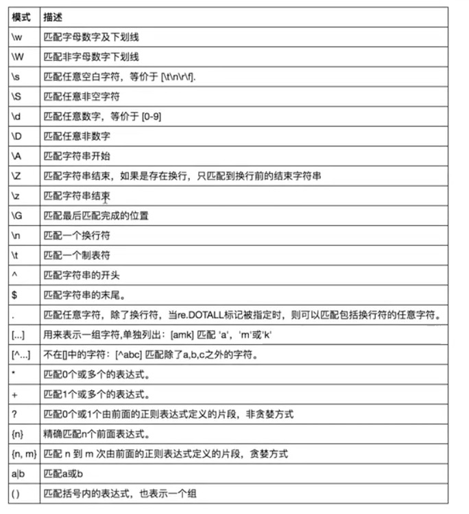
        
`import re`
`res = re.findall('\w', 'abc123_*()-= ')` 
`print(res)` # 返回值是一个列表

\w是如何工作的？   
首先从字符串的第一个字符开始匹配，'a'字符符合条件，放入列表，然后匹配下一个字符  
'b'也符合，放入列表，直到*不符合，跳过，匹配下一个，直到最后     

`re.findall('\W', 'abc123_*()-= ')`
匹配原理同上，但是\W匹配的是非字母数字下划线      

`re.findall('\Aalex', 'alexis alex sb')`
这里，'\Aalex'表示一个组合，正则的规则是\A，后面的alex则表示要匹配的内容    
即从头开始查找alex这个字符串     
从字符串第一个字符开始，'a'匹配上，匹配第二个字符，也匹配了，一直匹配到alex   
因为\A只匹配字符串开头，所以第二个'alex'不会被找到       
        
`re.findall('alex', 'alexis alex sb')`
没有加任何的匹配规则，就是从字符串中找到alex      
找到开头的alex之后，从字符'i'开始，与'a'不匹配，跳过    
's'与'a'也不匹配，跳过，直到发现第二个'a'，然后逐字匹配，匹配完成就放入列表   
         
**重要提示：**        
1. 在字符串中看不见的也是内容，空格，换行符，制表符等等       
2. 匹配规则一定是连续的   
+ 'abc'，就是查找abc
+ '^alex$'，查找开头是字符'a'，结尾是字符'b'，中间是'le'  
+ 从匹配成功的字符串后一个字符开始下一次匹配，不成功则继续逐字匹配      
          
**重复匹配符**             
包含：          
`.; *; ?; .*; .*?; +; {n, m}`         
`print(re.findall('a.b', 'a1b a2b  a  b a b))` # '.'匹配任意一个字符，\n除外，强调是一个字符       
`print(re.findall('a.b', 'a1b a2b  a  b a b), re.DOTALL)` # re.DOTALL表示可以匹配换行符         
`print(re.findall('a..b', 'a1b a2b  a  b a b))` # 匹配a+任意两个字符+b，\n除外         
          
`print(re.findall('ab*', 'a  ab  abbbbb bbbb'))` # '*'不可单独存在，表示左侧字符重复0次或无穷次，'a'必须有，'b'可有0次或无穷次       
`print(re.findall('ab+', 'a  ab  abbbbb bbbb'))` # '*'不可单独存在，表示左侧字符重复1次或无穷次，'a'必须有，'b'至少1次或无穷次       
`print(re.findall('ab?', 'a  ab  abbbbb bbbb'))` # '*'不可单独存在，表示左侧字符重复0次或1次，'a'必须有，'b'可有0次或1次       
        
{n,m}: 左侧字符重复n次到m次，可以取代上面几个       
{0,} 可以代替'*'        
{1,} 可以代替'+'         
{0,1} 可以代替'?'       
{n} 左侧字符匹配的次数    
`print(re.findall('ab{2,5}', 'a  ab  abbbbb bbbb'))` # b出现2-5次    
     
取出所有数字      
`print(re.findall('\d+\.?\d*', 'asdf123sadfsdf1.111sadf1asdf3'))`     
      
\[]匹配指定字符一个，可以放多个，如果是数字可以指定范围     
`print(re.findall('a[501234]b', 'a1b a2b a3b a4b a\nb', re.DOTALL))`    
`print(re.findall('a[0-5]b', 'a1b a2b a3b a4b a b a\nb', re.DOTALL))`    
`print(re.findall('a[0-9a-zA-Z]b', 'a1b a2b aXb aab a b a\nb', re.DOTALL))`    
`print(re.findall('a[^0-9a-zA-Z]b', 'a1b a2b aXb aab a b a\nb', re.DOTALL))`    # 这里的^表示取反，0-9与a-z与A-Z之外的所有字符   
    
注意：减号在中括号内，如果左右都有字符，表示范围，如果单纯地想匹配减号，应当放到最左侧或最右侧，表一个普通字符，如'a\[-0-9]b'

==========================
re模块的方法       
```
import re

# ['e', 'e', 'e'],返回所有满足匹配条件的结果,放在列表里
print(re.findall('e','alex make love') )   
   
# e,只到找到第一个匹配然后返回一个包含匹配信息的对象,该对象可以通过调用group()方法得到匹配的字符串,如果字符串没有匹配，则返回None。
print(re.search('e','alex make love').group()) 
 
#None,同search,不过在字符串开始处进行匹配,完全可以用search+^代替match
print(re.match('e','alex make love'))    

#['', '', 'cd']，先按'a'分割得到''和'bcd',再对''和'bcd'分别按'b'分割
print(re.split('[ab]','abcd'))     

#===> Alex mAke love，不指定n，默认替换所有
print('===>',re.sub('a','A','alex make love')) 

print('===>',re.sub('a','A','alex make love',1)) #===> Alex make love
print('===>',re.sub('a','A','alex make love',2)) #===> Alex mAke love
print('===>',re.sub('^(\w+)(.*?\s)(\w+)(.*?\s)(\w+)(.*?)$',r'\5\2\3\4\1','alex make love')) #===> love make alex

print('===>',re.subn('a','A','alex make love')) #===> ('Alex mAke love', 2),结果带有总共替换的个数


obj=re.compile('\d{2}')
print(obj.search('abc123eeee').group()) #12
print(obj.findall('abc123eeee')) #['12'],重用了obj
```


# 面向过程的编程思想

编程思想/范式   

面向过程的编程思想：    
核心是"过程"二字，过程即流程，指的是做事的步骤：先什么、再什么、后干什么    
基于该思想编写程序就好比在设计一条流水线    

优点：复杂的问题流程化、进而简单化    
缺点：扩展性非常差     

依据计算机的工作原理，编程最本质的思想就是面向过程的，其他思想如函数式，面向对象都是基于面向过程的一次次封装。    

面向过程的编程思想应用场景解析：   
1. 不是所有的软件都需要频繁更迭：比如编写脚本
2. 即便是一个软件需要频繁更迭，也不并不代表这个软件所有的组成部分都需要一起更迭

# 软件开发的目录规范

规范非强制性，但是有较高的可读性      
一个规范的软件开发应当含有以下目录：
1. bin：放可执行文件，例如start.py，启动文件也可以放在主目录内
2. conf：配置文件夹，对软件进行定制，例如各种路径的settings文件
3. db：对数据库进行操作，例如db_handle.py用于读写数据库
4. lib：存放各程序共用的功能，模块、包等均可放入，例如common.py
5. core：存放核心代码的逻辑，例如src.py，start.py只负责启动
6. api:各种接口文件，提供数据操作
    
还需要有以下文件：   
1. setup.py用于安装
2. requirement.txt用于列出所需库
3. READM.MD该项目的说明文件，例如如何使用，软件结构，官网地址等等 
4. run.py程序启动文件的另一个位置，程序的执行时所在文件夹默认为sys.path的第一路径，省去处理环境变量的麻烦
5. LICENSE.txt 开源项目的许可文件，可以有GPL,MIT等等
6. ChangeLog.txt 更新日志
          
注意：被执行的文件，例如bin/start.py，它的主目录是bin，也就是说，可执行文件的所在的目录被其视为主目录，是无法使用相对导入的
              
## 各目录之间的导入问题

python可以直接导入文件夹，但是相对导入不能跳出执行文件所在文件夹   
    
因此，只能使用绝对路径

    # /bin/start.py
    import sys
    sys.path.append(r'xx/x/xx/')

    import src
    src.run()

这样会把添加的环境变量写死，而且如果项目文件夹多，不利于导入       
        
应该把项目文件夹加入环境变量中   
`sys.path.append(r'项目文件夹路径')`   
这样，即使文件夹内的其他文件之间的调用也可以直接从项目文件夹开始找     
     
如何把项目文件夹的路径也写活？   
`print(__file__)`  
这里的__file__变量存储的是当前文件的绝对路径        
        
    import os
    print(__file__)
    print(os.path.dirname(__file__))
    print(os.path.dirname(os.path.dirname(__file__)))

os.path.dirname()获取传入参数的上一层文件夹      
    
python3.5之前用这个，兼容python2，3.5以后提供了pathlib包，更方便      
      
执行文件一般都加上以下语句：
`if __name__ == '__main__':`
`   run()`

## 执行文件放置位置

把start.py放到项目文件夹的根目录下，运行之后直接将所在文件夹加入到sys.path中
省去了处理环境变量的麻烦         

## 一些其他规范

配置文件中的变量一般都用大写，文件路径配置应当放入settings.py中               
 
其他文件不要导入执行文件，即start.py或者run.py    
   
共用的功能记得放入common文件夹

## 项目开发流程--ATM + 购物车

1. 需求分析
   + 与客户探讨需求，商量项目的功能能否实现，周期与价格，形成一个需求文档
   + 内部开会，探讨开发文档，包括UI，架构，使用软件，前端，后端等等，最终得到一个开发文档，交给不同岗位的程序员进行开发
        - Python: 后端，爬虫
        - 不同的岗位：
            - UI界面设计:
                - 设计软件的布局，会分局软件的外观切成一张张图片。
            - 前端:
                - 拿到UI交给他的图片，然后去搭建网页面。
                - 设计一些页面中，哪些位置需要接收数据，需要进行数据交互。
            - 后端:
                - 直接核心的业务逻辑，调度数据库进行数据的增删查改。
            - 测试:
                - 会给代码进行全面测试，比如压力测试，界面测试（CF卡箱子）。
            - 运维:
                - 部署项目。

2. 程序的架构设计   
   + 程序设计的好处:  
      + 思路清晰
      + 不会出现写一半代码时推翻重写
      + 方便自己或以后的同事更好维护  
   + 三层架构设计的好处  
      + 把每个功能都分层三部分，逻辑清晰
      + 如果用户更换不同的用户界面或不同的数据储存机制都不会影响接口层的核心逻辑代码，扩展性强。
      + 可以在接口层，准确的记录日志与流水。  
   + 三层架构  
      1. 用户视图层：用于与用户交互的，可以接受用户的输入，打印接口返回的数据。
      2. 逻辑接口层：接受用户视图层传递过来的参数，根据逻辑判断调用数据层加以处理，并返回一个结果给 用户视图层。
      3. 数据处理层：接受接口层传递过来的参数，做数据的 
        - 保存数据  save()
        - 查看数据  select()
        - 更新数据
        - 删除数据

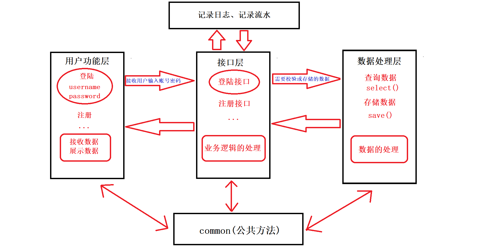
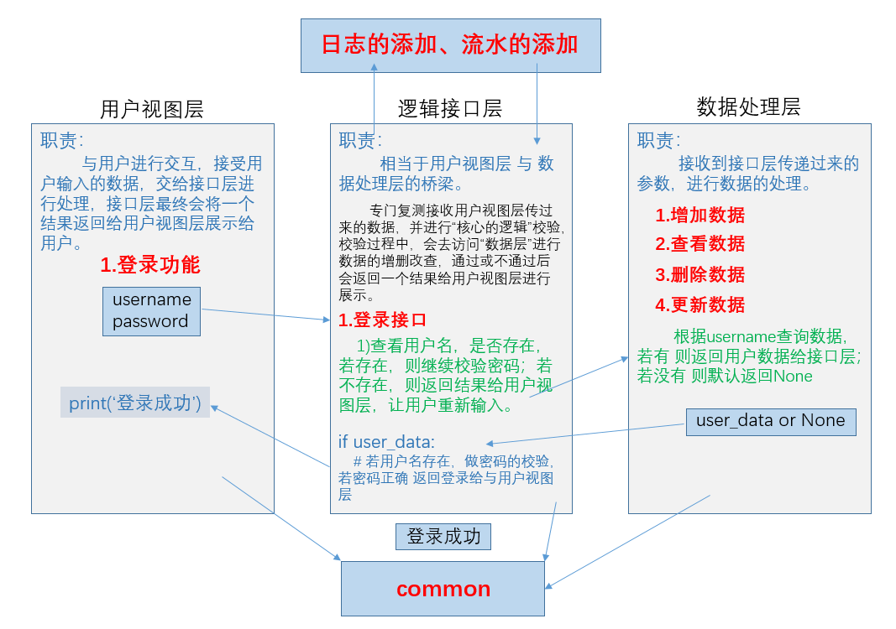

3. 分任务开发
4. 测试
5. 上线

**具体业务**   
1. 额度15000或自定义     -->  注册功能
2. 实现购物商城，买东西加入购物车，调用信用卡接口结账  --> 购物功能、支付功能
3. 可以提现，手续费5%   --> 提现功能
4. 支持多账户登录  --> 登录功能
5. 支持账户间转账  --> 转账功能
6. 记录日常消费 -->  记录流水功能
7. 提供还款接口 -->  还款功能
8. ATM记录操作日志 --> 记录日志功能
9. 提供管理接口，包括添加账户、用户额度，冻结账户等 ---> 管理员功能
10. 用户认证用装饰器  --> 登录认证装饰器

### 程序的架构设计--三层架构

+ 用户视图层
    - 用于与用户进行交互
        - 接收用户输入的内容
        - 打印输出内容给用户
        
+ 逻辑接口层
    - 核心业务逻辑，相当于用户视图与数据处理层的桥梁
        - 接收视图层传递过来的参数进行逻辑处理
        - 返回结果给视图层
    
+ 数据处理层
    - 做数据的 
        - 增
        - 删
        - 查
        - 改
    
### 搭建项目的目录规范

+ ATM 项目根目录

    - readme.md  项目的说明书

    - start.py  项目启动文件
    
    - conf  配置文件
        - settings.py
        
    - lib   公共方法文件
        - common.py
        
    - core（用户视图层）  存放用户视图层代码文件
        - src.py
        
    - interface（逻辑接口层）   存放核心业务逻辑代码
        - user_interface.py   用户相关的接口
        - bank_interface.py   银行相关的接口
        - shop_interface.py   购物相关的接口
    
    - db（数据处理层）  存放数据与数据处理层代码
        - db_handler.py  数据处理层代码
        - user_data  用户数据
        
    - log  存放日志文件

------

# 面向对象编程

## 基本概念  

程序就是用功能来处理数据，功能就是函数，数据就是变量。  
面向对象是一种编程范式，对于一些不提供面向对象编程的语言，可以按照这种思想来编写，都会有一种机制来对应  

**面向过程的程序设计：**  
核心是过程二字，过程指的是解决问题的步骤，即先干什么再干什么......   
面向过程的设计就好比精心设计好一条流水线，是一种机械式的思维方式。  

缺点是：一套流水线或者流程就是用来解决一个问题，生产汽水的流水线无法生产汽车，即便是能，也得是大改，改一个组件，牵一发而动全身。

应用场景：一旦完成基本很少改变的场景，著名的例子有Linux內核，git，以及Apache HTTP Server等。
  
**面向对象的程序设计：**  
核心是对象二字，对象是容器-->存放一个类的特征，属性，功能。  
将大量的数据和功能整合到一起  
归纳：具体--> 抽象  
演绎：抽象--> 具体  
地球上，本来没有人这个类，没有动物这个类。有了之后，人类开始观察，也就是通过逻辑上的归纳法，总结出了人类共有的一些特征，比如有一个脑袋，两只手，两条腿，可以制作工具等等。好了，把共有的特征归纳为一类，就是人类。  
在程序中，是先定义类，也就是先总结出你的程序哪些数据，功能（函数）属于一类，基于这个类在造出具体的东西，就是对象。   

优点是：解决了程序的扩展性。对某一个对象单独修改，会立刻反映到整个体系中，如对游戏中一个人物参数的特征和技能修改都很容易。

缺点：

1. 编程的复杂度远高于面向过程，不了解面向对象而立即上手基于它设计程序，极容易出现过度设计的问题。一些扩展性要求低的场景使用面向对象会徒增编程难度，比如管理linux系统的shell脚本就不适合用面向对象去设计，面向过程反而更加适合。
2. 无法向面向过程的程序设计流水线式的可以很精准的预测问题的处理流程与结果，面向对象的程序一旦开始就由对象之间的交互解决问题，即便是上帝也无法准确地预测最终结果。于是我们经常看到对战类游戏，新增一个游戏人物，在对战的过程中极容易出现阴霸的技能，一刀砍死3个人，这种情况是无法准确预知的，只有对象之间交互才能准确地知道最终的结果。

应用场景：需求经常变化的软件，一般需求的变化都集中在用户层，互联网应用，企业内部软件，游戏等都是面向对象的程序设计大显身手的好地方

类内的所有数据统称为属性，分为两种：一是数据属性，二是函数属性（称为方法）  

## 语法

基本原则：先定义类，在调用类产生对象
```
class 类名：

    变量1
    变量2

    def 功能1():
        pass
    def 功能2():
        pass

a = 类名(参数)
# a即为产生的具体对象
```
类名推荐驼峰体命名  

类是在定义时候运行的  
```
class Student:
    print("--->")
# 运行可看到结果
```
运行后，产生类的名称空间，并且这个名称空间是*局部*的

类的名称空间是定义阶段就产生，函数的名称空间是调用阶段产生  
查看类的名称空间(字典)：`print(Student.__dict__)`   

**访问类内的变量及功能**   
```
class Student:
    stu_name = 'abc'
    def tell_stu_school():
        pass
# 可以根据类的名称空间字典来读取类的内容
print(Student.__dict__['stu_name'])
print(Student.__dict__['tell_stu_schoo'])

# 更简单的方法，用类.变量/功能来调用类的功能
print(Student.stu_name)  # 本质上就是调用Student.__dict__['stu_name']
print(Student.tell_stu_school)
```

**创建类的对象--类的实例化**
类中存的是共有的，实例存的是独有的，但是自带了所有共有的内容   
类中的变量称为属性，功能称为方法，换一个说法，本质还是变量与函数    
```
class Student:
    stu_name = 'abc'
    def tell_stu_school():
        pass

stu1_obj = Student()
print(stu1_obj.stu_name)
print(stu1_obj.__dict__) # 这个字典是空的？实例中的字典只保存实例独有的属性
```
stu1_obj就是这个类的具体表现，它拥有类定义的属性和功能   
定制自己的对象，增加实例字典内容  
`stu1_obj.__dict__['stu_age'] = 18`  
`stu1_obj.__dict__['stu_gender'] = male`    
`print(stu1_obj.__dict__)`  

简化方法：本质上还是操作字典   
`stu1_obj.stu_name = 'edg'`  
`stu1_obj.stu_age = 18`  
`stu1_obj.stu_gender = 'male'`  

注意：实例创建好之后，类与实例不在是同一个东西了   
再创建第二个对象：  
```
stu2_obj = Student()  
print(id(Student))
print(id(stu1_obj))
print(id(stu2_obj))
```

## 类的__init__方法

每个实例都应当有自己的属性，而类可以只提供一个模板，可以以此来传入不同的参数   
也可以在模板的基础上新增一些属性   
调用类并接收其返回值的过程又叫实例化  

无模板新增属性
```
stu2_obj.stu_name = 'edg'
stu2_obj.stu_age = 18
stu2_obj.stu_gender = 'male'
```

python中提供了初始化的init方法，简化了这一过程
```
class Student:
    def __init__(self, name, age, gender):
        self.name = name
        self.age = age
        self.gender = gender

    def tell_stu_school(self):
        pass
```
其中的self就是实例的名字，例如stu1_obj, stu2_obj   
self只是约定俗成的用法，并非强制性要求   
  
```
# 新的实例化方法
stu1_obj = Student('abc', 18, 'male')
stu2_obj = Student('efg', 19, 'female')
```
该init方法在调用类的时候自动运行，给实例传参，并自动将对象当作第一个self的参数传入  

**实例化小结**  
1. 调用类时会先产生一个空对象
2. 自动调用类中的__init__方法，把实例化过程中括号内的参数传给__init__方法
3. 把初始化好的对象当作返回值返回

**init方法小结**  
1. 会在调用类时自动触发运行，用来为对象初始化自己独有的数据
2. \__init__内应该存放的是对象的初始化属性功能，但是可以存放任意其他代码，想要在类调用时就立刻执行的代码都可以放到该方法内
3. 该方法必须返回None，不可用return返回其他值

## 属性查找问题与绑定方法

**类的数据属性：**
```
class Student:
    stu_school = 'nau'
    def __init__(self, name, age, gender):
        self.name = name
        self.age = age
        self.gender = gender

    def tell_stu_school(self):
        pass

    def set_info(self, x, y, z):
        self.name = x
        self.age = y
        self.gender = z

stu1_obj = Student('lilei', 18, 'male')
print(stu1_obj.name)
print(stu1_obj.stu_school)
```
stu1_obj.name这个属性在实例里面存在，就从实例中查找  
stu1_obj.stu_school实例中不存在，就从类中查找  

下面定义多个实例  
```
stu2_obj = Student('hanmeimei', 19, 'female')  
stu3_obj = Student('poly', 17, 'male')  

print(stu2_obj.stu_school)
print(stu3_obj.stu_school)

print(id(Student.stu_school))
print(id(stu1_obj.stu_school))
print(id(stu2_obj.stu_school))
print(id(stu3_obj.stu_school))  # id相同，指向同一地址

Student.stu_school = 'NAU'
print(id(Student.stu_school))
print(id(stu1_obj.stu_school))
print(id(stu2_obj.stu_school))
print(id(stu3_obj.stu_school))  # id相同，指向同一地址

stu1_obj.stu_school = 'nnn'
print(id(Student.stu_school))
print(id(stu1_obj.stu_school))  # 当前实例产生了一个新属性，并且独有，与类无关
print(id(stu2_obj.stu_school))
print(id(stu3_obj.stu_school))  
```
注意：init方法是每调用一次就执行一次，所以，实例化三次就运行了三次   

**类的函数属性：绑定给对象使用**  
```
# 按照函数的规则来严格传参，第一个是实例对象
Student.set_info(stu1_obj, 'aaa', 11, 'male') 

# 通过实例来调用类中的函数叫做绑定方法
print(Student.set_info)
print(stu1_obj.set_info) # 地址不同
print(stu2_obj.set_info) # 地址不同
print(stu3_obj.set_info) # 地址不同

```
通过类的绑定方法，可以直接用实例调用类中的功能，不必使用'类.方法名'的方式来调用  
第一个参数即为实例名  
该功能的原来的位置还是在类中，各实例得到了该功能的地址，但是谁调用把谁当作第一个参数传入   
用法与普通函数是一样的   
注意：但凡在类中定义的函数，都需要固定的第一个参数，就是self，用来接收实例对象  

在python当中，一切皆对象，指的是类型也是一个类   
例如list是一个类型，也是一个类   
`l = ['aa', 'bb', 'cc']`本质上是`l = list(['aa', 'bb', 'cc'])`  
同样地，可以通过`l.方法`的方式来调用类中的方法，例如`l.append('dd')`就是把实例当作第一个参数自动传入      
也可以`list.append(l, 'dd')`，这种方法就需要传入实例对象参数。   


