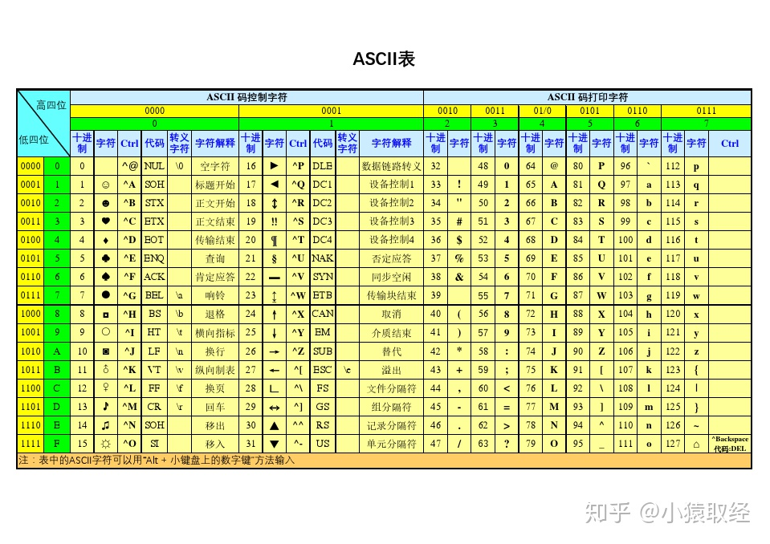
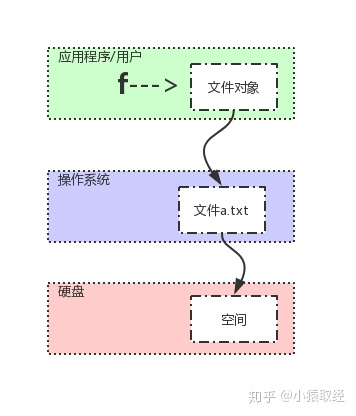

# 编辑器及解释器

本节主要介绍anaconda的使用及编辑器的使用

## ANACONDA

什么是anaconda?
它是一款开源的python发行版本，包含python的解释器和环境管理及一些包，
可以用它来管理python包，创建虚拟环境等等。 
----每个虚拟环境独立解释器和库

关于conda的环境变量
windows下要把anaconda文件夹下的scripts文件夹加入到系统的环境变量中，
然后可以通过cmd的conda --version命令来查看是否添加成功

如果不添加至系统的环境变量，可以通过anaconda自带的prompt来使用

以下是在不添加系统环境变量的情况下，使用anaconda powershell prompt

### 一、开始使用conda：

1.更新所有的工具包：conda upgrade --all
    或者conda update --all
    更新指定包：
        conda update/upgrade <package_name1 package_name2>
        以空格隔开多个包的名称
2.更新conda：conda update -n base -c defaults conda
    或者：conda update conda
3.创建虚拟环境:conda create -n learnpy python=3.7
    (自动查找3.7版本中的最新小版本)
    创建虚拟环境:conda create -name execrise_python python=3.8
    (自动查找3.8版本中的最新小版本)
    *-n或者--name后面跟的是虚拟环境的名称*
    *注意：创建虚拟环境需要联网以查找需要的python版本*
    *可以在指定版本之后加上包的名称，可以在创建虚拟环境的时候一起把包也下载了*
4.查看虚拟环境:conda env list
    显示结果前面的*号表示当前激活的虚拟环境
5.启用已经设定好的虚拟环境：conda activate learnpy
    如果只输入conda activate,则启动conda自带的base环境 
    **在linux环境中，使用source activate [环境名称：如learnpy]**
    **此时，linux系统会用learnpy的解释替换掉系统环境变量的解释器**
6.取消已激活的虚拟环境：conda deactivate
    **在linux环境中，使用source deactivate [环境名称：如learnpy]**
7.卸载环境：conda remove --name test --all
    同时卸载环境的所有包

### 二、在虚拟环境中安装包

*在某个虚拟环境中安装的包只有该虚拟环境能使用*
1.刚才新建的learnpy与execrise_python中是比较干净的环境，没有包
2.conda activate learnpy--->python--->import requests
    找不到这个包，推出解释器exit()
3.安装requests包：conda install requests
    或者：pip install requests
    安装好之后就可以在解释器中导入了
4.卸载包：conda remove requests
    或者：pip uninstall requests
    卸载指定环境的包：conda remove --name <env_name> <package_name>
5.查看当前环境的所有已安装包：conda list
6.给指定的环境安装包(即不给当前环境安装，给其他环境安装)
    conda install -- name <env_name> <package_name>
7.包的查找：
    a.精确查找：conda search --full-name <package_full_name>
    b.模糊查找：conda search <text>
    以上列出每个包可以安装的版本
***注意：在conda无法进行包的安装时，必须使用pip来安装***
***注意：pip无法指定环境安装，必须切换到具体的环境中***

### 三、导入导出环境信息

1.导出当前环境的包信息：conda env export > environment.yaml
    将包信息存入yaml文件中。
2.导入虚拟环境信息（即创建一个相同的虚拟环境）：conda env create -f environment.yaml
3.复制环境：conda create --name <new_env_name> --clone <copied_env_name>
    复制后的环境除了名称不一样其他都一样

anaconda的几个重要目录
1.查看anaconda的主目录，可以发现它就是base环境
2.进入env文件夹，即可看到你所创建的所有虚拟环境
3.本质上讲，每个虚拟环境其实都是一个真实的环境，不过可以通过activate来切换 

### anaconda源问题

anaconda 安装完成后，国内的网络连接Anaconda的官方源，速度基本为0，大部分时间是连接不上的。国内清华大学有对应的镜像源，可以更改为对应的源，可以通过更换原解决

首先在终端(Terminal)运行下面的命令生成 anaconda的 .condarc配置文件：
conda config 使用下面命令查看 .condarc 中的源
`conda config --show channels`

windows下
1 添加清华源
打开anaconda prompt  ，在命令行中直接使用以下命令：
conda config --add channels https://mirrors.tuna.tsinghua.edu.cn/anaconda/pkgs/free/
conda config --add channels https://mirrors.tuna.tsinghua.edu.cn/anaconda/cloud/conda-forge
conda config --add channels https://mirrors.tuna.tsinghua.edu.cn/anaconda/cloud/msys2/
    
设置搜索时显示通道地址
conda config --set show_channel_urls yes

Linux下
将以上配置文件写在 ~/.condarc 中
vim ~/.condarc
channels:
    - https://mirrors.ustc.edu.cn/anaconda/pkgs/main/
    - https://mirrors.ustc.edu.cn/anaconda/cloud/conda-forge/
    - https://mirrors.tuna.tsinghua.edu.cn/anaconda/pkgs/free/
    - defaults
show_channel_urls: true

也可以把 anaconda 仓(https://repo.continuum.io/)的添加进去：
这是在anaconda安装 tensorflow1.4.1 的时候遇到的问题，把这个 anaconda 仓添加进去问题就解决了
channels:
    - https://mirrors.ustc.edu.cn/anaconda/pkgs/main/
    - https://mirrors.ustc.edu.cn/anaconda/cloud/conda-forge/
    - https://mirrors.tuna.tsinghua.edu.cn/anaconda/pkgs/free/
    - https://repo.continuum.io/pkgs/main
    - defaults
show_channel_urls: true

若源不生效，试着把.condarc文件中的 - defaults那行去掉，就不会出现这个问题了

## VSCODE一些技巧及插件

1.ctrl+shift+p:打开 VsCode 命令窗口.在这个窗口下输入插件名称就能知道这个插件支持
    哪些特性了，顺带还会说明特性快捷键。
2.ctrl+F2：多光标编辑
3.ctrl+[：移动代码块   
4.ctrl+p:文件查找，快速打开文件列表，输入关键字匹配文件，优先显示最新打开过的
    文件，方便的在指定文件之间跳转。
5.F12:跳转到定义，跳转到函数或符号的定义。
6.alt+F12:以预览方式在当前页面显示定义，都是查看定义，相对F12的优点是不会跳出当前
    文件到定义文件，而是在当前文件打开一个小窗口预览
7.shift+F12:查看光标所在函数或变量的引用，就像 Alt +F12 一样以预览方式在当前文件
    打开引用的文件列表。
8.alt+左右/箭头:前进或者后退到光标所在源码的上一个位置。
9.ctrl+shift+o:查看当前文件的符号，可以用关键字过滤符号，当然你也可以在左侧的
    大纲视图中查找符号，不过大纲视图不能查找匹配符号，所以我更习惯用
    快捷键方式查找符号。

### VSCODE远程开发//TODO

    [vscode远程开发图示](image/vscode远程开发原理.png)

Local OS是 Win10 ,  Remote OS 是 Linux云主机。
远程开发本地 VS Code 用 SSH 协议与远程服务端通信，所以要先配置SSH环境变量，
由于Git自带SSH客户端程序

    [SSH程序](image/ssh程序.png)

配置GIT的环境变量，即将git的的bin目录添加到系统的环境变量中

    [环境变量](image/环境变量.png)

安装远程开发插件：
    vscode有一个远程开发插件包，包括了：

    Remote - SSH - 通过使用 SSH 链接虚拟或者实体Linux主机。
    Remote - Containers – 连接 Docker 开发容器。
    Remote - WSL - 连接 Windows Subsystem for Linux （Linux子系统）。

    打开软件的扩展界面，搜索 Remote 开头的插件，也能看到这三个的不同远程开发插件，
    我们这里连接的是云主机，选择安装 Remote - SSH 插件安装即可。


### 源码阅读插件

*插件名称：Todo Tree*
使用方法：这个插件的使用场景是，你看完代码加了下面这个注释 ：
// TODO 
以后会扩展这部分功能当然，不知道这个「以后」是什么时候，一不小心以后变成遥遥无期，
一部分原因是不想改，另一部分原因是写下这段注释的人时间久了就忘记了，这时候你需要
「 TODO Tree 插件」，我们可以更方便的管理代码中的此类注释。
这个插件能帮你组织和管理TODO注释，你在代码中注释的带 TODO 的标签会统一在侧边栏显示出来，
当然不限于 TODO 注释，可以自定义管理标签比如 FIXME 等，可以基于标签过滤和筛选。

*插件名称：Bookmarks*
使用方法：「书签」这个插件的功能就和它名字一样直接，没错它就是一个你的源码书签，
当我们看大工程源码的时候，往往需要在成千上万个源文件之间跳转，此外， Bookmarks 
能帮你方便的创建和管理书签，看到哪个位置想加个书签就按
快捷键 Ctrl + Alt + K ，多按一次就是删除，
不仅如此他还提供了在书签之前跳跃和查看管理的功能，更多功能可以自己体验，反正我看
大工程源码用这个很爽。

### GIT相关

    *插件名称：Git Graph*
    使用方法：提交记录变成一条条时间线，分支也能清晰的用不同颜色时间线区分出来，并且点开
    提交线上的提交点可以查看当时的提交动作，可以在提交动作上查看做了哪些改动，也可以方便
    的跳转到改动文件，更多功能自行体验。

    *插件名称：GitLens*
    使用方法：它可以在文件中改动的位置后面直接显示出本次改动的提交信息，然后你可以直接通过
    显示的提交信息跳转到提交文件对比，其实还有其他丰富的功能。

### 其他

    *插件名称：BracketPairColorizer*
    使用方法：这个插件让每一个括号都能找到他自己的颜色，成双成对，点一下其中一半括号自动
    匹配另一半，拯救了广大程序员的近视眼睛度数。

    *插件名称：koroFileHeader*
    使用方法：用于自动的插入头文件开头的说明和函数的说明。安装插件之后你只需要简单配置想要的格式，
    然后按下
    快捷键Ctrl + Alt +i
    即可自动即可自动生成这样一个模板。
    类似的对函数的说明注释模板，只需按下
    快捷键Ctrl + Alt +t
    即可完成，非常的方便。

    *插件名称：shellman*
    使用方法：在 Linux 下工作难免随手写一个脚本，这个插件能提供了便捷的shell script 自动补全
    和联想等功能，提高你的脚本编写速度和准确性。
   
### python

11.右键-提取方法自动生成函数 


1.安装yapf:代码重构 
    pip install yapf
2.安装好之后可以使用,在图形化配置中启用yapf
    快捷键:alt+shift+f 

插件
5.autoDocstring:快速生成结构化的文档注释
6.快捷键：ctrl+shift+2 

### C/C++

*插件名称：Switcher*
使用方法：我们经常需要通过头文件跳到对应的源文件，或者从源文件跳转到对应的头文件，
当然可以在侧边栏的文件管理器中选择打开，但是多了一个步骤有点繁琐，所以我找了这个插件，
其实按插件的说明文档，它是能在不同的文件类型之间跳转，不仅仅局限于头文件和源文件，
懒人福音，你值得拥有。


# Python基础

## 计算机基础

1.计算机三大核心硬件
CPU 内存 硬盘

2.应用程序与操作系统
应用程序实现功能
操作系统控制硬件

应用程序通过调用操作系统的功能来控制硬件

所有软件都是运行在硬件之上的，重点三大硬件：CPU--内存--硬盘
1.软件运行之前都是存放在硬盘内，以二进制形式存放
2.任何软件的启动都是将数据从硬盘中读入内存，然后CPU从内存中取出指令并执行
3.软件运行过程中产生的数据都是存放于内存中，若想永久保存软件产生的数据，则需将数据由内存存入硬盘

## 注释

单行注释“#”
多行注释"""注释内容"""
或者'''注释内容'''

## 变量

变量就是可以变化的量，量指的是事物的状态，比如人的年龄、性别，游戏角色的等级、金钱等等

先定义，后使用

对应内分为两个区，一个堆区，一个栈区
栈区放变量名
堆区放值

```
name = 'xxx' # 定义
print(name)  # 取
print(id(name)) # 获取变量的内存地址
l = ['a', name]
print(id(name))
print(id(l[1]))
```

定义变量的时候python解释器会向系统申请内存空间用于存放变量值

**变量有三大组成部分**
I：变量名=》是指向等号右侧值的内存地址的，用来访问等号右侧的值
II：赋值符号：将变量值的内存地址绑定给变量名 
III：变量值：代表记录的事物的状态

列表：本身并不存放值，存放的是索引与内容的对应关系，每个索引对应一个内存地址。
或者说，列表存放的是值的地址。
```
name = 'xxx'
l = ['a', name]
name = 'yyy'
print(l[1])
```
此时，l[1]的值不会变，因为值'xxx'在内存中的地址没有变，给name重新赋值，只是改变了name这个变量与'xxx'的绑定关系
l[1]依然指向值'xxx'的内存地址，与变量名无关
字典：key对应内存地址

### 内存管理：垃圾回收(GC)

垃圾：一个变量被绑定的变量名个数为0，此时该变量的值无法再被访问到，这个值就称之为垃圾

垃圾回收机制有三种：
1.引用计数
2.标记清除
3.分代回收

引用分为直接引用和间接引用

```
x = 10 # 直接引用
l = ['a', x]  # 间接应用，列表中为变量的内存地址
```
间接引用只出现在容器类型

一个值的引用计数增加
```
x = 10 # 10的引用计数为1
y = x  # 10的引用计数为2
z = x  # 10的引用计数为3
```
有三个变量指向10的地址

一个值的引用计数减少
```
del x # 解除变量名x与10的绑定关系，计数为2
del y # 10的计数为1
z = 12345 # 10的引用计数为0，此时被回收
```

引用计数为0，gc机制就将值回收

容器之间容易出现循环引用问题
循环引用导致计数不为0，但是又无法取到
此时无法通过引用计数回收
---> 内存泄漏，该内存无法被清空

标记清除：不是时时刻刻都在运行，当内存不够用时，python解释器会停止解释程序，开始扫描栈区
如果堆区的值在栈区中没有变量*直接引用*，就清除堆区


分代：
优化扫描垃圾的频率
在历经多次扫描的情况下，都没有被回收的变量，gc机制
就认为该变量是常用变量，gc会对其扫描的频率降低
即根据变量的存活时间划分不同的等级（不同的代）
以代为依据进行扫描

### 变量的基本类型

用函数type()来查看一个变量的类型
1.int型
2.float型
3.str
4.列表
    有序，计数从0开始而不是1
    可列表嵌套使用
5.字典
    key值位置，且key值必须为不可变类型，即不可使用容器类型
6.布尔值
    只有两个值，True和Falsfe，主要用于条件判断

可变类型：值改变，id不变，证明改的是原值，证明原值是可以被改变的
小结：list、dict是可变类型

不可变类型：值改变，id也变了，证明是产生新的值，压根没有改变原值，证明原值是不可以被修改的
小结：bool、int、float、str都被设计成了不可分割的整体，不能够被改变

### 列表的深浅copy

list1 = ['aaa', 'bbb', [1, 2]]
list2 = list1
print(list2)
list1[0] = 'ccc'
print(list2)
可以看到修改了list1,list2的内容跟着被修改
此时并不是真正意义上的复制。

浅copy:是把原列表第一层的内存地址不加区分完全copy一份给新列表

需求：
1、拷贝一下原列表产生一个新的列表
2、想让两个列表完全独立开，并且针对的是改操作的独立而不是读操作

要想copy得到的新列表与原列表的改操作完全独立开, 
必须有一种可以区分开可变类型与不可变类型的copy机制，这就是深copy

深copy的使用方法
import copy
list1 = ['aaa', 'bbb', [1, 2]]
list3 = copy.deepcopy(list1) 

## 输入与格式化输出

input得到的值均为**字符串类型**

字符串的格式化输出

### %----->效率低，不推荐

值按照位置与%s一一对应，少一个不行，多一个也不行
    res="my name is %s my age is %s" %('egon',"18")
    res="my name is %s my age is %s" %("18",'egon')
    res="my name is %s" %"egon"
    print(res)

以字典的形式传值，打破位置的限制
    res="我的名字是 %(name)s 我的年龄是 %(age)s" %{"age":"18","name":'egon'}
    print(res)

%s可以接收任意类型
    print('my age is %s' %18)
    print('my age is %s' %[1,23])
    print('my age is %s' %{'a.txt':333})
    print('my age is %d' %18) # %d只能接收int
    print('my age is %d' %"18")

### str.format:兼容性好

按照位置传值
    res='我的名字是 {} 我的年龄是 {}'.format('egon',18)
    print(res)

    res='我的名字是 {0}{0}{0} 我的年龄是 {1}{1}'.format('egon',18)
    print(res)

打破位置的限制，按照key=value传值
    res="我的名字是 {name} 我的年龄是 {age}".format(age=18,name='egon')
    print(res)

### f:python3.5以后才推出，效率高，推荐

    x = input('your name: ')
    y = input('your age: ')
    res = f'我的名字是{x} 我的年龄是{y}'
    print(res)

### 了解

填充与格式化
先取到值,然后在冒号后设定填充格式：[填充字符][对齐方式][宽度]
    \*<10：左对齐，总共10个字符，不够的用\*号填充
    print('{0:*<10}'.format('开始执行')) # 开始执行******

    *>10：右对齐，总共10个字符，不够的用*号填充
    print('{0:*>10}'.format('开始执行')) # ******开始执行

    *^10：居中显示，总共10个字符，不够的用*号填充
    print('{0:*^10}'.format('开始执行')) # ***开始执行***

### 精度与进制

    print('{salary:.3f}'.format(salary=1232132.12351))  #精确到小数点后3位，四舍五入，结果为：1232132.124
    print('{0:b}'.format(123))  # 转成二进制，结果为：1111011
    print('{0:o}'.format(9))  # 转成八进制，结果为：11
    print('{0:x}'.format(15))  # 转成十六进制，结果为：f
    print('{0:,}'.format(99812939393931))  # 千分位格式化，结果为：99,812,939,393,931

## 运算符

包括算数运算符、比较运算符、赋值运算符

### 算数运算符

加减乘除
** 表示乘方
// 除法，结果只保留整数部分
%  除法，结果只保留余数，即取余

### 比较运算符

    >、>=、<、<=、==、!=
    结果为布尔值

### 赋值运算符

= 变量的赋值

**链式赋值**
    x=10
    y=x
    z=y
    z = y = x = 10 # 链式赋值
    print(x, y, z)
    print(id(x), id(y), id(z))

    id相同，直接引用

**交叉赋值**
    m=10
    n=20
    m,n=n,m # 交叉赋值
    print(m,n)

**解压赋值**

```
salaries=[111,222,333,444,555]
# 把五个月的工资取出来分别赋值给不同的变量名
mon0=salaries[0]
mon1=salaries[1]
mon2=salaries[2]
mon3=salaries[3]
mon4=salaries[4]

解压赋值
mon0,mon1,mon2,mon3,mon4=salaries
print(mon0)
print(mon1)
print(mon2)
print(mon3)
print(mon4)

mon0,mon1,mon2,mon3=salaries # 对应的变量名少一个不行
mon0,mon1,mon2,mon3,mon4,mon5=salaries # 对应的变量名多一个也不行
```

**引入\*，可以帮助我们取两头的值，无法取中间的值**
```
取前三个值
x,y,z,*_=salaries=[111,222,333,444,555] # *会将没有对应关系的值存成列表然后赋值给紧跟其后的那个变量名，此处为_
print(x,y,z)
print(_)

取后三个值
*_,x,y,z=salaries=[111,222,333,444,555]
print(x,y,z)

x,*_,y,z=salaries=[111,222,333,444,555]
print(x,y,z)

salaries=[111,222,333,444,555]
_,*middle,_=salaries
print(middle)

解压字典默认解压出来的是字典的key
x,y,z=dic={'a.txt':1,'b':2,'c':3}
print(x,y,z)
```

## 流程控制

### 条件及判断

条件：是否往下执行的前提

1. 显示布尔值
a. 比较运算符
b. 布尔值True,False
2. 隐式布尔值:0，none，空（空字符串，空列表，空字典）--》布尔值为false，其余为真 

逻辑运算符：not/and/or
优先级：not > and > or

成员运算符:in和not in
print("egon" in "hello egon") # 判断一个字符串是否存在于一个大字符串中
print("e" in "hello egon") # 判断一个字符串是否存在于一个大字符串中

print(111 in [111,222,33]) # 判断元素是否存在于列表

判断key是否存在于字典
print(111 in {"k1":111,'k2':222})
print("k1" in {"k1":111,'k2':222})

not in
print("egon" not in "hello egon") # 推荐使用
print(not "egon" in "hello egon") # 逻辑同上，但语义不明确，不推荐

身份运算符
is # 判断的是id是否相等

*注意身份运算符与==运算符的不同，==比较的是两个变量的值，而is是比较两个变量的ID*

针对一连串的判断有短路运算
短路运算:偷懒原则，偷懒到哪个位置，就把当前位置的值返回

### if分支判断

语法1：
if 条件：
    代码1
    代码2
*满足条件，执行代码1和2，不满足就跳过*

语法2：
if 条件：
    代码1
else：
    代码2
*满足条件，执行代码1，不满足执行代码2*

语法3：
if 条件1：
    代码1
if 条件2：
    代码2
*每一个条件都要判断，都满足都执行，满足一个执行一个*

语法4：
if 条件1：
    代码1
elif 条件2:
    代码2
elif 条件3：
    代码3
else：
    代码4
*从上到下依次判断，满足哪一个执行哪一个代码，然后跳过其他的条件判断*
*也就是说：if与elif等只会执行一个代码块*

### while循环及for循环

```
while 条件：
    代码1
    代码2
满足条件即可运行块内代码
```

无出口会导致死循环，即条件始终为真。

退出循环的两种方法：
方式一:将条件改为false，等到下次循环判断时才会生效
```
tag=True
while tag:
    inp_name=input('请输入您的账号：')
    inp_pwd=input('请输入您的密码：')

    if inp_name  == username and inp_pwd == password:
        print('登录成功')
        tag = False # 之后的代码还会运行，下次循环判断条件时才生效
    else:
        print('账号名或密码错误')

    # print('====end====')
```

方式二：break,只要运行到break就会立刻终止本层循环
```
while True:
    inp_name=input('请输入您的账号：')
    inp_pwd=input('请输入您的密码：')

    if inp_name  == username and inp_pwd == password:
        print('登录成功')
        break # 立刻终止本层循环
    else:
        print('账号名或密码错误')

print('====end====')
```

while +continue：结束本次循环，直接进入下一次
强调：在continue之后添加同级代码毫无意义，因为永远无法运行

while + else：针对break
else包含的代码会在while循环结束后，并且while循环是在没有被break打断的情况下正常结束的，才会运行

for循环
理论上for循环能做的事情，while循环都可以做
之所以要有for循环，是因为for循环在循环取值（遍历取值）比while循环更简洁
语法：
```
for 变量名 in 可迭代对象:
    代码1
    代码2
    代码3
    ...
```
ps:可迭代对象可以是：列表、字典、字符串、元组、集合
(学过面向对象编程之后，可以知道可迭代对象都含有__iter__方法)

for循环控制循环次数：range()
for也可以与continue和else联用
补充：终止for循环只有break一种方案

while循环称之为条件循环，循环次数取决于条件何时变为假
for循环称之为"取值循环"，循环次数取决in后包含的值的个数

## 基本类型及方法详解

### 数字类型

类型转换
纯数字类型的字符串可以转换成int类型
`res = int('100000')`
进制转换
十进制--》二进制
11 -> 1011
1011 -> 8 + 2 + 1
`print(bin(11))`
十进制--》八进制
`print(oct(11))`
十进制--》十六进制
`print(hex(11))`

二进制->10进制
`print(int('0b1011',2)) # 11`
二进制->8进制
`print(int('0o13',8)) # 11`
二进制->16进制
`print(int('0xb',16)) # 11`

float类型转换成十进制会被截断，只保留整数部分
注意：不是四舍五入

### 字符串类型

str可以把任意其他类型都转成字符串

字符串类型类似于列表，可以按索引取值
`msg='hello world'`
正向取
`print(msg[0])`
`print(msg[5])`
反向取
`print(msg[-1])`

**只能取，不能改**
`msg[0]='H'`
报错：TypeError
所以，字符串类型只是类似于列表，但不是列表，该类型是不可变类型

**切片**
`msg = 'hello world`
`res = msg[0:5]   # 顾头不顾尾`
`res = msg[0:5:2] # 步长`
`res = msg[5:0:-1] # 反向步长`
`res = msg[:] # res = msg[0:11]`
`res = msg[::-1] # 把字符串倒过来`

**求长度**
`msg = 'hello world`
`print(len(msg))`

**成员运算**
判断一个子字符串是否存在于一个大字符串中
    print("alex" in "alex is sb")
    print("alex" not in "alex is sb")
    print(not "alex" in "alex is sb") # 不推荐使用

**去除-->strip方法**

默认去掉的是空白字符 --> 空白字符包括\n, \t, 空格等
    msg='      egon      '
    res=msg.strip()
    print(msg) # 不会改变原值
    print(res) # 是产生了新值

也可以指定去除的字符
    msg = 'abcdefga'
    print(msg.strip('a'))

了解：strip只取两边，不去中间
    msg = 'abcaaaadefga'
    print(msg.strip('a'))

*lstrip/rstrip指定去除左边/右边*

**split方法**

分割后的结果为列表
*默认分隔符是空格*
    info='egon 18 male'
    res=info.split()
    print(res) 

指定分隔符
    info='egon:18:male'
    res=info.split(':')
    print(res) 

指定分隔次数(了解)
    info='egon:18:male'
    res=info.split(':',1)
    print(res)

循环：取出每一个字符
    info='egon:18:male'
    for x in info:
        print(x)

**字符串拼接**
用加法

**字符串其他常用方法**  
乘法：多次打印
    msg = "hello World"
    print(msg * 3)

upper/lower方法：改变大小写
    print(msg.upper())
    print(msg.lower())

capitalize方法：首字母大写
    print(msg.capitalize())

startswith,endswith方法：判断首尾是否存在某字符串
    print("alex is sb".startswith("alex"))
    print("alex is sb".endswith('sb'))

join方法：把列表拼接成字符串，或在字符串中添加字符
该方法的参数为字符串或列表
在*每个字符*后添加一个字符
    str1 = 'abc'
    res = '+'.join(str1)
    print(res)
用join方法要求列表内的元素必须全为字符串类型，否则报类型错误。
    l = ['a', 'b', 'c']
    l1 = ":".join(l)
    l2 = "".join(l)
    print(l1)

replace
    msg="you can you up no can no bb"
    print(msg.replace("you","YOU",))
    print(msg.replace("you","YOU",1))

isdigit:判断字符串是否由纯数字组成
    print('123'.isdigit())
    print('12.3'.isdigit())

find,rfind,index,rindex
    msg='hello egon hahaha'
找到返回起始索引
    print(msg.find('e')) # 返回要查找的字符串在大字符串中的起始索引
    print(msg.find('egon'))
    print(msg.index('e'))
    print(msg.index('egon'))
找不到
    print(msg.find('xxx')) # 返回-1，代表找不到
    print(msg.index('xxx')) # 抛出异常

count:统计
    msg='hello egon hahaha egon、 egon'
    print(msg.count('egon'))

center,ljust,rjust,zfill
    print('egon'.center(50,'*'))
    print('egon'.ljust(50,'*'))
    print('egon'.rjust(50,'*'))
    print('egon'.zfill(10))

expandtabs
    msg='hello\tworld'
    print(msg.expandtabs(2)) # 设置制表符代表的空格数为2

swapcase,title
    print("Hello WorLd EGon".swapcase())
    print("hello world egon".title())

is数字系列：主要用于判断
    print('abc'.islower())
    print('ABC'.isupper())
    print('Hello World'.istitle())
    print('123123aadsf'.isalnum()) # 字符串由字母或数字组成结果为True
    print('ad'.isalpha()) # 字符串由由字母组成结果为True
    print('     '.isspace()) # 字符串由空格组成结果为True
    print('print'.isidentifier())
    print('age_of_egon'.isidentifier())
    print('1age_of_egon'.isidentifier())

isdigit只能识别：num1、num2
    num1=b'4' #bytes
    num2=u'4' #unicode,python3中无需加u就是unicode
    num3='四' #中文数字
    num4='Ⅳ' #罗马数字
    print(num1.isdigit()) # True
    print(num2.isdigit()) # True
    print(num3.isdigit()) # False
    print(num4.isdigit()) # False

isnumberic可以识别：num2、num3、num4
    print(num2.isnumeric()) # True
    print(num3.isnumeric()) # True
    print(num4.isnumeric()) # True

isdecimal只能识别：num2
print(num2.isdecimal()) # True
print(num3.isdecimal()) # False
print(num4.isdecimal()) # False

### 列表类型

取索引、切片、求长度（len（））同字符串类型
成员运算in和not in同字符串类型

类型转换：但凡能够被for循环遍历的类型都可以当做参数传给list()转成列表
`res = list('hello')`
`print(res) # 一个字符组成的列表`

`res = list({'k1':111, 'k2':333, 'k3':333})`
`print(res) # 取出key并组成列表`

**列表中增加元素**
1.append
在列表最后添加，需要一个参数
```
l = [111, 222, 333]
l.append('aaa')
```

2.insert
需要两个参数，第一个表示插入的位置，第二个是插入的内容
```
l = [111, 222, 333]
l.insert(0, 'aaa')
```

3.extend
可以把一个列表中的所有元素添加到另一个列表中，在目标列表的后面
```
l1 = [111, 222, 333]
l2 = ['aaa', 'bbb']
l1.extend(l2)
print(l1)
```

**列表中删除元素**
1.del:通用删除方法，无返回值
```
l = ['111', 222, 'aaa']
del l[1]
```

2.pop:依据索引删除，默认最后一个元素，返回值为被删除的元素
```
l = ['111', 222, 'aaa']
a = l.pop()
l.pop(0)
```

3.remove:依据元素删除，返回none
```
l = ['111', 222, 'aaa']
l.remove('111')
```

**列表的其他常用操作**
find/index/count用法同str类型
注意find不报错，index报错即可

clear方法：清空列表

reverse方法：倒序排列列表

sort方法：排序，要求列表内的元素必须相同
默认升序，可以传入参数（reverse=True）--》降序

### 元组类型

同列表一样是有序的，但是只能读取不能改
元组中也存放的是内存地址

如果元组中只有一个元素，必须加逗号
t=(10,) 

**类型转换**
```
print(tuple('hello'))
print(tuple([1,2,3]))
print(tuple({'a1':111,'a2':333}))
```

取索引、切片、求长度（len）、循环等操作同列表

### 字典类型

{}内用逗号分隔开多个key：value，其中value可以使任意类型，但是
key必须是不可变类型,且不能重复

定义字典：
方法一：直接定义
```
d={'k1':111,(1,2,3):222} # d=dict(...)
print(d['k1'])
print(d[(1,2,3)])
print(type(d))

d={} # 默认定义出来的是空字典
print(d,type(d))
```

方法二：dict函数
```
d=dict(x=1,y=2,z=3)
print(d,type(d))
```

方法三：类型转换
```
l1 = [
    ['aaa', 'bbb'],
    ('ccc', 'ddd'),
    ['eee', 'fff']
]
# 如果以上列表不是成对出现就会报错，ValueError
d1 = dict(l1)
print(d1) 
```

方法四：字典的fromkeys方法
```
l1 = ['aaa', 'bbb', 'ccc']
d1 = {}.fromkeys(l1, None)  # None是设定的默认值，可以换成其他的
print(d1)
```

取、改、增
```
dic1 = {
    'a':1111,
    'b':2222,
    'c':3333
}
print(dic1['a']) # 取，不存在报错
print(dic1.get('a')) # 取，不存在返回none，不报错
dic1['a'] = 4444 # 改
dic1['d'] = 5555 # 增
```

求长度len():结果为字典中key的数量

成员运算in和not in：依据key是否存在,值存在没有用

删
1.通用删del

2.pop方法：传入key作为参数，返回被删除key的value值

3.popitem方法：随机删除，返回元组

循环取值的结果：
```
d={'k1':111,'k2':2222}
# 取key
for k in d.keys():
    print(k)
# 取key
for k in d:
    print(k)
# 取value
for v in d.values():
    print(v)
# 取key和value
for k,v in d.items():
    print(k,v)

print(list(d.keys()))
print(list(d.values()))
print(list(d.items()))   # key-value组成的元组
```

**字典的常用方法**
1.clear:清空字典

2.update:更新字典-->如果key存在，则更改值，如果不存在则新增值

3.get:依据key取值，不存在不会报错，返回none

4.setdefault:如果key有则不添加,返回字典中key对应的值
            如果key没有则添加，返回字典中key对应的值

### 集合类型

定义: 在{}内用逗号分隔开多个元素，多个元素满足以下三个条件:
1. 集合内元素必须为不可变类型
2. 集合内元素无序-->把一个set转换成list，无法保证顺序
3. 集合内元素没有重复

定义空集合：
s = set()
s = {} # 这个是空字典

求长度、成员运算、循环同其他可变类型

类型转换
```
set({1,2,3})
res=set('hellolllll')
print(res)

print(set([1,1,1,1,1,1]))
print(set([1,1,1,1,1,1,[11,222]]) # 报错，内有可变类型

print(set({'k1':1,'k2':2}))  # 取出key，组成集合
```

**内置方法**
`animals = {"dog", "cat", "chicken", "duck"}`
`animalss = {"fish", "cow", "chicken", "duck"}`

1. 取交集：
`res = animals & animalss`
`print(res)`
`print(animals.intersection(animalss))`

2. 取并集：
`print(animals | animalss)`
`print(animals.union(animalss))`

3. 取差集：animals独有的元素
`print(animals - animalss)`
`print(animals.difference(animalss))`

4. 取对称差集：求两个集合独有的（即交集的补集）
`print(animals ^ animalss)`
`print(animals.symmetric_difference(animalss))`

5. 判断是否父子集：即是否包含
`print(animals > animalss) # 不存在包含关系，结果false`
`print(animals < animalss) # 不存在包含关系，结果false`
`print(animals.issuperset(animalss)) `
`print(animalss.issuperset(animals)) `

6. 判断是否有交集：
`res = animals.isdisjoint(animalss) # 完全无相同元素则返回True`

7. 删除元素
```
s = {1, 2, 3, 4}
s.discard(5) # 删除元素，不存在则什么也不做
s.remove(5)  # 删除元素，不存在则报错
a = s.pop()  # 删除元素，并返回被删除元素
```

7. 更新集合update
`s.update({2, 4, 6}) `

8. 增加元素add
`s.add(4)`

## 字符编码

[字符编码](https://www.cnblogs.com/leesf456/p/5317574.html)

应用：字符串类型、文本文件

什么是编码：建立字符与数字的对应关系

**文本编辑器的启动流程**
阶段1、启动一个文件编辑器（文本编辑器如nodepad++，pycharm，word）

阶段2、文件编辑器会将文件内容从硬盘读入内存

阶段3、文本编辑器会将刚刚读入内存中的内容显示到屏幕上
-->注意：显示到屏幕上的内容在内存中，点保存才会写入硬盘

**python解释器执行文件的流程**
阶段1、启动python解释器，此时就相当于启动了一个文本编辑器

阶段2、python解释器相当于文本编辑器，从硬盘上将xx.py的内容读入到内存中

阶段3、python解释器解释执行刚刚读入的内存的内容，开始识别python语法

### 字符编码种类和编码的基本过程

存：编码
字符---->编码表--->内存
取：解码
内存---->编码表--->字符

编码表由操作系统提供，启动后加载到内存
所以同一个文件在不同系统会出问题，除非用统一的编码表

在unicode中，地球上所有的字符都能找到对应的编码

windows系统cmd中文表示用的是gbk表示
大多数编程语言用到的是utf-8编码

ASCII表：
    1、只支持英文字符串
    2、采用8位二进制数对应一个英文字符串
    
    2**8=256

GBK表：
    1、支持英文字符、中文字符
    2、
    采用8位（8bit=1Bytes）二进制数对应一个英文字符串
    采用16位（16bit=2Bytes）二进制数对应一个中文字符串
    2**16=65536

unicode（内存中统一使用unicode）：
    1、
        兼容万国字符
        与万国字符都有对应关系
    2、
    采用16位（16bit=2Bytes）二进制数对应一个中文字符串
    个别生僻会采用4Bytes、8Bytes


unicode表：
                    内存
人类的字符---------unicode格式的数字----------
                        |                     |
                        |                     |
                        |
                    硬盘                    |
                        |
                        |                     |
                        |                     |
                GBK格式的二进制       Shift-JIS格式的二进制

老的字符编码都可以转换成unicode，但是不能通过unicode互转
理论上是可以将内存中unicode格式的二进制直接存放于硬盘中的，但由于unicode固定使用两个字节来存储一个字符，如果多国字符中包含大量的英文字符时，使用unicode格式存放会额外占用一倍空间（英文字符其实只需要用一个字节存放即可）
然而空间占用并不是最致命的问题，最致命地是当我们由内存写入硬盘时会额外耗费一倍的时间


utf-8：
将内存中的unicode二进制写入硬盘或者基于网络传输时必须将其转换成一种精简的格式，这种格式即utf-8（全称Unicode Transformation Format，即unicode的转换格式）
    英文->1Bytes(8bit)
    汉字->3Bytes(24bit)

结论：
    1、内存固定使用unicode，我们可以改变的是存入硬盘采用格式
      unicode更像是一种过渡版本，用来兼容其他诸如gbk,shift-jis等
        英文+汉字-》unicode-》gbk
        英文+日文-》unicode-》shift-jis
        万国字符》-unicode-》utf-8

        gbk\shift-jis\utf-8是平级的

    2、文本文件存取乱码问题
        存乱了：解决方法是，编码格式应该设置成支持文件内字符串的格式
        取乱了：解决方法是，文件是以什么编码格式存如硬盘的，就应该以什么编码格式读入内存

### python中字符编码的方法

**在文本编辑器中更改的字符编码改的是存入硬盘的编码格式**

1、python解释器默认读文件的编码
python3默认：utf-8
python2默认：ASCII

2、保证运行python程序前两个阶段不乱码的核心法则：
指定文件头，修改解释器的编码格式
ps：控制的是读文件的编码，即程序运行的前两个阶段
`# coding:文件当初存入硬盘时所采用的编码格式`

例如：
**字符串的编码与解码**
```
# coding:utf-8

x='上'
res=x.encode('gbk') # unicode--->gbk
# print(res,type(res))
print(res.decode('gbk'))
```
解释器用自己默认的字符编码读取文件的首行

写文件由编辑器控制

3、python3的str类型默认直接存成unicode格式，无论如何都不会乱码
保证python2的str类型不乱码
    x=u'上'

4、了解
python2解释器有两种字符串类型：str、unicode
    # str类型
    x='上' # 字符串值会按照文件头指定的编码格式存入变量值的内存空间
    # unicode类型
    x=u'上' # 强制存成unicode

## 文件操作

文件是存储数据的虚拟概念/接口

用户/应用程序直接操作的是文件，对文件进行的所有的操作，都是
在向操作系统发送系统调用，然后再由操作将其转换成具体的硬盘操作

注意：vscode中打开文件始终从.vscode所在目录开始进行查找，而不是从执行文件所在文件夹查找。

### python操作文件的基本方法和流程

控制文件读写内容的模式：t和b
**强调：t和b不能单独使用，必须跟r/w/a连用**
t文本（默认的模式）
1. 读写都以str（unicode）为单位的
2. 文本文件
3. 必须指定encoding='utf-8'

b二进制/bytes:除文本文件外的其他文件，如图片，视频等等

控制文件读写操作的模式:
1. r只读模式
2. w只写模式
3. a只追加写模式
4. +：r+、w+、a+

基本流程：
一、打开文件open
`open('文件路径')`

文件路径
绝对路径：以\（根目录）开头，或以盘符开头的路径
相对路径：以执行文件所在文件夹作为起始，向上或向下查找

windows路径分隔符问题
`open('C:\a.txt\nb\c\d.txt')`
解决方案一：推荐
`open(r'C:\a.txt\nb\c\d.txt')`
解决方案二：open这个功能自动识别
`open('C:/a.txt/nb/c/d.txt')`

解决跨平台路径问题，推荐使用os模块
该模块下的path函数用于读取文件/文件夹名称(str类型)
配合字符串的join方法拼接出完整路径
```
import os
BASE_PATH = os.path.join("User",
                        "adminstrator",
                        "aaa.txt")
```

open()函数会返回一个叫文件对象（file object）的对象
也称为文件句柄
这个文件对象是一种变量，归属于这个程序，同样存在于内存空间
并且同时映射到硬盘内的具体文件
操作文件：读/写文件，应用程序对文件的读写请求都是在向操作系统发送
系统调用，然后由操作系统控制硬盘把输入读入内存、或者写入硬盘

默认参数：
`f = open('aaa.txt')`
`print(f)`
`<_io.TextIOWrapper name='aaa.txt' mode='r' encoding='cp936'>`
指定参数：
`f = open('aaa.txt', mode='rt', encoding='utf-8')`

文件对象和其他类型一样，有内置的方法：
读：f.read() ---> 这个方法有返回值，需要有变量接收

写：f.write()



关闭文件：回收操作系统资源--->操作系统打开文件数是一定的
`f.close()`
但是这个f的变量还是存在的，只是不可以读取

with:上下文管理，跳出代码块后即关闭文件
```
with open('a.txt',mode='rt') as f1,\
        open('b.txt',mode='rt') as f2:
    res1=f1.read()  # t模式会将f.read()读出的结果解码成unicode
    res2=f2.read()
    print(res1)
    print(res2)
```

为什么用t模式需要指定编码表？
没有指定encoding参数操作系统会使用自己默认的编码
linux系统默认utf-8
windows系统默认gbk


### 文件操作模式详解

**r模式**
默认模式，当访问的文件不存在时报错，打开文件后*文件指针*跳到开头

```
with open('c.txt',mode='rt',encoding='utf-8') as f:
    print('第一次读'.center(50,'*'))
    res=f.read() # 把所有内容从硬盘读入内存
    print(res)
```

read方法在读取大文件时容易填满内存
在调用read方法后，*文件指针*移动，并读出文件内容直到文件结尾
此后，在调用read方法将无法读出文件内容

```
===============案例：输入验证==================
# 新建一个用于存放用户名和密码的文件user.txt

inp_username=input('your name>>: ').strip()
inp_password=input('your password>>: ').strip()

# 验证
with open('user.txt',mode='rt',encoding='utf-8') as f:
    for line in f:
        # print(line,end='') # egon:123\n
        # strip()取出空白字符，包括\n\t等等
        username,password=line.strip().split(':')
        if inp_username == username and inp_password == password:
            print('login successfull')
            break
    else: # 注意，for循环遍历完列表并且没有被break打断，执行代码
        print('账号或密码错误')
```

**w模式**
只写模式，当文件不存在时会创建空文件，当文件存在会*清空*文件，指针位于开始位置
此时文件不可读，即不可使用read方法，用了就报错

在以w模式打开文件没有关闭的情况下，连续写入，新的内容总是跟在旧的之后
```
with open('d.txt',mode='wt',encoding='utf-8') as f:
    f.write('这是一句话\n')
    f.write('这是另一句话\n')
    f.write('这还是一句话\n')
```

如果重新以w模式打开文件，则会清空文件内容
```
with open('d.txt',mode='wt',encoding='utf-8') as f:
    f.write('这是一句话\n')
with open('d.txt',mode='wt',encoding='utf-8') as f:
    f.write('这是另一句话\n')
with open('d.txt',mode='wt',encoding='utf-8') as f:
    f.write('这还是一句话\n')
```

案例：文件复制程序：
```
src_file=input('源文件路径>>: ').strip()
dst_file=input('源文件路径>>: ').strip()
with open(r'{}'.format(src_file),mode='rt',encoding='utf-8') as f1,\
    open(r'{}'.format(dst_file),mode='wt',encoding='utf-8') as f2:
    res=f1.read()
    f2.write(res)
```

**a模式**
只追加写，在文件不存在时会创建空文档，在文件存在时文件指针会直接跳到末尾，不会清空文件
此时文件不可读，即不可使用read方法，用了就报错


强调 w 模式与 a 模式的异同：
1. 相同点：在打开的文件不关闭的情况下，连续的写入，新写的内容总会跟在前写的内容之后
2. 不同点：以 a 模式重新打开文件，不会清空原文件内容，会将文件指针直接移动到文件末尾，新写的内容永远写在最后


```
案例：a模式用来在原有的文件内存的基础之上写入新的内容，比如记录日志、注册
注册功能
name=input('your name>>: ')
pwd=input('your name>>: ')
with open('db.txt',mode='at',encoding='utf-8') as f:
    f.write('{}:{}\n'.format(name,pwd))
```

**+模式**
了解即可，使用场景少，一般都用纯净的模式

+不能单独使用，必须配合r、w、a
特性取决与r\w\a
r+，如果文件不存在则报错，并且是覆盖写入
w+，如果文件不存在则创建，如果文件存在则清空
a+，打开文件后指针跳到最后

**x模式**
了解即可，使用场景少，一般都用纯净的模式

x，只写模式【不可读；不存在则创建，存在则报错】
防止清空文件时可用

**b模式**

1、读写都是以bytes为单位
2、可以针对所有文件-->图片，视频等等
3、一定不能指定字符编码，即一定不能指定encoding参数


1、在操作纯文本文件方面t模式帮我们省去了编码与解码的环节，b模式则需要手动编码与解码，所以此时t模式更为方便
2、针对非文本文件（如图片、视频、音频等，文本也行）只能使用b模式


错误演示：t模式只能读文本文件
```
with open(r'xxx.mp4',mode='rt') as f:
    f.read() # 硬盘的二进制读入内存-》t模式会将读入内存的内容进行decode解码操作
```

```
with open(r'test.jpg',mode='rb',encoding='utf-8') as f:
    res=f.read() # 硬盘的二进制读入内存—>b模式下，不做任何转换，直接读入内存
    print(res) # bytes类型—》当成二进制
    print(type(res))
```

b模式更加通用，t模式帮我们做了编码的操作，省了一步


```
案例：文件拷贝工具
src_file=input('源文件路径>>: ').strip()
dst_file=input('源文件路径>>: ').strip()
with open(r'{}'.format(src_file),mode='rb') as f1,\
    open(r'{}'.format(dst_file),mode='wb') as f2:
    # res=f1.read() # 内存占用过大
    # f2.write(res)

    for line in f1:
        f2.write(line)


循环读取文件
方式一：自己控制每次读取的数据的数据量
with open(r'test.jpg',mode='rb') as f:
    while True:
        res=f.read(1024) # 1024字节
        if len(res) == 0:
            break
        print(len(res))
b模式下的read方法接受一个参数，即字节大小


方式二：以行为单位读，当一行内容过长时会导致一次性读入内容的数据量过大
with open(r'g.txt',mode='rt',encoding='utf-8') as f:
    for line in f:
        print(len(line),line)

with open(r'g.txt',mode='rb') as f:
    for line in f:
        print(line)

with open(r'test.jpg',mode='rb') as f:
    for line in f:
        print(line)

# 无论是图片还是视频，都是以某种方式来换行，for循环都可以遍历
```

如果某个文件的一行太大，用while循环按照字节来读取不会对内存造成太大压力。

**bytes类型转换**

1：如果是纯英文字符，可以直接加前缀b得到bytes类型
所有编码表均兼容英文字符
l = [
    b'1111aaa1\n',
    b'222bb2',
    b'33eee33'
]

2：'上'.encode('utf-8') 等同于bytes('上',encoding='utf-8')
l = [
    bytes('上啊',encoding='utf-8'),
    bytes('冲呀',encoding='utf-8'),
    bytes('小垃圾们',encoding='utf-8'),
]
f.writelines(l)

flush方法：
flush刷新
因为操作系统不是每次写入操作都会立刻执行，而是在某些条件下才会触发
f.flush()会让操作系统立刻写入
尽量少用，因为操作系统的延迟写入本身也是一种优化机制

**重点：只有在调用read方法时才会把内容放入内存**
**open函数只是产生了一个文件对象，不会读取内容**

### read方法与write方法

readline:一次读一行

readlines:生成一个列表，把每行内容放入这个大列表中

f.read()与f.readlines()都是将内容一次性读入内存，如果内容过大会导致内存溢出，若还想将内容全读入内存，用循环的方式

f.writelines():把一个列表中的元素，以for循环的方式写入文件
```
with open('h.txt',mode='wt',encoding='utf-8') as f:
    l=['11111\n','2222','3333']
    # l=['11111\n','2222','3333',4444]  --> 报错
    # for line in l:
    #     f.write(line)
    f.writelines(l)  # 接受一个列表作为参数
                     # 这个列表中的内容要么是byte类型，要么是str
```

f.readable() -->判断是否可读
f.writable() -->判断是否可写
f.encode     -->查看编码格式，例如返回utf-8
f.name       -->查看文件名

### 文件指针

指针移动的单位都是以bytes/字节为单位
只有一种情况特殊：t模式下的read(n),n代表的是字符个数

f.seek(n,模式):n指的是移动的字节个数
模式有三种：0、1、2
**强调：只有0模式可以在t下使用，1、2必须在b模式下用**

模式0：参照物是文件开头位置
f.seek(9,0)
f.seek(3,0) # 3

模式1：参照物是当前指针所在位置
f.seek(9,1)
f.seek(3,1) # 12

模式2：参照物是文件末尾位置，应该倒着移动
f.seek(-9,2) # 3
f.seek(-3,2) # 9

f.tell() # 获取文件指针当前位置

注意：如果打开一个文件，然后修改该文件，并不是追加操作
在打开文件的时候已经把文件的所有内容读取到了内存，修改后保存
是把内存中的内容全部覆盖回硬盘
只有用a模式才是正宗的追加操作

应用：文件增加检测
```
import time

with open('access.log', mode='rb') as f:
    # 1、将指针跳到文件末尾
    # f.read() # 错误
    f.seek(0,2)

    while True:
        line=f.readline()
        if len(line) == 0:
            time.sleep(0.3)
        else:
            print(line.decode('utf-8'),end='')
```

### 文件修改的两种方式

方式一：文本编辑采用的就是这种方式
实现思路：将文件内容发一次性全部读入内存,然后在内存中修改完毕后再覆盖写回原文件
优点: 在文件修改过程中同一份数据只有一份
缺点: 会过多地占用内存
```
with open('c.txt',mode='rt',encoding='utf-8') as f:
    res=f.read()
    data=res.replace('alex','dsb')
    print(data)

with open('c.txt',mode='wt',encoding='utf-8') as f1:
    f1.write(data)
```

方式二：
import os
实现思路：以读的方式打开原文件,以写的方式打开一个临时文件,一行行读取原文件内容,修改完后写入临时文件...,删掉原文件,将临时文件重命名原文件名
优点: 不会占用过多的内存
缺点: 在文件修改过程中同一份数据存了两份
```
with open('c.txt', mode='rt', encoding='utf-8') as f, \
        open('.c.txt.swap', mode='wt', encoding='utf-8') as f1:
    for line in f:
        f1.write(line.replace('alex', 'dsb'))

os.remove('c.txt')
os.rename('.c.txt.swap', 'c.txt')
```

### csv文件操作//TODO

csv用于excel表格
导入csv模块
`import csv`

## 函数

定义函数
```
def 函数名(参数1,参数2,...):
    """文档描述"""
    函数体
    return 值
```

可有可无部分：参数、文档描述、return语句

定义函数发生的事情
1、申请内存空间保存函数体代码
2、将上述内存地址绑定函数名
3、定义函数不会执行函数体代码，但是会检测函数体语法，**只检测语法**

调用函数发生的事情
1、通过函数名找到函数的内存地址
2、然后加括号就是在触发函数体代码的执行，或者说内存地址()触发运行
`print(func) --> 打印函数的地址`
`func() --> 有括号，触发函数体执行`
本质上，定义函数与定义变量类似，
通过变量名找到值，通过函数名找到函数
名字对应值

形式一：无参函数 --> 调用某一功能
`def func():`

形式二：有参函数 --> 对数据进行加工
`def func(x, y, z):`

形式三：空函数 --> 占位，构思代码，待以后补全
`def func():`
`    pass`
`pass可以用...取代`

**函数返回值**
*return是函数结束的标志，即函数体代码一旦运行到return会立刻*
终止函数的运行，并且会将return后的值当做本次运行的结果返回：

1、返回None：函数体内没有return
            return
            return None  --> 没必要

2、返回一个值：return 值
```
def func():
    return 10
res=func()
print(res)
```

3、返回多个值：用逗号分隔开多个值，会被return返回成元组
```
def func():
    return 10, 'aa', [1, 2]
res = func()
print(res, type(res))
```

### 函数的参数

形参：函数定义阶段定义的参数
实参：函数调用阶段传入的值


形参与实参的关系：
1、在调用阶段，实参（变量值）会绑定给形参（变量名）
2、这种绑定关系只能在函数体内使用
3、实参与形参的绑定关系在函数调用时生效，函数调用结束后解除绑定关系

*python中，所有的传递都是内存地址的传递*
C语言中，是把实参的副本复制给形参，不会影响到原参数

实参是可求值的表达式或具体值
形式一：具体值
`func(1,2)`
形式二：变量
`a = 1`
`b = 2`
`func(a, b)`
形式三：表达式
`func(int('1'), 2)`
`func(func1(1,2), func2(2,3), x+y)`

#### 位置参数、关键字形参与默认形参

**位置参数**

按照从左到右的顺序依次定义的参数称之为位置参数

位置形参:在函数定义阶段，按照从左到右的顺序直接定义的"变量名"
特点：必须被传值，多一个不行少一个也不行

位置实参:在函数调用阶段，按照从左到有的顺序依次传入的值
特点：按照顺序与形参一一对应

**关键字形参**

关键字实参：在函数调用阶段，按照key=value的形式传入的值
特点：指名道姓给某个形参传值，可以完全不参照顺序

**混用**

1、位置实参必须放在关键字实参前
2、不能能为同一个形参重复传值

**默认形参**

默认形参：在定义函数阶段，就已经被赋值的形参，称之为默认参数
特点：在定义阶段就已经被赋值，意味着在调用阶段可以不用为其赋值

**位置形参与默认形参混用**

1、位置形参必须在默认形参的左边
2、默认参数的值是在函数定义阶段被赋值的，准确地说被赋予的是值的内存地址
```
m=2
def func(x,y=m): # y=>2的内存地址
    print(x,y)
m=3333333333333333333
func(1)
```
```
m = [111111, ]

def func(x, y=m): # y=>[111111, ]的内存地址
    print(x, y)

m.append(3333333)
func(1)
```
函数最理想的状态：函数的调用只跟函数本身有关系，不外界代码的影响

3、虽然默认值可以被指定为任意数据类型，但是不推荐使用可变类型
可变类型会导致函数结果的不确定
如果在程序的其他地方更改了可变类型，直接导致函数结果发生变化

解决方案：-->把需要传入的可变类型赋值成None，然后用if判断
```
def func(x,y,z,l=None): -->规范
    if l is None:
        l=[]
    l.append(x)
    l.append(y)
    l.append(z)
    print(l)

func(1,2,3)
func(4,5,6)

new_l=[111,222]
func(1,2,3,new_l)
```
补充：None类似于小整数池，在解释器启动后就会被生成
无论是什么方法产生的None其实都是一个None，都指向最初的None的地址

#### 可变长度参数

可变长度指的是在调用函数时，传入的值（实参）的个数不固定
而实参是用来为形参赋值的，所以对应着，针对溢出的实参必须有对应的形参来接收

**可变长度的位置参数**

\*形参名：用来接收溢出的位置实参，溢出的位置实参会被\*保存成*元组*的格式然后赋值紧跟其后的形参名
\*后跟的可以是任意名字，但是约定俗成应该是args

1. 形参中带*
```
def my_sum(*args):
    res=0
    for item in args:
        res+=item
    return res

res=my_sum(1,2,3,4,)
print(res)
```

2. 实参中带*
\*可以用在实参中，实参中带\*，先\*后的值打散成位置实参
```
def func(x,y,z):
    print(x,y,z)

# func(*[11,22,33]) # func(11，22，33)
# func(*[11,22]) # func(11，22)

l=[11,22,33]
func(*l)
```

3. 形参和实参中都带*
```
def func(x,y,*args): # args=(3,4,5,6)
    print(x,y,args)

func(1,2,[3,4,5,6]) # 结果为：1 2 ([3, 4, 5, 6],) --> 没有解压列表，作为一个参数传入
func(1,2,*[3,4,5,6]) # func(1,2,3,4,5,6)   --> for循环遍历取出
func(*'hello') # func('h','e','l','l','o')
```

**可变长度的关键字参数**

<\*\*形参名>：用来接收溢出的关键字实参，\*\*会将溢出的关键字实参保存成*字典*格式，然后赋值给紧跟其后的形参名
**后跟的可以是任意名字，但是约定俗成应该是kwargs
即：两个星号+形参名

1. 形参中带**
```
def func(x,y,**kwargs):
    print(x,y,kwargs)

func(1,y=2,a=1,b=2,c=3)
```

2. 实参中带**
\*\*后跟的只能是字典，实参中带**，先**后的值打散成关键字实参
```
def func(x,y,z):
    print(x,y,z)

func(*{'x':1,'y':2,'z':3}) # func('x','y','z') # for循环遍历这个字典，取出key
func(**{'x':1,'y':2,'z':3}) # func(x=1,y=2,z=3)
```

3. 形参和实参都带**

```
def func(x,y,**kwargs):
    print(x,y,kwargs)

func(y=222,x=111,a=333,b=444)
func(**{'y':222,'x':111,'a':333,'b':4444})
```

**混用\*和\*\***
*args必须在**kwargs之前

```
def func(*args,**kwargs):
    print(args)
    print(kwargs)

func(1,2,3,4,5,6,7,8,x=1,y=2,z=3)
# 以上形式的函数，只要实参遵循位置实参在前，关键字实参在后，可以接受任意数量的参数
```

**混用的真正用处**

```
def index(x,y,z):
    print('index=>>> ',x,y,z)

def wrapper(*args,**kwargs): #args=(1,) kwargs={'z':3,'y':2}
    index(*args,**kwargs)
    # index(*(1,),**{'z':3,'y':2})
    # index(1,z=3,y=2)

wrapper(1,z=3,y=2) # 为wrapper传递的参数是给index用的
# 原格式---》汇总-----》打回原形
```

无论index的参数如何变化，wrapper都可以接受任意参数并传给index


**命名关键字参数**
在定义函数时，*后定义的参数，如下所示，称之为命名关键字参数
特点： 命名关键字实参必须按照key=value的形式为其传值
```
def func(x,y,*,a,b): # 其中，a和b称之为命名关键字参数
    print(x,y)
    print(a,b)

func(1,2,b=222,a=111)
```

形参混用的顺序：位置新参，默认形参,*args,命名关键字形参，**kwargs

### 名称空间与作用域

复习：内存划分两个区域，栈区和堆区
栈区存放变量名，堆区（堆放货物）存放值

名称空间有三种：内置名称空间、全局名称空间、局部名称空间

1. 内置名称空间

存放的名字：存放的python解释器内置的名字
存活周期：python解释器启动则产生，python解释器关闭则销毁

2. 全局名称空间

存放的名字：只要不是函数内定义、也不是内置的，剩下的都是全局名称空间的名字
存活周期：python文件执行则产生，python文件运行完毕后销毁

3. 局部名称空间

存放的名字：在调用函数时，运行函数体代码过程中产生的函数内的名字
存活周期：在调用函数时存活，函数调用完毕后则销毁

**名称空间的加载顺序**
内置名称空间>全局名称空间>局部名称空间

**名称空间的销毁顺序**
局部名称空间>全局名空间>内置名称空间

**名字的查找优先级：当前所在的位置向上一层一层查找**
内置
↑
全局
↑
局部

如果当前处在全局名称空间，只会向上查找内置名称空间

**注意：名称空间的"嵌套"关系是以函数定义阶段为准，与调用位置无关**

**作用域**
全局作用域：内置名称空间、全局名称空间
1、全局存活
2、全局有效:被所有函数共享

局部作用域: 局部名称空间的名字
1、临时存活
2、局部有效:函数内有效

局部函数的私有变量对全局变量有遮蔽效应，即在函数内部中，覆盖全局变量

**global与nonlocal**

如果再局部想要修改全局的名字对应的值（不可变类型），需要用global
```
x=111
def func():
    global x # 声明x这个名字是全局的名字，不要再造新的名字了
    x=222

func()
print(x)
```

可变类型的情况：
```
l=[111,222]   # -->本身是存的是列表内元素的地址
def func():
    l.append(333)

func()
print(l)
```

nonlocal(了解): 修改函数外层函数包含的名字对应的值（不可变类型）
```
x=0
def f1():
    x=11
    def f2():
        nonlocal x    # -->使得这个x指向外层函数，即f1函数中的那个x = 11
        x=22
    f2()
    print('f1内的x：',x)

f1()
```

### 函数对象

精髓：可以把函数当成变量去用
    func=内存地址
    def func():
        print('from func')


1. 可以赋值
    f=func
    print(f,func)
    f()

2. 可以当做参数传给另外一个函数
    def foo(x): # x = func的内存地址
        # print(x)
        x()     # 加上括号就是调用

    foo(func) # foo(func的内存地址)

3. 可以当做另外一个函数的返回值
    def foo(x): # x=func的内存地址
        return x # return func的内存地址

    res=foo(func) # foo（func的内存地址）
    print(res) # res=func的内存地址

    res()

4. 可以当做容器类型的一个元素
```
l=[func,]
# print(l)
l[0]()
```

    dic={'k1':func}
    print(dic)
    dic['k1']()

**案例-->多功能界面**
银行ATM

```
def login():
    print('登录功能')

def transfer():
    print('转账功能')

def check_banlance():
    print('查询余额')

def withdraw():
    print('提现')

def register():
    print('注册')

func_dic = {
    '0': ['退出', None],
    '1': ['登录', login],
    '2': ['转账', transfer],
    '3': ['查询余额', check_banlance],
    '4': ['提现', withdraw],
    '5': ['注册', register]
}
# func_dic['1']()

while True:
    for k in func_dic:
        print(k, func_dic[k][0])   # 打印主界面

    choice = input('请输入命令编号：').strip()  # 用strip()取出结尾的换行符
    if not choice.isdigit():
        print('必须输入编号，傻叉')
        continue

    if choice == '0':
        break

    # choice='1'
    if choice in func_dic:
        func_dic[choice][1]()    # 找到函数的地址，然后加上括号去调用
    else:
        print('输入的指令不存在')
```

### 函数嵌套

**函数的嵌套调用：在调用一个函数的过程中又调用其他函数**
    def max2(x,y):
        if x > y:
            return x
        else:
            return y


    def max4(a,b,c,d):
        # 第一步：比较a，b得到res1
        res1=max2(a,b)
        # 第二步：比较res1，c得到res2
        res2=max2(res1,c)
        # 第三步：比较res2，d得到res3
        res3=max2(res2,d)
        return res3

    res=max4(1,2,3,4)
    print(res)

**函数的嵌套定义:在函数内定义其他函数**
```
def f1():
    def f2():
        pass
```

**应用：一个函数多种用途**
```
求圆形的求周长：2*pi*radius
def circle(radius,action=0):
    from math import pi

    def perimiter(radius):
        return 2*pi*radius

    # 求圆形的求面积：pi*(radius**2)
    def area(radius):
        return pi*(radius**2)

    if action == 0:
        return perimiter(radius)

    elif action == 1:
        return area(radius)

res = circle(33,action=0)
print(res)
```

### 函数装饰器

#### 闭包函数

一：大前提：
闭包函数=名称空间与作用域+函数嵌套+函数对象
核心点：名字的查找关系是以函数定义阶段为准

二：什么是闭包函数
"闭"函数指的该函数是内嵌函数，外部无法直接访问-->除非其地址被返回
"包"函数指的该函数包含对外层函数作用域名字的引用（不是对全局作用域）
-->主要是引用该函数的外层函数的变量等等引用。首先要求它是内层函数，被嵌套定义。

闭包函数：名称空间与作用域的应用+函数嵌套(嵌套定义)
```
def f1():
    x = 33333333333333333333
    def f2():
        print(x)
    f2()


x=11111
def bar():
    x=444444
    f1()

def foo():
    x=2222
    bar()

foo()   #   33333333333333
```

闭包函数：函数对象
```
def f1():
    x = 33333333333333333333    # 本质上，这个x就是传给内层函数f2的参数
    def f2():
        print('函数f2：',x)
    return f2         # 返回的是f2的内存地址，被返回后可以在全局拿到

f=f1()
# print(f)

# x=4444
# f()         # 拿到f2的内存地址后，加上括号就可调用
def foo():
    x=5555
    f()      # 只会在定义阶段查找x的值，在哪里调用不会影响

foo()
```


三：为何要有闭包函数=》闭包函数的应用  
两种为函数体传参的方式  
方式一：直接把函数体需要的参数定义成形参  
方式二：外层函数“包”给内层函数  
```
def f1(x): # x=3   --> 这个是包给内层函数f2的参数
    x=3
    def f2():
        print(x)
    return f2

x=f1(3)   # 调用f1，实际上是运行了三行代码，第一行给x赋值，第二行定义了一个函数f2，第三行返回f2地址
print(x)

x()
```

用哪种方案来传参？
看需求，如果一种传参的方案无法满足需求，可以尝试另一种方案

#### 装饰器

**储备知识复习**
1. 万能形参
*args， **kwargs
-->在形参中是汇总，前一个汇总成元组，后一个汇总成字典
-->在实参中是打散
```
def index(x,y):
    print(x,y)

def wrapper(*args,**kwargs):  #-->汇总
    index(*args,**kwargs) # -->打散
                          # index(y=222,x=111)
wrapper(y=222,x=111)  # 结果就是按照index的参数要求原封不动的传给包内的index
```

2. 函数对象
可以把函数当做参数传入  
可以把函数当做返回值返回   
```
def index():
    return 123

def foo(func):   # -->接受一个函数地址作为参数
    return func  # -->返回一个函数地址

foo(index)
```

3. 闭包函数
```
def outter():
    x=111
    def wrapper():
        x            # -->wrapper的参数需要从外层函数找，x被引用，outter的名称空间不会被回收
    return wrapper   #  原wrapper函数属于全局，现在属于outter内，需要return至全局

f=outter()           # 依然是wrapper的功能，outter的返回值是wrapper的地址
wrapper = outter()   # 不同名称空间的相同名字，不会产生冲突
```

**装饰器**

1、什么是装饰器  
器指的是工具，可以定义成成函数、类  
*装饰指的是为其他事物添加额外的东西点缀*  

合到一起的解释：  
装饰器指的定义一个函数/类，该函数/类是用来为其他函数添加额外的功能  

2、为何要用装饰器  
开放封闭原则  
开放：指的是对拓展功能是开放的 --> 注意不是修改，修改的话还是要修改源代码  
封闭：指的是对修改源代码是封闭的  --> 线上运行的软件不可轻易修改，测试环境无所谓  

尽量少修改源代码，有些BUG是测试不出来的  

装饰器就是在*不修改被装饰器对象源代码*以及*调用方式*的前提下为被装饰对象添加新功能  

写程序不要写重复代码，会造成代码冗余。有一段功能重复使用，写入一个函数  

##### 无参装饰器

推导过程  
现有一个函数func1  
```
def func1(x, y, z):
    print(f'num--> {x} {y} {z}')
    print('num--> %s %s %s' % (x, y, z))
    print('num--> {} {} {}'.format(x, y, z))

func1(1, 2, 3)
```

增加一个统计软件运行时间的功能
```
import time

def func1(x, y, z):
    start = time.time()
    time.sleep(1)
    print(f'num--> {x} {y} {z}')
    print('num--> %s %s %s' % (x, y, z))
    print('num--> {} {} {}'.format(x, y, z))
    stop = time.time()
    print(stop - start)

func1(1, 2, 3)
```
以上修改了源代码，不可取

不修改原代码的情况
`start = time.time()`
`time.sleep(1)`
`func1(1, 2, 3)`
`stop = time.time()`
`print(stop - start)`
以上代码扩展性非常差，如果有100处调用了函数func1，就要添加100次代码，造成代码冗余  

以函数方式实现：把原函数func1放入闭包函数中，并给其传参  
```
第一步
import time

def func1(x, y, z):
    print(f'num--> {x} {y} {z}')
    print('num--> %s %s %s' % (x, y, z))
    print('num--> {} {} {}'.format(x, y, z))

def wrapper():
    start = time.time()
    time.sleep(1)
    func1(1, 2, 3)
    stop = time.time()
    print(stop - start)

# func1(1, 2, 3)  --> 不可这样调用了
wrapper()   --> 参数写死了，需要通过wrapper给func1传参

修改传参：
第二步
import time

def func1(x, y, z):
    print(f'num--> {x} {y} {z}')
    print('num--> %s %s %s' % (x, y, z))
    print('num--> {} {} {}'.format(x, y, z))

def wrapper(*args, **kwargs):
    start = time.time()
    time.sleep(1)
    func1(*args, **kwargs)
    stop = time.time()
    print(stop - start)

wrapper(1, 2, 3)
# 此时，如果修改了函数func1的功能，增加或者减少参数，不影响wrapper的运行
# 但是改变了调用方式
# 而且，需要将外层的函数变成可以给其他函数增加功能的装饰器

第三步：把函数地址作为参数传递给外层增加功能的函数（即装饰器）
import time

def func1(x, y, z):
    print(f'num--> {x} {y} {z}')
    print('num--> %s %s %s' % (x, y, z))
    print('num--> {} {} {}'.format(x, y, z))
# print(func1)

def dec(func):
    def wrapper(*args, **kwargs):
        start = time.time()
        time.sleep(1)
        func(*args, **kwargs)   # func接受dec传入的参数，即函数地址
        stop = time.time()
        print(stop - start)
    return wrapper

# x = dec(func1)
# y = dec(func1)  --> 名字可以是任意的，直接赋值给原函数名，其他调用的地方即可无感切换
func1 = dec(func1) --> 偷梁换柱
print(func1)      --> 对比一下两个函数的地址的不同，第二个func1已经变了
func1(1, 2, 3)
```

至此，原函数func1已经添加了一个新的功能，统计运行时间功能
并且，这个新的功能可以增加给任意的函数
另有一个函数
```
def func2(x):
    print(f'hello {x}')

增加统计时间的功能
func2 = dec(func2)
func2('nobody')
```

*拓展功能是wrapper这层函数实现的，所以装饰器最核心的是这个wrapper函数*  

但是，如果原函数有参数，wrapper函数的实际返回值是None
所以，要把被装饰函数的返回作为wrapper的返回值
最终修改版
```
def dec(func):
    def wrapper(*args, **kwargs):
        start = time.time()
        time.sleep(1)
        result = func(*args, **kwargs)
        stop = time.time()
        print(stop - start)
        return result
    return wrapper
```

**语法糖**
让你开心的语法，就是让你省事的语法

装饰一个函数func1
`func1 = dec(func1)`
`func1()`
这一步要在函数调用时使用，或者是函数定义好之后使用
可否省略这一步，只需要跟原来一样简单调用原函数即可？

在被装饰对象的正上方单独一行加上语法糖
```
@dec
def func1():
```
@的功能就是func1 = dec(func1)
即把下方函数的名字当做参数传入装饰器并覆盖原名字

注意，因为python的脚本语言，按顺序执行，需要把装饰器写在被装饰函数的定义前面
否则会报未定义错误

关于装饰器的命名：与拓展功能相关最好，比如统计时间timmer,验证auth等等

**无参装饰器模板**
```
def dec(func):                      # 写活函数，把函数当参数传，可以拓展更多函数功能
    def wrapper(*args, **kwargs):   # 功能拓展
        # 1 调用原函数
        # 2 为其增加功能
        res = func(*args, **kwargs)
        return res
    return wrapper
```

python中一切皆对象，定义的函数也是一种对象
所以，每一个函数定义好之后就会继承一些函数类的属性值
如.__name__(查看函数名)、.__doc__(查看文档)等等

如何把装饰后的函数彻底变成与原函数相同，拥有同样的属性？
```
from functools import wraps

def outter(func):
    @wraps(func)  --> 装饰wrapper，使其更像被装饰对象func，边边角角的伪装，加了更好
    def wrapper(*args, **kwargs):
        """这个是主页功能"""
        res = func(*args, **kwargs) # res=index(1,2)
        return res
    # 手动将原函数的属性赋值给wrapper函数
    # 1、函数wrapper.__name__ = 原函数.__name__
    # 2、函数wrapper.__doc__ = 原函数.__doc__
    # wrapper.__name__ = func.__name__
    # wrapper.__doc__ = func.__doc__

    return wrapper

@outter # index=outter(index)
def index(x,y):
    """这个是主页功能"""
    print(x,y)

print(index.__name__)
print(index.__doc__) #help(index)

index(1,2) # wrapper(1,2)
```

##### 有参装饰器

偷梁换柱之后
index的参数什么样子，wrapper的参数就应该什么样子
index的返回值什么样子，wrapper的返回值就应该什么样子
index的属性什么样子，wrapper的属性就应该什么样子==》from functools import wraps

无参模版
```
def dec(func):
    def wrapper(*args, **kwargs):
        ...
        res = func(*args, **kwargs)
        ...
        return res
    return wrapper
```

问题：如果拓展功能的装饰器wrapper函数内还需要其他参数，应该如何传参
```
def auth(db_type):
    def deco(func):
        def wrapper(*args, **kwargs):
            name = input('your name>>>: ').strip()
            pwd = input('your password>>>: ').strip()

            if db_type == 'file':
                print('基于文件的验证')
                if name == 'egon' and pwd == '123':
                    res = func(*args, **kwargs)  # index(1,2)
                    return res
                else:
                    print('user or password error')
            elif db_type == 'mysql':
                print('基于mysql的验证')
            elif db_type == 'ldap':
                print('基于ldap的验证')
            else:
                print('不支持该db_type')
        return wrapper
    return deco


@auth(db_type='file')  # @deco # index=deco(index) # index=wrapper
def index(x, y):
    print('index->>%s:%s' % (x, y))

@auth(db_type='mysql')  # @deco # home=deco(home) # home=wrapper
def home(name):
    print('home->>%s' % name)


@auth(db_type='ldap')  # 账号密码的来源是ldap
def transfer():
    print('transfer')

```
注意点：
如果是单纯的@auth，是运行一个语句，加了括号之后@auth(xxx)则先运行auth()这个函数，然后才运行语法糖
也就是说@后面放的是函数运行的结果，即返回值

`@auth(db_type='mysql')`
相当于先运行了
```
def auth(db_type)
    def deco(func)
    return deco
```
至于deco中的代码完全不用管

**有参装饰器模板**
```
def 有参装饰器(x,y,z):
    def outter(func):
        def wrapper(*args, **kwargs):
            res = func(*args, **kwargs)
            return res
        return wrapper
    return outter

@有参装饰器(1,y=2,z=3)
def 被装饰对象():
    pass
```

##### 叠加多个装饰器

记住结论：
1. 加载-->自下而上
2. 执行-->自上而下

### 迭代器与生成器

#### 迭代器

什么是迭代器：
迭代器指的是迭代取值的工具，迭代是一个重复的过程，每次重复都是基于上一次的*结果*而继续的，单纯的重复并不是迭代
    
为何要有迭代器：
迭代器是用来迭代取值的工具，而涉及到把多个值循环取出来的类型
有：列表、字符串、元组、字典、集合、打开文件
```
l=['egon','liu','alex']
i=0
while i < len(l):
    print(l[i])
    i+=1
```    
上述迭代取值的方式只适用于有索引的数据类型：列表、字符串、元组
为了解决基于索引迭代器取值的局限性
*python必须提供一种能够不依赖于索引的取值方式，这就是迭代器*

**使用方法：**

```
调用可迭代对象下的__iter__方法会将其转换成迭代器对象
d={'a':1,'b':2,'c':3}
d_iterator=d.__iter__()  # 生成了一个迭代器，可以不依赖索引取值
# print(d_iterator)

所有的迭代器对象都有.__next__()方法 --> 没有该方法就不是迭代器对象
# print(d_iterator.__next__())
# print(d_iterator.__next__())
# print(d_iterator.__next__())
# print(d_iterator.__next__()) # 抛出异常StopIteration
```

迭代器中，取完即报错，可重复造迭代器

迭代器对象：内置有__next__方法并且内置有__iter__方法的对象
迭代器对象.__next__（）：得到迭代器的下一个值
迭代器对象.__iter__（）：得到迭代器的本身，说白了调了跟没调一个样子

迭代器对象的.__iter__()方法可以让for循环的工作原理统一，可以不加区分的调用可迭代对象或者本身就是迭代器。

**for循环原理**

for循环可称之为取值循环或迭代器循环

for循环--> 可以运行可迭代对象和迭代器对象

1. d.__iter__()得到一个迭代器对象
2. 迭代器对象.__next__()拿到一个返回值，然后将该返回值赋值给变量
3. 循环往复步骤2，直到抛出StopIteration异常for循环会捕捉异常然后结束循环

**文件既是可迭代对象又是迭代器对象**

```
with open('a.txt', mode='r') as f:
    f.__iter__()
    f.__next__()
```

list函数
`list('hello') #原理同for循环`

优点：
I、为序列和非序列类型提供了一种统一的迭代取值方式。

II、惰性计算：迭代器对象表示的是一个数据流，可以只在需要时才去调用next来计算出一个值，就迭代器本身来说，同一时刻在内存中只有一个值，因而可以存放无限大的数据流，而对于其他容器类型，如列表，需要把所有的元素都存放于内存中，受内存大小的限制，可以存放的值的个数是有限的。

缺点：
I、除非取尽，否则无法获取迭代器的长度

II、只能取下一个值，不能回到开始，更像是‘一次性的’，迭代器产生后的唯一目标就是重复执行next方法直到值取尽，否则就会停留在某个位置，等待下一次调用next；若是要再次迭代同个对象，你只能重新调用iter方法去创建一个新的迭代器对象，如果有两个或者多个循环使用同一个迭代器，必然只会有一个循环能取到值。

#### 生成器

生成器本质是自定义的迭代器

在函数内一旦存在yield关键字，调用函数并不会执行函数体代码而是会返回一个生成器对象

注意：定义函数不是生成器，需要调用一下，该函数的返回值才是生成器
```
def func():
    print('第一次')
    yield 1
    print('第二次')
    yield 2
    print('第三次')
    yield 3
    print('第四次')

# g=func()  --> 这个g就是生成器
# print(g)  --> 结果：<generator object func at 0x000002D9667961B0>

# 生成器有.__iter()方法和.__next__()方法
# 所以生成器就是迭代器
# g.__iter__()
# g.__next__()

# 生成器的运行过程
# 调用.__next__()方法会触发函数体代码的运行，然后遇到yield停下来
# 将yield后的值当做本次调用的结果返回
# res1=g.__next__()  # 触发函数体运行，打印‘第一次’，并且得到一个返回值赋值给res1，函数暂停在yield 1后面
# print(res1)

# res2=g.__next__()  # 从上一次暂停处开始，打印‘第二次’，并且得到一个返回值赋值给res2，函数暂停在yield 2后面
# print(res2)

# res3=g.__next__()  # ...
# print(res3)

# res4=g.__next__()  # --> 它报的错是StopIteration，但是它执行了print函数，在后面没有找到yield，报错

```

额外补充小知识点:  
len()函数可以计算某些变量的长度，这些可计算长度的变量都有.__len__()的方法
```
a = 'abcdefg'
res = a.__len__()
print(res)
```
以上简写就是print(len(a))  
就是把.__len__()方法当做一个函数来调用

同样的，.__next__()方法和.__iter__()方法都可以表示成函数的形式

即：next(g)--> 调用一次生成器, iter(可迭代对象)-->返回迭代器

案例应用：自定义range函数
```
def my_range(start, end, step=1):
    while start < end:
        yield start
        start += step

gen1 = my_range(1, 10, 3)
print(next(gen1))
print(next(gen1))
print(next(gen1))
print(next(gen1)) # --> 报错，取值完毕

for n in my_range(1, 10, 3):
    print(n)

# for循环in的后面跟的是可迭代对象，再次证明生成器就是迭代器
# 用for循环不报错，因为for循环已经帮助我们捕捉了异常
```

用生成器做一个可以取无限值的函数
```
def unlimit_v():
    count = 0
    while True:
        count += 1
        yield count

g_unlimit = unlimit_v()
print(next(g_unlimit))
print(next(g_unlimit))
print(next(g_unlimit))
print(next(g_unlimit))
...
无限取值，但是生成器g_unlimit不占多少空间
```

总结yield：
有了yield关键字，我们就有了一种自定义迭代器的实现方式。yield可以用于返回值，但不同于return，函数一旦遇到return就结束了，而yield可以保存函数的运行状态挂起函数，用来返回多次值

========================================

yield的表达式形式     

`x = yield 返回值`
yield可以给变量赋值，但是这个yield后面的返回值与变量x无关

考虑一下代码:
```
def dog(name):
    print('道哥%s准备吃东西啦...' %name)
    while True:
        # x拿到的是yield接收到的值
        x = yield # x = '肉包子'
        print('道哥%s吃了 %s' %(name,x))


g=dog('alex')  # --> 得到一个生成器，此时它有了.send()方法
# 直接给send传参会报错
# g.send('aaa')
# TypeError: can't send non-None value to a just-started generator
# 意思是你必须在新得到的生成器运行至少一次后，才能用send给它传值

g.send(None) # 等同于next(g) --> 运行一次，相当于初始化一下
# send的功能就是用它的值去替换yield
# 此时不可以在用next来运行生成器g了

# g.send('肉包子')  # --> 上一次挂起在了yield处，在挂起处用send的值替换yield
# g.send('一同泔水') # --> 先不着急运行代码，把'一同泔水'替换yield之后才会继续往下运行

g.send(['一根骨头','aaa'])  # 不能传两个值，但是可以传列表，然后用变量去解压！
# g.close()
# g.send('1111') # 关闭之后无法传值

```
非生成器的函数运行是一步到底  
但是有了生成器，可以在某一位置挂起，然后传值，多次使用  

并发编程用的多  

### 递归\\TODO

函数的递归调用：是函数嵌套调用的一种特殊形式   
具体是指：在调用一个函数的过程中又直接或者间接地调用到本身   

函数递归容易导致死循环，在其他语言中会无限申请内存导致内存泄漏   
在python中，递归调用的默认次数是1000次   

如何查看python的递归默认层级？
在交互式环境中打开Python
`import sys`
`sys.getrecursionlimit()`
设置递归层级
`sys.setrecursionlimit(2000)`
`sys.getrecursionlimit()`
虽然可以设置，但是不应该设置   

本质上，函数递归就是一个循环 --> 可以递归的肯定能循环
所以，现在一段代码的循环运行方案有两种:递归和循环     

如何结束递归调用？     
```
def func1(n):
    if n == 10:
        return
    n += 1
    print(n)
    func1(n)
func1(0)
```

**递归的两个阶段**
1. 回溯:一层一层调用
2. 递推:满足结束条件，从后往前依次结束调用的函数

#### 算法入门：二分法

算法-->高效解决问题的方法    

**二分法**    
应用场景：在一个顺序排列的纯数字列表中查找数字       
    
常规做法      
伪代码：从一个列表中查找某个数x     
列表1     
for循环遍历列表    
与要查找的数字进行对比
找到后停止循环,break      
找到后打印该数     

如果列表中有大量值，效率极低     

二分法是先找到这个列表的中间值，然后比较，决定查找放向，向左或向右    
一半一半的减少查找量

伪代码：二分法
```
def 查找函数(要查找值,列表):
    中值=列表中间的值
    if 要查找值 > 中值:
        # 接下来的查找应该是在列表的右半部分
        列表=列表切片右半部分
        查找函数(要查找值,列表)
    elif 要查找值 < 中值:
        # 接下来的查找应该是在列表的左半部分
        列表=列表切片左半部分
        查找函数(要查找值,列表)
    else:
        print('找到了!')
```

案例
```
nums=[-3,4,7,10,13,21,43,77,89]
find_num=10
def binary_search(find_num,l):
    print(l)
    if len(l) == 0:
        print('找的值不存在')
        return
    mid_index=len(l) // 2

    if find_num > l[mid_index]:
        # 接下来的查找应该是在列表的右半部分
        l=l[mid_index+1:]
        binary_search(find_num,l)
    elif find_num < l[mid_index]:
        # 接下来的查找应该是在列表的左半部分
        l=l[:mid_index]
        binary_search(find_num,l)
    else:
        print('find it')

binary_search(find_num,nums)
```

### 函数式编程

将计算机的运算视为数学意义上的运算，注重执行结果而非执行过程    
可读性较差   

#### 匿名函数与lambda

匿名函数不能用def来定义
`lambda [参数列表] : [表达式]`
lambda是在定义函数，而不是运行函数

对比：
```
def func1():   # 有名函数
    pass
print(func1)

print(lambda x, y : x + y)
```
通常匿名函数不会有打印之类的操作，都是直接放表达式    

如何调用？    
`(lambda x, y : x + y)(参数1， 参数2)`
`res = (lambda x, y : x + y)(参数1， 参数2)`
拿到返回值
`func = (lambda x, y : x + y)(参数1， 参数2)`
`func(参数1, 参数2)`
不要这么做，给匿名函数赋一个名字没有意义     

匿名函数用于临时调用一次的场景：更多的是与其他函数配合使用

**max(),min(),sorted()函数**    
max接收两个参数，一个是可迭代对象，一个是key即比较依据    
```
salaries = {
    'siry':3000,
    'tom':7000,
    'lili':10000,
    'jack':2000
}
# 找出value最大的key
# max(salaries)字典默认的取值是key
def func(k):
    return salaries[k]

res = max(salaries, key=func) # key后面的函数不加括号，key这个参数会自动调用
print(res)

# 函数func的用途只有一次，可以用匿名函数
res = max(salaries, key=lambda name: salaries[name])
print(res)
res = min(salaries, key=lambda name: salaries[name])
print(res)

res = sorted(salaries, key=lamda k:salaries[k])
# sorted默认是key排序
print(res)

# sorted函数还有一个参数是reverse,可以设置为reverse=True，即降序排列

```

**map函数**      
map -->  映射函数

```
l = ['alex', 'lxx', 'wxx', 'xxq]
# new_l = [name+'dsb' for name in l]  # 列表生成式
# new_l = (name+'dsb' for name in l)  # 生成器  --> 推荐使用
print(new_l)

# map函数接受两个参数，map(映射规则，可迭代对象)
res = map(lambda name:name+'_dsb', l)   
print(res)  # 可以发现res是一个生成器，可以调用res的.__iter__()和.__next__()
```

**filter函数**        
过滤器函数     

```
l = ['alex_dsb', 'lxx_dsb', 'wxx', 'xxq]
# 要把有dsb的过滤出来
# res = (name for name in l if name.endwith('dsb'))  # 生成器  --> 推荐使用
print(res)

# filter方法
# filter函数接受两个参数，filter(过滤规则，可迭代对象)
# filer会依次取出并判断可迭代对象的每一个值
# 留下结果为True的值
res = filter(lambda name:name.endwith('dsb'), l)   
print(res)  # 可以发现res是一个生成器，可以调用res的.__iter__()和.__next__()
```

**reduce**
在python3中，reduce已经不再是内置函数了，需要导入functools包才能使用    
```
from functools import reduce
res = reduce(lambda x, y:x+y, [11, 22, 33], 10) # 一个合并操作
print(res)
# 最后的10是指定的初始值，也可以不写，默认0
# reduce会取出列表中第一个值，与10相加，得到21
# 然后取出第二个值，与21相加，得到43
# 最后取出第三个值，与43相加，得到76

# 可以用作字符串的拼接
res = reduce(lambda x, y:x+y, ['a', 'b', 'c'])
print(res) 
```

### 内置函数 --> 死记硬背


### 类型注解功能
     
Python是一种动态语言，在声明一个变量时我们不需要显式地声明它的类型      

对于一个函数，我们并不知道传入参数的类型        
    def func(a, b):
        c = a + b
        return c
这里的两个形参a和b可以是任意类型，但是我们可以看出来他是需要整型或者浮点型  
如果给参数a传入1，参数b传入字母'b'，就会导致错误           

如何去确定参数的类型？      
或者说如何让使用者知道这个函数需要的参数是什么类型？这就需要类型注解         

在 Python 3.5 中，Python  PEP 484 引入了类型注解（type hints）     
在 Python 3.6 中，PEP 526 又进一步引入了变量注解（Variable Annotations）    
    x: int = 111      # 变量注解
    y: float = 222
    def func(a:int, b:int) -> int:
        c = a + b
        return c

具体的语法是可以归纳为两点：
1. 在声明变量时，变量的后面可以加一个冒号，后面再写上变量的类型，如int、list 等等。
2. 在声明方法返回值的时候，可以在方法的后面加一个箭头，后面加上返回值的类型，如int、list等等。

在PEP8中，具体的格式是这样规定的：
1. 在声明变量类型时，变量后方紧跟一个冒号，冒号后面跟一个空格，再跟上变量的类型。
2. 在声明方法返回值的时候，箭头左边是方法定义，箭头右边是返回值的类型，箭头左右两边都要留有空格。

*尤其是在定义函数或者方法时，不要忘了最后的冒号*

这种类型和变量注解实际上只是一种类型提示，对运行实际上是没有影响的     
比如调用func的时候，我们传入的不是int类型，而是一个float类型，它也不会报错，也不会对参数进行类型转换             

查看函数的类型提示信息-->
`函数名.__annotations__`
`print(func.__annotations__)`

## 表达式与生成式

**三元表达式**   

语法格式： 条件成立时要返回的值 if 条件 else 条件不成立时要返回的值   
注意中间不能有冒号

例：两个数比大小   
`x = 1`
`y = 2`
`res = x if x < y else y`
`print(res)`

***各种生成器主要针对的是容器类型***
**列表生成式**

用列表生成式的目的就是精简代码  

语法格式：表达式 for item1 in iterable1 if condition1  
可以多层嵌套：
```
[表达式 for item1 in iterable1 if condition1
for item2 in iterable2 if condition2
...
for itemN in iterableN if conditionN]
```

最简单的形式：[expression for item in iterable] --> if判断省略，类似与if True永远真  
如果嵌套过多就没有任何意义  

**字典生成器**

用一行代码快速生成一个字典  
```
keys=['name','age','gender']
dic={key:None for key in keys}  # ->给列表一个空value
print(dic)

items=[('name','egon'),('age',18),('gender','male')]
res={k:v for k,v in items if k != 'gender'}   # 注意观察表达式的形式k:v
print(res)
```

**集合生成器**

```
keys=['name','age','gender']
set1={key for key in keys}   # 第一个key就是填入集合的值，第二个key用于遍历原列表
print(set1,type(set1))
```

**生成器表达式**     
因为元组是不可更改的，所以不存在元组生成器  

`g = (i for i in range(10) if i > 3)`
`print(g, type(g))`

案例：统计某文件的字符数  
```
with open('note_of_git.md', mode='rt', encoding='utf-8') as f:
    # 基本方法
    # res = 0
    # for line in f:
    #     res += len(line)
    # print(res)

    # 列表生成器方法 -->如果文件行数过多，内存依然会被占满
    # res = sum([len(line) for line in f])  
    # print(res)

    # 高效法： -->不用列表，用的生成器
    # res = sum((len(line) for line in f))
    res = sum(len(line) for line in f) # -->可以简写
    print(res)
```


## 模块

模块是一系列功能的集合体   

注意：模块文件的用途是存放功能，而不是用来运行    

自定义模块的命名应当使用纯小写+下划线的风格

模块和函数一样都是第一类对象（一等公民），即可以当返回值，被赋值给变量，当容器类型的元素    

1. 内置模块 --> 大多是c/c++写的
2. 第三方模块  --> 其他人写的
3. 自定义的模块--> 可以是python写的，也可以是c/c++写的

一个python文件本身就一个模块，文件名m.py，模块名叫m      

模块有四种形式
1. 使用python编写的.py文件 
2. 已被编译为共享库或DLL的C或C++扩展 
3. 把一系列模块组织到一起的文件夹（注：文件夹下有一个__init__.py文件，该文件夹称之为包）
4. 使用C编写并链接到python解释器的内置模块

**模块的作用**
1. 内置与第三的模块拿来就用，无需定义，这种拿来主义，可以极大地提升自己的开发效率
2. 自定义的模块：可以将程序的各部分功能提取出来放到一模块中为大家共享使用，减少了代码冗余，程序组织结构更加清晰

### 模块的导入

新建一个py文件，名为mol_1.py    
新建一个主文件，名为run.py      

在run.py文件中将mol_1.py作为模块导入    
`import mol_1`
注意：导入模块是不要加后缀名.py

**导入后发生的三件事**    

1. 执行mol_1.py
2. 产生mol_1.py的名称空间，将mol_1.py运行过程中产生的名字都丢到mol_1的名称空间中
3. 在当前文件中产生一个与模块名字相同的变量名mol_1，并指向2中产生的名称空间

之后的导入，都是直接引用首次导入产生的foo.py名称空间,不会重复执行代码
`import mol_1`
`import mol_1`  # 此次不执行，只执行上一次的导入

三件事的解释 --> 使用import后，在run.py文件中定义了模块的名字，这个名字指向了模块文件，模块就开始运行，并且产生了模块的名称空间，这个名称空间存储的都是模块内的名字，包括函数，变量等等     
注意：当run.py运行结束后，run.py占用的内存被回收，此时模块文件的引用也消失了，即模块的名称空间在run.py运行结束之后被回收。     

    # mol_1.py
    print("This is a module")
    x = 111
    y = 222
    z = 333
    def func1():
        pass
    def func2():
        pass
    def func3():
        pass

    # run.py
    import mol_1

运行run.py会发现运行了mol_1.py文件     

**引用模块内容**    
1. 指名道姓要内容     
在run.py中使用模块名+.+引用内容即可   
    # run.py
    import mol_1
    mol_1.x         # 引用变量
    mol_1.func1()   # 引用函数
以上指名道姓的要内容不会与当前的文件的内容发生任何冲突     

注意：无论是查看还是修改，操作的都是原模块文件的内容，与调用位置无关
+ 这一点参看作用域相关内容
+ 一个名字指向一个内存地址，run.py中的mol_1.x这个名字指向mol_1.py文件中的x地址
+ 同理，run.py中的mol_1.func1()这个名字指向mol_1.py文件中的func1的地址

2. 多模块导入    
+ 写多个import语句
    import time
    import mol_1
    import mol_2
+ 以逗号为分隔符，写多个模块名（显得不清晰，不建议）
    import time, mol_1, mol_2

导入顺序的规范：内置--> 第三方 --> 自定义
    import time  # 内置模块
    import os    # 内置模块

    import pygame# 第三方模块

    import mol_1 # 自定义模块

3. 导入并起别名    
适用与模块名太长的模块       
语法：import x as y
`import time as t`
`t.sleep(3)`

4. 可以在函数内导入模块
    def func1():
        import time
        pass

**模块测试**

python文件的两种用途：
1. 被当作程序执行
2. 被当作模块来导入

测试模块时可能会需要运行这个模块的文件，虽然一个模块文件不应当被执行   

    # mol_1.py
    # 测试
    print("This is a module")
    x = 111
    y = 222
    z = 333
    def func1():
        pass
    def func2():
        pass
    def func3():
        pass
    func1()
    func2()
此时，用到py文件的一个内置属性__name__   
__name__有两个属性：1、'__main__', 2、文件名    
当这个文件被执行的时候__name__ == '__main__'     
当这个文件被导入的时候__name__ == 文件名     

所以，测试代码更改如下：

    # mol_1.py
    # 测试
    print("This is a module")
    x = 111
    y = 222
    z = 333
    def func1():
        pass
    def func2():
        pass
    def func3():
        pass
    if __name__ == '__main__':
       func1()
       func2()
小技巧：输入main之后，vscode可以自动补全if判断代码

**导入的另一种形式：from .. import ..**         
from ... import ...可以加as来表示别名             
该导入方式不加前缀，但是会导致名称空间的冲突        
      
用from导入发生的3件事：
1. 产一个模块的名称空间
2. 运行mol_1.py将运行过程中产生的名字都丢到模块的名称空间去
3. 在当前名称空间拿到一个名字，该名字与模块名称空间中的某一个内存地址相对应

`from mol_1 import func1`
`print(mol_1)`
注意：当前名称空间没有mol_1这个名字，但是有func1这个名字

    # run.py
    from mol_1 import x
    from mol_1 import func1
    from mol_1 import func2

一次导入模块中的所有名字：     
`from mol_1 import *`
--> 不推荐，容易导致不知道导入了哪些名字       
--> 一个模块内被需要的名字太多可以用        

**\__all__属性**     
每一个模块被导入的模块都有一个属性叫__all__   
\__all__是一个列表，里面存了字符串格式的名字，默认是当前文件的所有名字    
所以，可以用这个变量来控制*所导入的名字
```
mol_1.py
__all__ = ['x', 'func1']

run.py
from mol_1 import *
print(x)
print(func1)
print(func2)
```
       
**循环导入问题**    
即某个python文件导入了模块1，模块1又导入了模块2，其中模块2又导入了模块1   

循环导入问题是逻辑设计的问题，要注意避免       

如何解决？      
把两个模块共用的东西放到第三个模块中去         

如果只是某个函数用到模块内容，可以把导入语句放到函数内        

**模块的查找优先级**    
1. 内存(内置模块)
2. 硬盘：按照sys.path中存放的文件的顺序一次查找要导入的模块

`import sys`
`print(sys.path)`
这个sys.path是一个列表，里面存放了路径，第一个元素是执行文件所在的文件夹    
sys.path本质是环境变量的列表      
       
可以将一个文件夹放入到这个路径中，使其可以被查找(临时加入，运行结束即消失)       
`sys.path.append(r'路径')`
注意：尤其是windows系统，记得加上字母r

列表中都找不到则报错      
        
查看内存中已加载到内存中的模块       
`import sys`
`print(sys.modules)`
字典的形式      

python对于模块导入的性能优化：    
因为导入模块申请内存空间比较损耗性能，所以，在解除名称与内存的绑定关系之后，    
模块依然会存在于内存之中

### 模块编写规范

```
#!/usr/bin/env python #通常只在类unix环境有效,作用是可以使用脚本名来执行，而无需直接调用解释器。

# 模块的文档描述
"""
The module is used to...
""" 

import sys #导入模块

x=1 #定义全局变量,如果非必须,则最好使用局部变量,这样可以提高代码的易维护性,并且可以节省内存提高性能

class Xxx: #定义类,并写好类的注释
    '类的描述'
    pass

def test(): #定义函数,并写好函数的注释
    '函数描述'
    pass

if __name__ == '__main__': # 测试程序
    test() #在被当做脚本执行时,执行此处的代码释

```

### 包

包就是一个含有__init__.py文件的文件夹   
包是模块的一种形式，用来被当作模块导入的    
包可以用来组织很多个模块       
          
例如：    
新建一个名为mol_package的文件夹    
在文件夹内新建一个__init__.py的文件    
在文件夹外新建一个run.py的文件    
    run.py
    import mol_package
    from mol_package import xxx
注意：使用import关键依然会运行文件，但是文件夹是无法被运行的     
所以，import运行的是文件夹下的__init__.py这个文件     
        
在python3中，文件夹下可以没有__init__.py文件，python2必须有     
     
在__init__.py文件中，应该能找到包内的所有名称，这就需要在这个文件中导入文件夹内的模块     
在mol_package中新建三个文件，mol_1.py,mol_2.py,mol_3.py  
这个三个文件中分别定义func1,func2,func3这三个函数     

1. 绝对导入：以包这个文件夹作为起始来进行导入
+ 模块的使用者要把文件夹的路径加入到环境变量中去
+ from mol_package.mol_1 import func1
+ from mol_package.mol_2 import func2
+ from mol_package.mol_3 import func3
+ 基本形式：from 文件夹名.模块名 import 功能名
+ 绝对导入无论在哪个位置，都可以从顶级包开始，都能找的到

2. 相对导入：.代表当前文件所在的目录，..代表当前目录的上一级目录，依此类推
+ 相对导入仅限于包内，不能跨出包
+ 包内模块之间的导入推荐使用相对导入，比较精简

注意三点：   
1. 关于包相关的导入语句也分为import和from ... import ...两种，但是无论哪种，无论在什么位置，在导入时都必须遵循一个原则：凡是在导入时带点的，点的左边都必须是一个包，否则非法。     
可以带有一连串的点，如import 顶级包.子包.子模块,但都必须遵循这个原则。但对于导入后，在使用时就没有这种限制了，点的左边可以是包,模块，函数，类(它们都可以用点的方式调用自己的属性)。        

2. 包A和包B下有同名模块也不会冲突，如A.a与B.a来自俩个命名空间

3. import导入文件时，产生名称空间中的名字来源于文件，import 包，产生的名称空间的名字同样来源于文件，即包下的__init__.py，导入包本质就是在导入该文件
      
自己开发包的场景：1、项目很大，有很多通用的功能；2、自己为行业写一个功能

*注意：绝对导入参照的是sys.path，相对导入是当前文件位置*

### 常用模块的使用方法

#### time模块

三种格式：
1. 时间戳：1970年到现在的秒数
`import time`
`print(time.time())`
time.time() # 结果是秒，是1970年1月1日0时0分(unix元年，诞生的年份)到当前时间的秒数  
返回值是float型    
用于时间间隔的计算    

2. 格式化的字符串格式：
`import time`
`print(time.strftime('%Y-%m-%d %H:%M:%S %p'))`
`print(time.strftime('%Y-%m-%d %X'))`
其他格式：
+ %a    Locale’s abbreviated weekday name.     
+ %A    Locale’s full weekday name.     
+ %b    Locale’s abbreviated month name.     
+ %B    Locale’s full month name.     
+ %c    Locale’s appropriate date and time representation.     
+ %d    Day of the month as a decimal number [01,31].     
+ %H    Hour (24-hour clock) as a decimal number [00,23].     
+ %I    Hour (12-hour clock) as a decimal number [01,12].     
+ %j    Day of the year as a decimal number [001,366].     
+ %m    Month as a decimal number [01,12].     
+ %M    Minute as a decimal number [00,59].     
+ %p    Locale’s equivalent of either AM or PM.    (1)
+ %S    Second as a decimal number [00,61].    (2)
+ %U    Week number of the year (Sunday as the first day of the week) as a decimal number [00,53]. All days in a new year preceding the first Sunday are considered to be in week 0.    (3)
+ %w    Weekday as a decimal number [0(Sunday),6].     
+ %W    Week number of the year (Monday as the first day of the week) as a decimal number [00,53]. All days in a new year preceding the first Monday are considered to be in week 0.    (3)
+ %x    Locale’s appropriate date representation.     
+ %X    Locale’s appropriate time representation.     
+ %y    Year without century as a decimal number [00,99].     
+ %Y    Year with century as a decimal number.     
+ %z    Time zone offset indicating a positive or negative time difference from UTC/GMT of the form +HHMM or -HHMM, where H represents decimal hour digits and M represents decimal minute digits [-23:59, +23:59].     
+ %Z    Time zone name (no characters if no time zone exists).  

返回值是str型        
主要用于展示         
       
3. 结构化时间：

    import time
    res = time.localtime() # -> 北京时间
    res1 = time.gmtime()   # -> 世界标准时间，格林尼治时间
    print(res)

tm_year=2021  -> 年
tm_mon=1      -> 月 
tm_mday=6     -> 日
tm_hour=15    -> 时
tm_min=53     -> 分 
tm_sec=48     -> 秒
tm_wday=2     -> 一年中的第几周
tm_yday=6     -> 一年中的第几天
tm_isdst=0    -> 是否夏令时，0表示否
    
以上可以单独取出
`print(res.tm_year)`
`print(res.tm_sec)`

获取当前时间的某一部分       


**三种格式时间的转换**

```
格式化时间----------->结构化时间---------->时间戳
         strptime()            mktime()
             
格式化时间<-----------结构化时间<----------时间戳
         strftime()            localtime()/gmtime()

时间戳与格式化时间之间不可转换
```
注意：localtime()/gmtime()接收的参数单位是秒         

现有一个时间：2020-01-01 11:11:11，而且是字符串格式需要转换成结构化的时间
`print(time.strptime('2020-01-01 11:11:11', '%Y-%m-%d %H:%M:%S'))`
      
应用场景：VIP充值     
用户A于2020-01-01 11:11:11充值VIP，充值30天      
需要把这个时间与数字30相加，然后写回VIP内的到期时间     
```
# 第一步：格式化这个字符串使其成为结构化时间
orgin_time = time.strptime('2020-01-01 11:11:11', '%Y-%m-%d %H:%M:%S')

# 第二步：把得到的时间转换成时间戳（即秒数）
stamp_time = time.mktime(orgin_time)

# 第三步：时间戳进行加法运算
res_time = stamp_time + 30*86400

# 第四步：显示30日后的时间，即格式化的时间
back_flow1 = time.localtime(res_time) # --> 结构化时间
final_res = tiem.strftime('%Y-%m-%d %H:%M:%S', back_flow1) # --> 格式化时间
```

**其他**

time.sleep(3) # 休眠3秒，接受的参数为秒，爬虫用的多
time.asctime() # 当前格式化时间，该格式linux系统使用

#### datetime模块

`import datetime`
`print(datetime.datetime.now())` # -> 一次获取到格式化的时间
`print(datetime.datetime.utcnow())` # -> 世界标准时间的格式化时间

time模块只有time.time()的返回值可以参与运算，而且单位是秒，相当麻烦     
如果要求三天后的时间，如何操作？
`print(datetime.datetime.now() + datetime.timedelta(days=3))`
datetime.timedelta()接收的参数可以有days,seconds,hours,microseconds等等   
可以是负数，即往前数多长时间    

`print(datetime.datetime.fromtimestamp(86400))`
fromtimestamp方法自动生成格式化时间，但是方式不可改    
用time模块的话就可以自定义年月日的位置等等     

#### random模块

随机取值，基本用法：
`import random`
`print(random.random())` # .random方法随机产生0与1之间的浮点数，不需要参数       
`print(random.randint(1, 3))` # [1, 3]，1<= 随机整数 <=3，注意有等号
`print(random.randrange(1, 3))` # [1, 3), 1<= 随机整数 <3，后面无等号
`print(random.choice([1, 'a', [1, 2, 3]]))` # 随机取列表一个元素
`print(random.sample([1, 'a', 'b', 2,[1, 2, 3]], 3))` # 随机取自定义个元素，例如3，返回值是一个列表
`print(random.uniform(1, 3))` # (1, 3) 1<随机小数<3，高精度小数

```
list1 = [1, 2, 3, 4, 5]
random.shuffle(list1)  # 打乱顺序，洗牌功能
print(item)
```

应用：随机验证码
要用到一个函数，chr()把一个十进制数字转换成字符，即这个字符的ASCII编码   
ord()函数则把ASCII字符转换成十进制数
chr(65) --> 'A'
chr(66) --> 'B'
chr(90) --> 'Z'
```
import random

res = ''
for i in range(6):
    chr_1 = chr(random.randint(65, 90))
    chr_2 = str(random.randint(0,9))
    res += random.choice([chr_1, chr_2])
print(res)

升级版
import random

def make_code(size=4):
    res = ''
    for i in range(size):
        chr_1 = chr(random.randint(65, 90))
        chr_2 = str(random.randint(0, 9))
        res += random.choice([chr_1, chr_2])
    return res
print(make_code(6))
```

#### os模块

`import os`

1. os.getcwd() (常用)获取当前工作目录，即当前python脚本工作的目录路径
2. os.chdir("dirname")  改变当前脚本工作目录；相当于shell下cd
3. os.curdir  返回当前目录: ('.')
4. os.pardir  获取当前目录的父目录字符串名：('..')
5. os.makedirs('dirname1/dirname2')    可生成多层递归目录
6. os.removedirs('dirname1')    若目录为空，则删除，并递归到上一级目录，如若也为空，则删除，依此类推
7. os.mkdir('dirname')    生成单级目录；相当于shell中mkdir dirname
8. os.rmdir('dirname')    删除单级空目录，若目录不为空则无法删除，报错；相当于shell中rmdir dirname
9. os.listdir('dirname')   (常用) 列出指定目录下的所有文件和子目录，包括隐藏文件，并以列表方式打印
10. os.remove()  (常用)删除一个文件
11. os.rename("oldname","newname")  (常用)重命名文件/目录
12. os.stat('path/filename')  获取文件/目录信息
13. os.sep    输出操作系统特定的路径分隔符，win下为"\\",Linux下为"/"
14. os.linesep    输出当前平台使用的行终止符，win下为"\t\n",Linux下为"\n"
15. os.pathsep    输出用于分割文件路径的字符串 win下为;,Linux下为:
16. os.name    输出字符串指示当前使用平台。win->'nt'; Linux->'posix'
17. os.system("bash command")  (常用)运行shell命令，直接显示
18. os.environ  (常用)获取系统环境变量，都是key-value的格式，而且key与value必须都是字符串；可以往里面加东西os.environ['aaaa'] = '11111'
19. os.path.abspath(path)  返回path规范化的绝对路径
20. os.path.split(path)  将path分割成目录和文件名二元组返回，即一个元素是文件夹，一个元素是文件名
21. os.path.dirname(path)  返回path的目录。其实就是os.path.split(path)的第一个元素
22. os.path.basename(path)  返回path最后的文件名。如何path以／或\结尾，那么就会返回空值。即os.path.split(path)的第二个元素
23. os.path.exists(path)  如果path存在，返回True；如果path不存在，返回False
24. os.path.isabs(path)  如果path是绝对路径，返回True
25. os.path.isfile(path)  如果path是一个存在的文件，返回True。否则返回False
26. os.path.isdir(path)  如果path是一个存在的目录，则返回True。否则返回False
27. os.path.join(path1[, path2[, ...]])  将多个路径组合后返回，第一个绝对路径之前的参数将被忽略
28. os.path.getatime(path)  返回path所指向的文件或者目录的最后存取时间
29. os.path.getmtime(path)  返回path所指向的文件或者目录的最后修改时间
30. os.path.getsize(path)  返回path的大小，查看文件或文件夹的大小，单位字节
31. os.path.normcase(path) 在Linux和Mac平台上，该函数会原样返回path，在windows平台上会将路径中所有字符转换为小写，并将所有斜杠转换为饭斜杠。
32. os.path.normpath(path) 规范化路径

## 面向过程的编程思想

编程思想/范式   

面向过程的编程思想：    
核心是"过程"二字，过程即流程，指的是做事的步骤：先什么、再什么、后干什么    
基于该思想编写程序就好比在设计一条流水线    

优点：复杂的问题流程化、进而简单化    
缺点：扩展性非常差     

依据计算机的工作原理，编程最本质的思想就是面向过程的，其他思想如函数式，面向对象都是基于面向过程的一次次封装。    

面向过程的编程思想应用场景解析：   
1. 不是所有的软件都需要频繁更迭：比如编写脚本
2. 即便是一个软件需要频繁更迭，也不并不代表这个软件所有的组成部分都需要一起更迭

## 软件开发的目录规范

规范非强制性，但是有较高的可读性      
一个规范的软件开发应当含有以下目录：
1. bin：放可执行文件，例如start.py，启动文件也可以放在主目录内
2. conf：配置文件夹，对软件进行定制，例如各种路径的settings文件
3. db：对数据库进行操作，例如db_handle.py用于读写数据库
4. lib：存放各程序共用的功能，模块、包等均可放入，例如common.py
5. core：存放核心代码的逻辑，例如src.py，start.py只负责启动
6. api:各种接口文件，提供数据操作
还需要有以下文件：   
1. setup.py用于安装
2. requirement.txt用于列出所需库
3. READM.MD该项目的说明文件，例如如何使用，软件结构，官网地址等等 
4. run.py程序启动文件的另一个位置，程序的执行时所在文件夹默认为sys.path的第一路径，省去处理环境变量的麻烦
5. LICENSE.txt 开源项目的许可文件，可以有GPL,MIT等等
6. ChangeLog.txt 更新日志
          
注意：被执行的文件，例如bin/start.py，它的主目录是bin，也就是说，可执行文件的所在的目录被其视为主目录，是无法使用相对导入的
              
### 各目录之间的导入问题

python可以直接导入文件夹，但是相对导入不能跳出执行文件所在文件夹   
    
因此，只能使用绝对路径

   /# /bin/start.py
   import sys
   sys.path.append(r'xx/x/xx/')

   import src
   src.run()

这样会把添加的环境变量写死，而且如果项目文件夹多，不利于导入       
        
应该把项目文件夹加入环境变量中   
`sys.path.append(r'项目文件夹路径')`
这样，即使文件夹内的其他文件之间的调用也可以直接从项目文件夹开始找     
     
如何把项目文件夹的路径也写活？   
`print(__file__)`
这里的__file__变量存储的是当前文件的绝对路径        
        
    import os
    print(__file__)
    print(os.path.dirname(__file__))
    print(os.path.dirname(os.path.dirname(__file__)))

os.path.dirname()获取传入参数的上一层文件夹      
    
python3.5之前用这个，兼容python2，3.5以后提供了pathlib包，更方便      
      
执行文件一般都加上以下语句：
`if __name__ == '__main__':`
`   run()`

### 一些其他规范

配置文件中的变量一般都用大写，文件路径配置应当放入settings.py中               
 
其他文件不要导入执行文件，即start.py或者run.py    
   
共用的功能记得放入common文件夹


# Python基础--面向对象编程