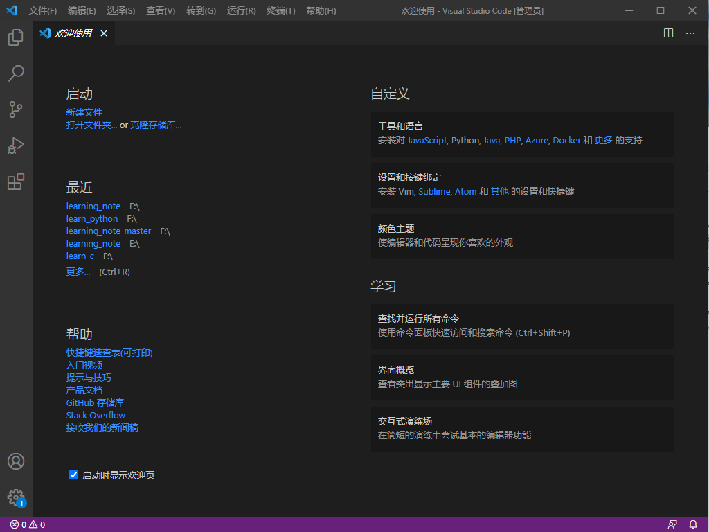
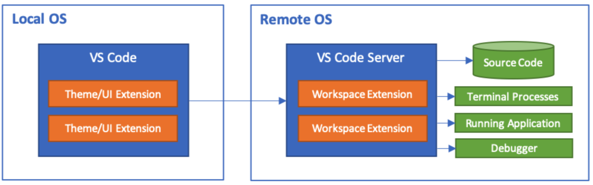

# 编辑器Vscode

为啥要用vscode？  
全球2400万开发者，有1400万在用vscode。  
跟风不是一个好习惯，但是vscode确实有其独到之处。  
它与IDE不一样，首次使用时并不是开箱即用，而是需要根据自己的一些要求来进行配置。  
而且vscode体积小，运行快，对电脑的配置也没多少需求。   
  
[Vscode下载地址](https://code.visualstudio.com/)   
注意：请下载管理员版本

**基本概念**   
窗口(window)：每打开一个软件，整个软件界面就是一个窗口  

工作区(workbench)：一个工作区是一个独立的小窗口，是窗口下面的一个“小窗口”  

缓冲区(buffer)：一个工作区可以有很多个小缓冲区，类似于vim中的标签(tag)  

控制台(console)：显示调试软件时的输出  

## 常用快捷键  

**工作区：**  
|快捷键|作用|备注|
|--|--|--|
|ctrl+shift+p|打开VsCode命令窗口。在这个窗口下输入插件名称就能知道这个插件支持哪些特性了，顺带还会说明特性快捷键。|vscode的控制中心|
|ctrl+\ |新建一个工作区(在当前窗口的右侧)|抄代码利器  |
|ctrl+b |显示/隐藏侧边栏|  |
|ctrl+1、2... |切换工作区|  |
|ctrl+j |显示/隐藏控制台|  |
|ctrl+shift+n |重新打开一个软件的窗口|类似于游戏多开  |
|ctrl+shift+w |关闭软件的当前窗口||
|ctrl+n |新建文件||
|ctrl+w |关闭当前文件||
|alt+F12|以预览方式在当前页面显示定义，都是查看定义，相对F12的优点是不会跳出当前文件到定义文件，而是在当前文件打开一个小窗口预览|  |
|shift+F12|查看光标所在函数或变量的引用，就像 Alt +F12 一样以预览方式在当前文件打开引用的文件列表。|  |
|ctrl+shift+o|查看当前文件的符号，可以用关键字过滤符号，当然你也可以在左侧的大纲视图中查找符号，不过大纲视图不能查找匹配符号，所以我更习惯用快捷键方式查找符号。|  |

**跳转操作：**  
|快捷键|作用|备注|
|--|--|--|
|ctrl+tab|在一个工作的不同缓冲区之间跳转|  |
|ctrl+pagedown/pageup|在一个工作的不同缓冲区之间跳转|  |
|ctrl+shift+o|在当前文件的不同**方法**之间进行跳转|  |
|ctrl+g|跳转到指定行|  |
|ctrl+shift+\ |跳转到指定的括号|超级方便，可以从左括号直接跳转到右括号  |
|F12|跳转到定义，跳转到函数或符号的定义。|  |

**移动光标：**  
|快捷键|作用|备注|
|--|--|--|
|ctrl+ 左右方向键|在单词之间移动|类似vim的w\e\b  |
|fn+←或→|整行之间移动|  |
|fn+←(或win+←)|将光标定位到当前行的最左侧|  |
|fn+→(或win+→)|将光标定位到当前行的最右侧|  |
|ctrl+home|将光标定位到当前文件的第一行|  |
|ctrl+end|将光标定位到当前行的最后一行|  |
|alt+左/右箭头|前进或者后退到光标所在源码的上一个位置。|  |

**编辑操作：**  
|快捷键|作用|备注|
|--|--|--|
|ctrl+enter|在当前行的下方新增一行，然后跳至该行|即使光标不在行尾，也可以快速向下插入新行  |
|ctrl+shift+enter|在当前行的上方新增(插入)一行||
|alt+↑/↓|将光标所在行向上/下移动||
|alt+shift+↑/↓|将光标所在行向上/下复制||
|ctrl+F2|多光标编辑，选中光标所在位置的单词，然后编辑|常用于大规模修改变量名等  |
|alt+鼠标左键点击任意位置|在任意位置设置多光标编辑点|  |
|ctrl+alt+上下键|在连续的多列上同时出现光标|  |
|ctrl+[|移动代码块(向左移动)|在python中非常常用 |
|ctrl+]|移动代码块(向右移动)| |

**删除操作：**   
|快捷键|作用|备注|
|--|--|--|
|ctrl+shift+k|删除整行| |
|ctrl+backspce|删除光标之前的一个单词| |
|ctrl+delete|删除光标之后的一个单词| |

**编程相关：**  
|快捷键|作用|备注|
|--|--|--|
|ctrl+/|添加单行注释| |
|alt+shift+f|代码格式化| |
|F2|以重构的方式进行重命名| |
|ctrl+u|将光标的移动回退到上一个位置| |

**搜索相关：**  
|快捷键|作用|备注|
|--|--|--|
|ctrl+shift+f|全局搜索代码| |
|ctrl+f|在当前文件中搜索代码，光标在搜索框中| |
|F3|在当前文件中搜索代码，光标仍停留在编辑区| |
|ctrl+p|文件查找，快速打开文件列表，输入关键字匹配文件，优先显示最新打开过的文件，方便的在指定文件之间跳转。 |  |

**自定义快捷键**  
方法一：(推荐)
1. ctrl+shift+p打开命令面板
2. 输入`键盘快捷方式`
3. 选择`首选项：打开键盘快捷方式`
方法二：
1. 点击左下角齿轮图标
2. 点击`键盘快捷方式`按钮

附：[快捷键官方速查表](https://code.visualstudio.com/shortcuts/keyboard-shortcuts-windows.pdf)

## 常用设置

设置使用命令面板功能更加高效，即ctrl+shift+p  
设置方法：  
1. 打开功能面板：ctrl+shift+P   
2. 输入：settings
   + 首选项：打开设置(ui)  --> 通过图形界面来设置
   + 首选项：打开设置(json) --> 通过json文件来设置
3. 搜索框内输入需要的搜索的内容
4. 可以选择在json中打开，自行手动输入设置
   
常用设置：
1. 显示相对行号：`linenumbers:relative`
vim插件中根据相对行号跳转  
`:.+n` # +号表示向下跳转n行   
`:.-n` # -号表示向下跳转n行  
2. 设置git路径
3. 设置python相关的一些路径
4. 大小写转换：选中需要转换的文本，打开命令面板，输入transform 

## VSCODE远程开发//TODO

Local OS是 Win10 ,  Remote OS 是 Linux云主机。
远程开发本地 VS Code 用 SSH 协议与远程服务端通信，所以要先配置SSH环境变量，
由于Git自带SSH客户端程序

    [SSH程序](image/ssh程序.png)

配置GIT的环境变量，即将git的的bin目录添加到系统的环境变量中

    [环境变量](image/环境变量.png)

安装远程开发插件：
    vscode有一个远程开发插件包，包括了：

    Remote - SSH - 通过使用 SSH 链接虚拟或者实体Linux主机。
    Remote - Containers – 连接 Docker 开发容器。
    Remote - WSL - 连接 Windows Subsystem for Linux （Linux子系统）。

    打开软件的扩展界面，搜索 Remote 开头的插件，也能看到这三个的不同远程开发插件，
    我们这里连接的是云主机，选择安装 Remote - SSH 插件安装即可。

## 插件推荐  

vscode受欢迎的一个重要因素就是其强大的可扩展性和插件市场，你可以自己定制自己的插件，也可以在插件市场中找到其他人写好的插件，一键安装，即装即用。  

### 插件推荐-源码阅读插件

**插件名称：Todo Tree**  
使用方法：这个插件的使用场景是，你看完代码加了下面这个注释 ：
// TODO 
以后会扩展这部分功能当然，不知道这个「以后」是什么时候，一不小心以后变成遥遥无期，
一部分原因是不想改，另一部分原因是写下这段注释的人时间久了就忘记了，这时候你需要
「 TODO Tree 插件」，我们可以更方便的管理代码中的此类注释。
这个插件能帮你组织和管理TODO注释，你在代码中注释的带 TODO 的标签会统一在侧边栏显示出来，
当然不限于 TODO 注释，可以自定义管理标签比如 FIXME 等，可以基于标签过滤和筛选。

**插件名称：Bookmarks**  
使用方法：「书签」这个插件的功能就和它名字一样直接，没错它就是一个你的源码书签，
当我们看大工程源码的时候，往往需要在成千上万个源文件之间跳转，此外， Bookmarks 
能帮你方便的创建和管理书签，看到哪个位置想加个书签就按
快捷键 Ctrl + Alt + K ，多按一次就是删除，
不仅如此他还提供了在书签之前跳跃和查看管理的功能，更多功能可以自己体验，反正我看
大工程源码用这个很爽。

### GIT相关

*插件名称：Git Graph*
使用方法：提交记录变成一条条时间线，分支也能清晰的用不同颜色时间线区分出来，并且点开
提交线上的提交点可以查看当时的提交动作，可以在提交动作上查看做了哪些改动，也可以方便
的跳转到改动文件，更多功能自行体验。

*插件名称：GitLens*
使用方法：它可以在文件中改动的位置后面直接显示出本次改动的提交信息，然后你可以直接通过
显示的提交信息跳转到提交文件对比，其实还有其他丰富的功能。

### 其他

*插件名称：BracketPairColorizer*
使用方法：这个插件让每一个括号都能找到他自己的颜色，成双成对，点一下其中一半括号自动
匹配另一半，拯救了广大程序员的近视眼睛度数。

*插件名称：koroFileHeader*
使用方法：用于自动的插入头文件开头的说明和函数的说明。安装插件之后你只需要简单配置想要的格式，
然后按下
快捷键Ctrl + Alt +i
即可自动即可自动生成这样一个模板。
类似的对函数的说明注释模板，只需按下
快捷键Ctrl + Alt +t
即可完成，非常的方便。

*插件名称：shellman*
使用方法：在 Linux 下工作难免随手写一个脚本，这个插件能提供了便捷的shell script 自动补全
和联想等功能，提高你的脚本编写速度和准确性。
   
### 插件推荐-python相关

1. 右键-提取方法自动生成函数 
2. 安装yapf:代码重构 
pip install yapf
3. 安装好之后可以使用,在图形化配置中启用yapf
快捷键:alt+shift+f 

插件
4. autoDocstring:快速生成结构化的文档注释
5. 快捷键：ctrl+shift+2 

### 插件推荐-C/C++

*插件名称：Switcher*
使用方法：我们经常需要通过头文件跳到对应的源文件，或者从源文件跳转到对应的头文件，
当然可以在侧边栏的文件管理器中选择打开，但是多了一个步骤有点繁琐，所以我找了这个插件，
其实按插件的说明文档，它是能在不同的文件类型之间跳转，不仅仅局限于头文件和源文件，
懒人福音，你值得拥有。
